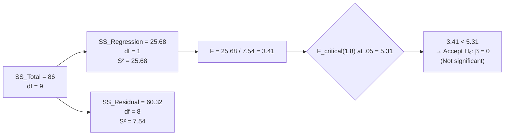
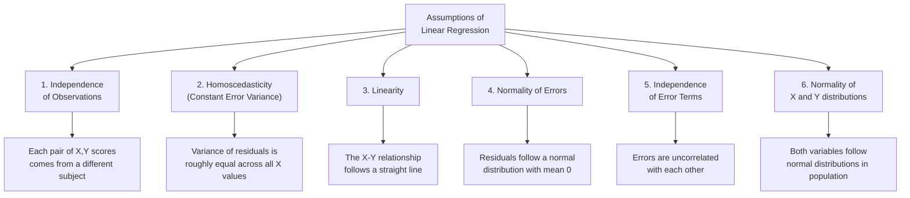

# Regression: Significance Testing, Accuracy Measures, and Assumptions

## Introduction

Computing the regression equation gives us a line — but we haven't yet asked whether that line is **worth using**. Two key questions follow every regression analysis:

1. **Is the relationship real?** Could the observed slope have arisen by chance, even if the true population slope β = 0? → *Significance testing*
2. **How accurate is the prediction?** Even if significant, how closely do our predictions match reality? → *Accuracy measures*

Beyond these questions, regression analysis rests on a set of **statistical assumptions** — conditions that must be met for the results to be trustworthy. Violating them can produce misleading conclusions.

This section completes the bivariate regression framework and prepares you for multiple regression.

---

**Source PDFs**:
- 📄 [Block-2/Unit-4.pdf — Pages 76–81](/pdfs/MPC-006%20Statistics%20in%20Psychology/Block-2/Unit-4.pdf)
- 📚 MPC-006 Statistics in Psychology, Block 2: Correlation and Regression

---

## Significance Testing of the Regression Slope (b)

### The Null Hypothesis

$$H_0: \beta = 0 \quad \text{(the population slope is zero — X does not predict Y)}$$
$$H_A: \beta \neq 0 \quad \text{(the population slope is non-zero — X does predict Y)}$$

If β = 0, then the regression line is flat — knowing X tells us nothing about Y. The F-test examines whether our sample slope b is large enough to be unlikely under H₀.

### The ANOVA Table for Regression

The F-test in regression uses the same logic as ANOVA: compare **variance explained** to **variance unexplained**.

| Source | Sum of Squares | df | Mean Square (S²) | F |
|---|---|---|---|---|
| **Regression** | $\sum(\hat{Y}-\bar{Y})^2$ = SS_R | k | SS_R / k | S²_R / S²_e |
| **Residual** | $\sum(Y-\hat{Y})^2$ = SS_e | n − k − 1 | SS_e / (n−k−1) | |
| **Total** | $\sum(Y-\bar{Y})^2$ = SS_T | n − 1 | | |

Where:
- k = number of predictor variables (k = 1 for bivariate regression)
- n = sample size
- df_Regression = k, df_Residual = n − k − 1

**F formula**:
$$F = \frac{S^2_{Regression}}{S^2_{Residual}} = \frac{SS_R/k}{SS_e/(n-k-1)}$$

### Worked Example: Stigma → Appointments Missed

From the previous section:
- SS_Regression = 25.68, SS_Residual = 60.32
- k = 1, n = 10

**ANOVA table**:

| Source | SS | df | S² | F |
|---|---|---|---|---|
| Regression | 25.68 | 1 | 25.68 | 3.41 |
| Residual | 60.32 | 8 | 7.54 | |
| Total | 86.00 | 9 | | |

$$F = \frac{25.68}{7.54} = 3.41$$

**Critical value**: F_(1,8) at α = .05 = **5.31**

Since 3.41 < 5.31, we **fail to reject H₀**.

**Conclusion**: The regression slope is not statistically significant. Stigma scores do not significantly predict appointments missed in this sample.

> ⚠️ **Why did this fail?** The sample size is only **n = 10**. With such a small sample, the test has very low **statistical power** — the ability to detect a real relationship even when it exists. With n = 50 or 100, a similar slope magnitude might well be significant.

**Important lesson**: A non-significant result does not mean the relationship doesn't exist. It may simply mean we don't have enough data to detect it reliably.

---

## Accuracy of Prediction

Even when a regression is significant, we want to know **how accurate** the predictions are. Three measures are commonly used:

### 1. Standard Error of Estimate (s_Y.X)

The standard error of estimate measures the **average prediction error** — how far, on average, the predicted Ŷ values deviate from the actual Y values.

$$s_{Y.X} = \sqrt{\frac{SS_{Residual}}{df_{Residual}}} = \sqrt{\frac{\sum(Y-\hat{Y})^2}{n-k-1}}$$

It is the **standard deviation of the residuals**. A smaller value indicates more precise prediction.

**Calculation for the stigma example**:

$$s_{Y.X} = \sqrt{\frac{60.32}{8}} = \sqrt{7.54} = 2.75$$

**Interpretation**: On average, our predictions are off by about **2.75 appointments**. Given that the mean of Y is 6 appointments, this is a substantial error (~46% of the mean).

**Practical use**: s_Y.X can be used to build **prediction intervals**. For a new patient with stigma = 65, we predict Ŷ = −6.14 + 0.199(65) = 6.80 appointments missed, with a margin of error of approximately ±2 × 2.75 = ±5.5 (rough 95% interval). This interval is so wide here that the prediction has limited practical utility.

### 2. Coefficient of Determination (r²)

$$r^2 = \frac{SS_{Regression}}{SS_{Total}} = \frac{\sum(\hat{Y}-\bar{Y})^2}{\sum(Y-\bar{Y})^2}$$

r² represents the **proportion of variance in Y explained by X**. It ranges from 0 to 1 (or 0% to 100%).

**Calculation**:
$$r^2 = \frac{25.68}{86} = 0.299$$

**Interpretation**: Stigma scores explain **29.9% of the variance** in appointments missed. About 70% of the variation remains unexplained — due to other variables (transport availability, appointment scheduling difficulty, treatment motivation, etc.) and random error.

> 💡 **Connection to Pearson's r**: √r² = r (Pearson's correlation coefficient). In our example, √0.299 = 0.547, which is the Pearson's r between stigma and appointments missed.

**Effect size interpretation** (Cohen's guidelines):

| r² | Effect Size | Practical Meaning |
|---|---|---|
| 0.02 | Small | X explains ~2% of variance in Y |
| 0.13 | Medium | X explains ~13% of variance in Y |
| 0.26+ | Large | X explains 26%+ of variance in Y |

Our r² = 0.299 represents a **large effect size** — even though it wasn't statistically significant (due to small n).

### 3. Proportional Improvement in Prediction (PIP)

PIP measures how much better we predict Y using the regression equation compared to simply using the mean (Ȳ) as our prediction for everyone:

$$PIP = 1 - \sqrt{1-r^2}$$

**Calculation**:
$$PIP = 1 - \sqrt{1 - 0.299} = 1 - \sqrt{0.701} = 1 - 0.837 = 0.163$$

**Interpretation**: Using the regression equation improves our prediction accuracy by **16.3%** compared to using the mean of Y alone.

> 📌 PIP is less commonly reported than r² but gives a more conservative and intuitive sense of practical improvement.

### Comparing the Three Accuracy Measures

| Measure | Formula | Range | What it tells you |
|---|---|---|---|
| s_Y.X (Standard Error) | √(SS_e / df_e) | 0 to ∞ (in Y units) | Average prediction error |
| r² | SS_R / SS_T | 0 to 1 | % variance explained |
| PIP | 1 − √(1−r²) | 0 to 1 | Improvement over mean-prediction |

---

## Interpreting the Full Regression Output

A complete bivariate regression analysis reports:

### The Intercept (a)

- Mathematical meaning: Predicted Y when X = 0
- Only interpret as "Y when X = 0" if zero is within the data range AND theoretically meaningful
- Otherwise, treat it as a **regression constant** (an anchor needed to position the line)
- In the stigma example: a = −6.14. Since stigma = 0 is outside the range (49–73) and logically impossible for these patients, the intercept has no meaningful interpretation

### The Slope (b)

The most important parameter. It directly answers the research question:

- b = 0.199: "Each 1-point increase in stigma predicts 0.199 more appointments missed"
- Rate-of-change interpretation: "A 5-point increase in stigma → approximately 1 additional missed appointment"
- The sign (positive/negative) indicates direction; the magnitude indicates strength

### r²

- Percentage of variance in Y accounted for by X
- r² = 0.299 → "Stigma explains 30% of variance in appointment non-compliance"
- Can also be understood as **proportional reduction in prediction error**: using the regression equation reduces error by 30% compared to simply predicting Ȳ for everyone

### The F-ratio

- Tests H₀: β = 0
- Significant F → reject H₀ → X significantly predicts Y in the population
- Non-significant F → fail to reject H₀ → insufficient evidence of a real relationship
- Even when non-significant, examine r² to assess practical/substantive significance

---

## Assumptions Underlying Linear Regression

For regression results to be valid, six key assumptions must hold:

### 1. Independence of Observations
Each data point must come from a **different, independent subject**. Violations occur with repeated measurements from the same subjects (use repeated-measures regression instead) or clustered data (students within classrooms — use multilevel modelling).

### 2. Homoscedasticity (Constant Error Variance)
The variance of the residuals should be roughly **constant** across all values of X. When residuals fan out or shrink as X increases (heteroscedasticity), standard errors are biased, making significance tests unreliable.

**Detection**: Plot residuals against predicted values. A random horizontal band is good; a fan shape signals violation.

### 3. Linearity
The relationship between X and Y must be **linear** (approximated by a straight line). Curved (curvilinear) relationships violate this assumption.

**Detection**: Inspect the scatter diagram. If points follow a curve (e.g., inverted U for Yerkes-Dodson performance curve), linear regression is inappropriate.

### 4. Normality of Error Terms
The **residuals** (not necessarily the raw variables) should follow a **normal distribution** with mean = 0.

**Detection**: Draw a histogram of residuals; use Kolmogorov-Smirnov or Shapiro-Wilk test on residuals.

**Robustness**: With large samples (n > 30+), regression is fairly robust to this violation due to the Central Limit Theorem.

### 5. Independence of Error Terms
Residuals should be **uncorrelated** with each other (no autocorrelation). This is especially important in time-series data (e.g., daily mood scores) where yesterday's error may predict today's.

**Detection**: Durbin-Watson statistic (values near 2 = independence; far from 2 = autocorrelation).

### 6. Bivariate Normality
The population distributions of both X and Y should be **normal**, and their joint distribution should follow a **bivariate normal distribution**.

**Detection**: Test normality of each variable separately using statistical tests or Q-Q plots.

### What Happens When Assumptions Are Violated?

| Assumption Violated | Consequence |
|---|---|
| Non-independence | Underestimated standard errors → inflated significance |
| Heteroscedasticity | Biased standard errors → untrustworthy p-values |
| Non-linearity | Systematic underfit → poor prediction |
| Non-normality of errors (small n) | Inaccurate p-values |
| Autocorrelation | Biased standard errors |

---

## Indian Research Context 🇮🇳

- **NIMHANS treatment research**: Regression models predicting treatment response (Y) from initial severity (X) assume linearity — which must be checked. For severe disorders like schizophrenia, response may not increase linearly with medication dose (the dose-response curve often plateaus), requiring nonlinear approaches
- **Educational assessment (CBSE)**: Large national samples satisfy normality assumptions easily. Homoscedasticity testing is critical — high-SES students may have lower prediction variance (more homogeneous performance) than low-SES students
- **Occupational psychology in Indian IT sector**: Regression of job performance (Y) on experience (X) often shows curvilinear trends (initial improvement, then plateau after 5 years), requiring polynomial regression when linearity is violated
- **Indian agricultural psychology research**: Crop yield predicted from rainfall — independence assumption can be violated in spatial data (nearby farms share correlated error terms)

---

## Memory Aids 🧠

### Assumptions: "IN-HO-LI-NO-IN-BI"
- **IN**dependence of observations
- **HO**moscedasticity (constant variance)
- **LI**nearity
- **NO**rmality of errors
- **IN**dependence of error terms
- **BI**variate normality

### F-test Logic: "EXPLAINED over UNEXPLAINED"
$$F = \frac{Variance\ Explained\ (S^2_{Regression})}{Variance\ Unexplained\ (S^2_{Residual})}$$
A large F means the regression explains much more than it leaves unexplained → reject H₀.

### Three Accuracy Measures — "SEP"
- **S** tandard Error (s_Y.X) — average prediction error in Y units
- **E** xplained variance (r²) — proportion of total variance captured
- **P** roportional Improvement in Prediction (PIP) — improvement over simple mean prediction

---

## External Resources 🔗

### Wikipedia Articles
- 📖 [F-test in Regression](https://en.wikipedia.org/wiki/F-test#Regression_problems) — Mathematical derivation
- 📖 [Coefficient of Determination](https://en.wikipedia.org/wiki/Coefficient_of_determination) — r² and its interpretations
- 📖 [Homoscedasticity and Heteroscedasticity](https://en.wikipedia.org/wiki/Homoscedasticity_and_heteroscedasticity) — Assumption and its violations

### Educational Videos
- 🎥 [F-test in Linear Regression (StatQuest)](https://www.youtube.com/watch?v=nk2CQITm_eo) — Excellent visual explanation
- 🎥 [Assumptions of Linear Regression (Statistics How To)](https://www.youtube.com/watch?v=C0GkqeMp8UU) — Checking assumptions visually

### Research Articles
- 📄 [Checking Regression Assumptions (Osborne & Waters, 2002)](https://pareonline.net/getvn.asp?v=8&n=2) — Free, accessible guide for social scientists
- 📄 [Effect Size in Regression: r² and Cohen's Guidelines (2020)](https://www.frontiersin.org/articles/10.3389/fpsyg.2019.02767/full) — Modern interpretation standards
- 📄 [Statistical Power in Regression — Why Sample Size Matters (2019)](https://www.ncbi.nlm.nih.gov/pmc/articles/PMC6107781/) — Power analysis for regression studies

### Online Tools
- 🔧 [Regression ANOVA Table Calculator](https://www.socscistatistics.com/tests/regression/default.aspx) — Full output including F-test
- 🔧 [Residual Plot Generator (Desmos)](https://www.desmos.com/calculator) — Visualise assumptions graphically
- 🔧 [G*Power — Sample Size for Regression](https://www.psychologie.hhu.de/arbeitsgruppen/allgemeine-psychologie-und-arbeitspsychologie/gpower) — Power analysis tool

---

## Self-Assessment Questions ✅

### Recall Level
1. State the null and alternative hypotheses tested in regression significance testing.
2. Write the formula for the F-test in regression. What are the degrees of freedom for numerator and denominator?
3. List any three assumptions of linear regression.

### Understanding Level
4. In the stigma-appointments example, F = 3.41 was not significant despite r² = 0.299 (a large effect size). How do you reconcile a large effect size with a non-significant F-test? What does this tell us about statistical power?
5. A researcher reports s_Y.X = 0.5 for one study and s_Y.X = 8.5 for another. Both predict Y from a single X. Which prediction is more accurate? Does the size of s_Y.X depend on the scale of Y?
6. What does r² = 0 mean? What does r² = 1 mean? What does r² = 0.50 mean in terms of prediction accuracy?

### Application Level
7. A clinical psychologist runs a regression of therapy outcome (Y) on therapeutic alliance ratings (X) in n = 30 patients, obtaining:
   - SS_Regression = 182, SS_Residual = 318, k = 1
   (a) Construct the ANOVA table with F-statistic
   (b) Test significance at α = .05 (F_critical(1,28) = 4.20)
   (c) Compute r²
   (d) Compute s_Y.X
   (e) Interpret all results for a clinical audience

8. An IGNOU student project finds SS_R = 450, SS_T = 900, n = 25, k = 1. (a) Compute r². (b) Interpret the effect size. (c) Is this practically significant? (d) Compute PIP.

### Critical Thinking Level
9. Two researchers study the same variables (study time → exam marks). Researcher A uses n = 20 and gets b = 3.5, F = 4.1 (ns). Researcher B uses n = 100 and gets b = 3.5, F = 25.3 (p < .001). Both found the same slope, but different conclusions. Explain this outcome. What does it mean for interpreting "statistical significance" in small-sample studies?
10. A researcher violates the linearity assumption — the true relationship between workload and performance is an inverted-U (Yerkes-Dodson). They run a linear regression anyway and find r² = 0.05 and a non-significant F. Does this mean workload doesn't predict performance? What has gone wrong?

---

## Summary

Significance of a regression slope is tested using the **F-test** with the ANOVA table (df_numerator = k, df_denominator = n−k−1). If F exceeds the critical value, we reject H₀: β = 0, concluding that X linearly predicts Y. Even when significant, **three accuracy measures** quantify prediction quality: the **standard error of estimate** (s_Y.X, average residual size in Y units), the **coefficient of determination** (r², proportion of Y variance explained), and the **Proportional Improvement in Prediction** (PIP). Six assumptions underlie valid regression: independence of observations, homoscedasticity, linearity, normality of errors, independence of error terms, and bivariate normality. Violations can bias estimates and p-values.

➡️ *Next: [Standardised Regression and Multiple Regression — Predicting from Multiple Variables](/mpc-006/block-2/standardised-multiple-regression)*
