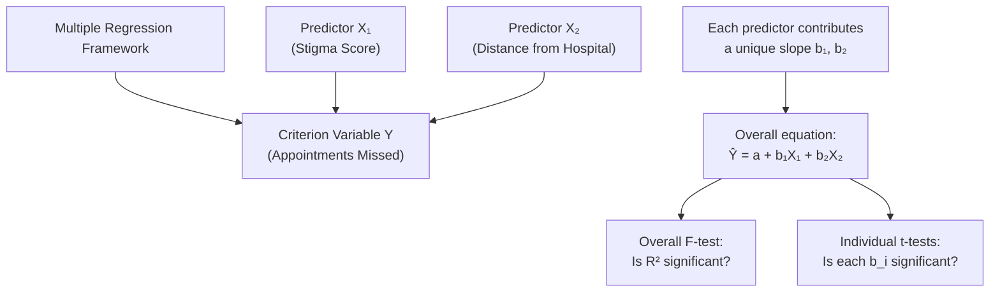
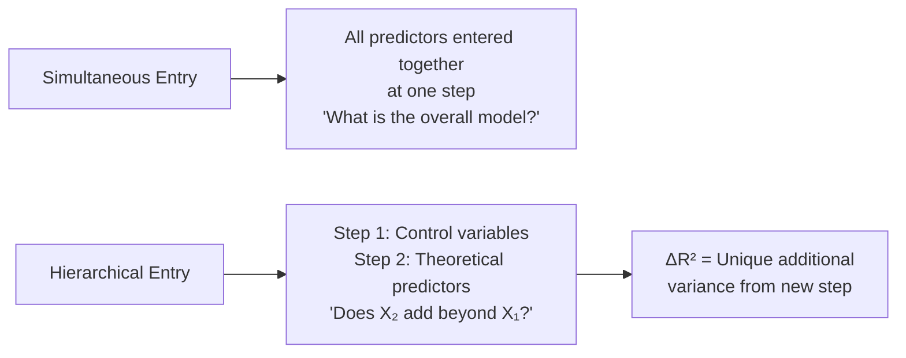

# Standardised Regression and Multiple Regression

## Introduction

Bivariate regression tells us how one predictor relates to one outcome. But psychological phenomena are almost never driven by a single cause. A patient's treatment non-compliance is affected by *both* stigma *and* distance from the hospital. Academic achievement depends on *both* intelligence *and* motivation. Job performance is predicted by *both* ability *and* personality.

**Multiple regression** allows us to simultaneously examine how **two or more predictor variables** together predict a criterion variable. It is the most widely used quantitative method in contemporary psychological research, appearing in the majority of empirical studies published in journals like *Psychological Science*, *Journal of Personality and Social Psychology*, and *Clinical Psychology Review*.

Before exploring multiple regression, we revisit **standardised regression** — which creates comparable coefficients by expressing all variables in standard deviation units.

---

**Source PDFs**:
- 📄 [Block-2/Unit-4.pdf — Pages 81–84](/pdfs/MPC-006%20Statistics%20in%20Psychology/Block-2/Unit-4.pdf)
- 📚 MPC-006 Statistics in Psychology, Block 2: Correlation and Regression

---

## Standardised Regression Analysis

### Why Standardise?

In ordinary (unstandardised) regression, coefficients are in the **original units** of the variables. This makes interpretation context-dependent but not comparable across predictors with different scales.

For example, predicting exam performance from:
- Study hours (X₁): b₁ = 3.5 marks per hour
- Anxiety score (X₂): b₂ = −0.8 marks per point on a 100-point scale

Are these comparable? Not directly — they use different units. To compare which predictor has a stronger relationship with Y, we need a **common scale**.

**Solution**: Transform both X and Y to Z-scores (mean = 0, SD = 1) before regression.

### Z-Score Transformation

For any variable X:
$$Z_X = \frac{X - \bar{X}}{S_X}$$

When both predictor and criterion are Z-scores:
- **Mean of Z = 0**
- **SD of Z = 1**

### The Standardised Regression Equation

$$Z_Y = a + b Z_X + e$$

After Z-transformation, the **intercept always becomes zero** because:
- Regression line passes through (X̄, Ȳ)
- After standardisation, (X̄, Ȳ) = (0, 0) — the origin
- Therefore: a = Ȳ − bX̄ = 0 − b(0) = 0

So the equation simplifies to:

$$Z_Y = \beta Z_X + e$$

Where **β (beta weight)** is the standardised regression coefficient.

### Why β = r in Simple Regression

Recall:
- Pearson's r = Cov_XY / (S_X × S_Y)
- Regression slope b = Cov_XY / S_X²

When both variables are standardised (S_X = S_Y = 1):
- Cov becomes the correlation between Z-scores
- S_X² = 1
- Therefore: **β = Cov_ZxZy / 1 = r**

> ✅ **Key insight**: In **simple regression** (one predictor), the standardised coefficient β exactly equals the **Pearson's correlation coefficient r**. This elegant relationship links correlation and regression directly.

In **multiple regression**, however, each β is a **partial** standardised coefficient — it reflects the unique contribution of that predictor while holding all other predictors constant.

### Comparing β Weights

In multiple regression, **β weights** allow direct comparison of predictors:
- Larger |β| = stronger unique contribution to predicting Y
- Sign of β indicates direction of relationship (controlling for other predictors)

| Predictor | Unstandardised b | Standardised β | Interpretation |
|---|---|---|---|
| Study hours | 3.5 marks/hour | 0.52 | ↑ 1 SD in study hours → 0.52 SD ↑ in marks |
| Anxiety | −0.8 marks/point | −0.28 | ↑ 1 SD in anxiety → 0.28 SD ↓ in marks |

From the β weights, study hours (β = 0.52) has a stronger unique effect on marks than anxiety (β = −0.28).

---

## Multiple Regression

### The Multiple Regression Equation

When predicting Y from k predictors (X₁, X₂, ..., X_k):

**Population level**:
$$Y = \alpha + \beta_1 X_1 + \beta_2 X_2 + \cdots + \beta_k X_k + \varepsilon$$

**Sample level**:
$$\hat{Y} = a + b_1 X_1 + b_2 X_2 + \cdots + b_k X_k$$

Where each b_i is the **partial regression coefficient** for predictor X_i — the expected change in Y per unit increase in X_i, **with all other predictors held constant**.

### Worked Example: Appointments, Stigma, and Distance

**Research question**: Can we better predict missed therapy appointments if we add **distance from hospital** (X₂) to our stigma (X₁) model?

**Data** (10 patients):

| Appts Missed (Y) | Stigma (X₁) | Distance in km (X₂) |
|---|---|---|
| 2 | 40 | 2 |
| 3 | 43 | 5 |
| 4 | 45 | 4 |
| 5 | 46 | 7 |
| 6 | 60 | 9 |
| 7 | 63 | 5 |
| 8 | 69 | 2 |
| 9 | 54 | 8 |
| 11 | 70 | 6 |
| 11 | 62 | 9 |

**Results** (from computer solution):

| Parameter | Value |
|---|---|
| Intercept (a) | −7.88 |
| Slope for stigma (b₁) | 0.22 |
| Slope for distance (b₂) | 0.40 |
| R² | 0.81 |
| Adjusted R² | 0.76 |

**Multiple regression equation**:
$$\hat{Y} = -7.88 + 0.22 \times Stigma + 0.40 \times Distance$$

### Interpreting the Coefficients

**Intercept (a = −7.88)**: When both stigma = 0 and distance = 0, predicted appointments missed = −7.88. Again, this is not meaningful (impossible values), serving only as a mathematical anchor.

**b₁ = 0.22 (Stigma)**: For every 1-unit increase in stigma, appointments missed increase by 0.22, **holding distance constant**. This is a *partial* effect — the unique contribution of stigma after controlling for distance.

**b₂ = 0.40 (Distance)**: For every 1 km increase in distance, appointments missed increase by 0.40, **holding stigma constant**. Distance appears to have a stronger per-unit effect on attendance than stigma does.

### R² and Adjusted R²

$$R^2 = 0.81 \quad \text{(81% of variance in appointments missed explained by both predictors)}$$

Compare this to the bivariate model with stigma alone: r² = 0.299 (30%). Adding distance jumps the explained variance from 30% to **81%** — a dramatic improvement.

$$\bar{R}^2 = 0.76$$

The adjusted R² (0.76) is lower than R² (0.81) as expected, correcting for the small sample and two predictors.

### ANOVA Table for Multiple Regression

| Source | SS | df | S² | F | p |
|---|---|---|---|---|---|
| Regression | 73.28 | 2 | 36.64 | 14.98 | .003 |
| Residual | 17.12 | 7 | 2.45 | | |
| Total | 90.40 | 9 | | | |

$$F_{(2,7)} = 14.98, \quad p = .003$$

Critical value F_(2,7) at α = .05 = 4.74. Since 14.98 > 4.74 → **Reject H₀**.

**Conclusion**: The combination of stigma and distance **significantly predicts** therapy appointment non-compliance (F(2,7) = 14.98, p = .003, R² = .81).

### Individual Predictor Significance (t-tests)

Beyond the overall F-test, each predictor's unique contribution can be tested with individual t-tests:

| Predictor | b | t | p |
|---|---|---|---|
| Stigma (X₁) | 0.22 | 4.61 | < .01 |
| Distance (X₂) | 0.40 | 1.93 | > .05 |

**Stigma** is a **significant** predictor (t = 4.61, p < .01) — it uniquely predicts appointments missed above and beyond distance.

**Distance** is **not significant** (t = 1.93, p > .05) — though the F-test for the overall model was significant and R² improved substantially when distance was added, distance alone doesn't reach significance with this small sample.

> 💡 This pattern — overall model significant, but individual predictors not all significant — is common with small samples and correlated predictors. With larger n, distance would likely reach significance.

---

## Simultaneous vs. Hierarchical Entry

Multiple regression can be performed in two ways:

### Simultaneous (Forced) Entry

All predictors are entered into the equation **at once**. This is used when:
- Theory suggests all predictors should be included
- There is no a priori reason to prioritise any predictor
- You want the overall model R² and all partial coefficients

### Hierarchical (Sequential) Entry

Predictors are entered in **pre-specified steps**, typically:
1. **Step 1**: Enter control variables (demographics, baseline measures)
2. **Step 2**: Enter predictors of theoretical interest

This allows us to ask: "After controlling for X₁, does X₂ add significant predictive power?"

The increase in R² from Step 1 to Step 2 (ΔR²) tells us the **unique additional variance** explained by the new predictors.

**Example in psychology**:
- Step 1: Enter age and gender (control variables) → R² = 0.12
- Step 2: Enter self-efficacy and social support → R² = 0.48
- ΔR² = 0.36 → Self-efficacy and social support explain an additional 36% of variance beyond demographics

---

## Caution: Regression ≠ Causation

A critical principle: **Regression analysis describes statistical relationships, not causal ones.**

Just because higher stigma predicts more appointments missed does not mean stigma *causes* non-compliance. Confounding variables, reverse causality, and common causes may all explain the observed relationship. Causality must come from **theory and research design**, not from the regression equation.

The slope b₁ = 0.22 tells us: "In our sample, for each 1-point increase in stigma, appointments missed tended to increase by 0.22, holding distance constant." It does not tell us *why* — that requires theory.

---

## Indian Research Context 🇮🇳

Multiple regression is ubiquitous in Indian psychological research:

- **NIMHANS outcome studies**: Multiple regression predicts treatment response (Y) from baseline severity (X₁), social support (X₂), medication adherence (X₃), and family burden (X₄). These models inform clinical resource allocation and early intervention criteria
- **Indian IT sector occupational psychology**: Hierarchical regression examines whether personality traits (Step 2) explain turnover intention beyond job demands and pay (Step 1), helping companies identify who is at risk of leaving
- **NCERT large-scale assessments**: National learning outcome surveys use multiple regression to predict student performance from school resources, teacher quality, parental education, and socioeconomic status simultaneously
- **Delhi University admissions research**: Hierarchical multiple regression comparing whether interview performance adds to GPA + entrance scores in predicting first-year academic success — guiding admissions policy

---

## Memory Aids 🧠

### Multiple Regression Equation: "a + b₁X₁ + b₂X₂ + ... + bₖXₖ"
Think of it as bivariate regression with extra predictors appended. Each b is **partial** — controlling for all others.

### β vs. b: "β is BETTER for Comparison"
- **b** (unstandardised): Use for **interpretation** in real-world units
- **β** (standardised): Use for **comparison** across predictors (who contributes more?)

### Simultaneous vs. Hierarchical: "ALL-AT-ONCE vs. STEP-BY-STEP"
- Simultaneous: throw all predictors in at once → overall model
- Hierarchical: control first, then add theoretically interesting predictors → ΔR² tells unique contribution

### R² always increases with more predictors
Adding a predictor (even a random one) can never decrease R². This is why **adjusted R²** penalises for too many predictors and is preferred with small samples.

---

## External Resources 🔗

### Wikipedia Articles
- 📖 [Multiple Regression](https://en.wikipedia.org/wiki/Linear_regression#Multiple_linear_regression) — Full mathematical treatment
- 📖 [Standardisation (Statistics)](https://en.wikipedia.org/wiki/Standard_score) — Z-scores and their properties
- 📖 [Hierarchical Linear Regression](https://en.wikipedia.org/wiki/Hierarchical_regression) — Sequential model building

### Educational Videos
- 🎥 [Multiple Regression — CrashCourse Statistics #35](https://www.youtube.com/watch?v=zITIFTsivN8) — Excellent conceptual overview
- 🎥 [Beta Weights and Standardised Regression (StatQuest)](https://www.youtube.com/watch?v=nk2CQITm_eo) — Visual explanation of β vs. b

### Research Articles
- 📄 [Multiple Regression in Behavioural Science (Cohen et al., 2003)](https://www.routledge.com/Applied-Multiple-RegressionCorrelation-Analysis-for-the-Behavioral-Sciences/Cohen-Cohen-West-Aiken/p/book/9780805822236) — The canonical reference
- 📄 [Interpreting Multiple Regression in Psychology (2021)](https://www.frontiersin.org/articles/10.3389/fpsyg.2021.635738/full) — Practical reporting guidelines
- 📄 [Hierarchical vs Simultaneous Regression — When to Use Each (2018)](https://www.ncbi.nlm.nih.gov/pmc/articles/PMC5991815/) — Decision guide with examples

### Online Tools
- 🔧 [Multiple Regression Calculator (SocSciStats)](https://www.socscistatistics.com/tests/multipleregression/default.aspx) — Multi-predictor regression online
- 🔧 [JASP — Free Statistical Software](https://jasp-stats.org/) — Full multiple regression with R², β, ANOVA table
- 🔧 [SPSS Multiple Regression Guide (IBM)](https://www.ibm.com/support/knowledgecenter/SSLVMB_26.0.0/statistics_mainhelp_ddita/spss/regression/idh_mlin.html) — Step-by-step SPSS instructions
- 🔧 [R: lm() for Multiple Regression](https://stat.ethz.ch/R-manual/R-devel/library/stats/html/lm.html) — Standard R implementation

---

## Self-Assessment Questions ✅

### Recall Level
1. Why does the intercept equal zero in standardised regression?
2. In simple regression, what is the relationship between β (standardised coefficient) and r (Pearson's correlation)?
3. Write the multiple regression equation for a model with two predictors. Define each term.

### Understanding Level
4. In the stigma-distance example, the overall F-test was significant (p = .003), but distance alone was not significant (t = 1.93, p > .05). How can the overall model be significant if one predictor isn't? What would you advise the researcher to do?
5. The unstandardised coefficient for distance is b₂ = 0.40 (appointments per km), while for stigma it is b₁ = 0.22 (appointments per stigma point). Can you directly compare these to say "distance matters more"? Why or why not? What should you use instead?
6. Why does R² always increase (or stay the same) when more predictors are added? What problem does this create for model building, and how does adjusted R² address it?

### Application Level
7. A researcher predicts job burnout (Y) from workload (X₁) and autonomy (X₂) in n = 60 employees:
   - a = 3.2, b₁ = 0.58, b₂ = −0.31
   - R² = 0.52, Adjusted R² = 0.49
   - F(2,57) = 31.2, p < .001
   - t for workload = 7.1 (p < .001), t for autonomy = −3.8 (p < .001)
   (a) Write the regression equation
   (b) Predict burnout for an employee with workload = 7 and autonomy = 4
   (c) Interpret b₁ and b₂
   (d) What does R² = 0.52 tell us?
   (e) Both predictors are significant — what does this mean for workplace intervention?

8. A researcher uses hierarchical regression to study resilience (Y):
   - Step 1: Age and gender → R² = 0.08
   - Step 2: Add social support and mindfulness → R² = 0.47
   (a) What is ΔR² for Step 2?
   (b) What does this ΔR² mean?
   (c) Why is hierarchical entry preferred here over simultaneous entry?

### Critical Thinking Level
9. Suppose stigma and distance are highly correlated with each other (r = 0.87). Both are entered as predictors in multiple regression. The overall model is significant (R² = 0.79), but neither predictor's individual t-test is significant. Explain this phenomenon. What is it called, and why does it happen?
10. A regression equation predicts depression (Y) from 8 predictor variables in n = 25 participants and achieves R² = 0.92. A researcher concludes that "our model explains 92% of variance in depression." What are the problems with this conclusion? What steps should the researcher take before drawing such a conclusion?

---

## Summary

**Standardised regression** transforms both X and Y to Z-scores, eliminating the intercept and producing **β (beta) weights** that are directly comparable across predictors with different scales. In simple regression, β = r (Pearson's correlation). In **multiple regression**, a single equation with k predictors (Ŷ = a + b₁X₁ + b₂X₂ + ⋯ + b_kX_k) uses **partial coefficients** — each b reflects the unique contribution of its predictor holding all others constant. Overall model significance is tested via the **F-test** (ANOVA table, df_num = k, df_denom = n−k−1); individual predictor significance uses t-tests. **R²** (proportion of variance explained) always increases with more predictors, so **adjusted R²** is preferred. Predictors can be entered **simultaneously** or **hierarchically** (ΔR² reveals unique contributions at each step). Regression describes statistical associations, not causality.

➡️ *Next: [MPC-006 Block 3 — t-Tests and ANOVA](/mpc-006/block-3/)*
