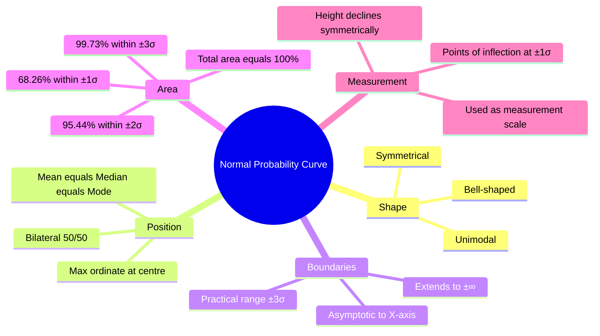

import Tabs from '@theme/Tabs';
import TabItem from '@theme/TabItem';

# Normal Distribution: Concept, Properties, and Theoretical Foundations

> *"The normal curve is not merely a mathematical convenience — it is a mirror that reflects the way nature distributes many human characteristics."*

The **Normal Probability Curve (NPC)** — the iconic bell-shaped curve — is arguably the single most important statistical concept in psychology and education. From IQ scores to examination marks, from anxiety levels to reaction times, countless psychological variables follow (or approximate) this elegant distribution. This unit unpacks what the normal distribution is, why it behaves the way it does, and what its ten key properties mean for psychological measurement.

---

## 1. What Is the Normal Distribution?

### 1.1 The Concept of Normal Distribution

When a large sample of observations is collected on a psychological or educational variable, the resulting frequency distribution often shows a characteristic pattern: **most scores cluster around the centre**, and frequencies taper off symmetrically on both sides. This pattern, when graphed as a frequency polygon, produces the bell-shaped **Normal Probability Curve**.

A distribution is said to be **normally distributed** when:
- The three measures of central tendency — **Mean (M), Median (Md), and Mode (Mo)** — coincide at the same central point.
- Frequencies are symmetrically distributed around this central value.
- The curve is bell-shaped and theoretically extends to ±infinity.

**Classic example from IGNOU MPC-006:**

A mathematics achievement test administered to 150 Class IX students produced the following distribution:

| Class Interval | Frequency |
|---|---|
| 85–89 | 1 |
| 80–84 | 2 |
| 75–79 | 4 |
| 70–74 | 7 |
| 65–69 | 10 |
| 60–64 | 16 |
| 55–59 | 20 |
| **50–54** | **30** |
| 45–49 | 20 |
| 40–44 | 16 |
| 35–39 | 10 |
| 30–34 | 7 |
| 25–29 | 4 |
| 20–24 | 2 |
| 15–19 | 1 |
| **Total** | **150** |

Notice the pattern: maximum frequency (30) at the central class, tapering symmetrically outward. When plotted as a frequency polygon, this yields a near-perfect bell curve with M = Md = Mo = 52.

### 1.2 Universality of the Normal Distribution

The normal distribution appears across biology, psychology, education, and physics:

| Domain | Normally Distributed Variables |
|---|---|
| Physical | Height, weight, body temperature, blood pressure |
| Biological | Longevity, birth weight, blood glucose |
| Psychological | Intelligence (IQ), anxiety, adjustment, personality traits |
| Educational | Achievement scores, aptitude, reaction time |
| Physical Sciences | Measurement errors in astronomy, physics, chemistry |

This universality is not coincidental — it follows from the **Central Limit Theorem**, which states that the sum of many independent random variables tends toward normality, regardless of the underlying distributions.

---

## 2. Theoretical Basis of the Normal Probability Curve

The NPC rests on the **Law of Probability** formulated by **Abraham de Moivre (1667–1754)**, a French-English mathematician. In the early 18th century, De Moivre discovered that when many independent random events combine (like flipping a coin many times), the resulting distribution approaches the bell shape.

The mathematical equation for the Normal Probability Curve is:

$$Y = \frac{N}{\sigma\sqrt{2\pi}} \cdot e^{-\frac{(X-M)^2}{2\sigma^2}}$$

Where:
- **Y** = height (ordinate) of the curve at point X
- **N** = total number of cases
- **σ** = standard deviation of the distribution
- **M** = mean of the distribution
- **e** = Euler's number (≈ 2.718)
- **π** ≈ 3.14159

Later, the curve was rigorously developed by **Carl Friedrich Gauss (1777–1855)** (which is why it is also called the **Gaussian distribution**) and **Pierre-Simon Laplace (1749–1827)**.

:::info Key Contributors to Normal Distribution Theory
- **Abraham de Moivre** (1733): Discovered the normal approximation to the binomial distribution
- **Carl Friedrich Gauss** (1809): Applied it to astronomical measurement errors — hence "Gaussian distribution"  
- **Pierre-Simon Laplace** (1812): Proved the Central Limit Theorem
- **Adolphe Quetelet** (1835): First applied normal distribution to human measurements (height, chest circumference)
- **Francis Galton**: Applied to intelligence and heredity
:::

---

## 3. Ten Properties of the Normal Probability Curve

These properties are **foundational** for IGNOU MAPC examinations. Each property has practical consequences for psychological measurement.

### Property 1: Symmetrical

The NPC is perfectly symmetrical around its vertical axis (ordinate) at the mean. The left and right halves are **mirror images** of each other. This implies:
- Equal percentage of cases on each side of the mean
- Positive deviations and negative deviations are equally distributed

**Implication for measurement:** A test yielding a symmetric distribution measures the ability without systematic bias toward easy or difficult items.

### Property 2: Unimodal

There is only **one peak** (mode) in the distribution — at the exact centre. This reflects the natural tendency of psychological traits to cluster around an average, with extremes being rare.

**Contrast:** Bimodal distributions (two peaks) indicate the presence of two distinct subgroups in the sample.

### Property 3: Maximum Ordinate at the Centre

The highest point of the curve occurs exactly at the **mean value**. In the standardised (unit) normal curve (mean = 0, σ = 1), this maximum height equals **0.3989**.

As you move away from the centre in either direction, the height of the curve decreases.

### Property 4: Asymptotic to the X-Axis

The curve **approaches but never touches** the horizontal baseline as it extends toward ±infinity. This means theoretically, no score is impossible — extremely high or low scores just become increasingly rare.

**Practical implication:** For computational purposes, we treat the curve as ending at **±3σ**, since 99.73% of all cases fall within this range.

### Property 5: Height Declines Symmetrically

The curve descends symmetrically and at the same rate on both sides of the maximum point. This property is a consequence of the symmetry property.

### Property 6: Points of Inflection at ±1σ

The normal curve changes its direction of curvature at exactly **one standard deviation** above and below the mean. These are called **points of inflection** — where the curve transitions from concave to convex (or vice versa).

This property gives us a visual way to identify σ: drop perpendiculars from the inflection points to the x-axis — they will fall at exactly ±1σ from the mean.

### Property 7: Fixed Area Within Standard Deviations

This is the most practically useful property:

| Range | % of Cases | Practical meaning |
|---|---|---|
| Mean ± 1σ | **68.26%** | About 2 in 3 people are "average" |
| Mean ± 2σ | **95.44%** | 19 out of 20 people fall here |
| Mean ± 3σ | **99.73%** | Almost everyone (997 in 1000) |

**Memory Aid — The 68-95-99.7 Rule (Empirical Rule):**
> Think: **"One, Two, Three — 68, 95, 99"**

**Why this matters in psychology:** If IQ has M = 100 and σ = 15:
- 68.26% of people have IQ between 85 and 115 (average range)
- 95.44% have IQ between 70 and 130
- 99.73% have IQ between 55 and 145

### Property 8: Total Area = 100% Probability

The entire area under the normal curve represents **100% of cases** (probability = 1.0). This allows us to express any portion of the curve as a percentage or probability.

### Property 9: Bilateral (50%/50% Split)

Exactly **50% of the area** lies to the left of the mean, and **50% lies to the right**. This follows from symmetry. This property is critical for problems involving scores above or below the mean.

### Property 10: Mathematical Model for Behavioural Sciences

The NPC serves as a **measurement scale** for psychology and education. The unit of measurement on this scale is **±1σ (one standard deviation)**. All standardised scores (z-scores, T-scores, IQ scales) are transformations of this basic unit.

---

## 4. Interpretation of the Normal Curve

When a psychological test yields a normal distribution, this carries important interpretive implications:

| Observation | What It Tells You |
|---|---|
| Distribution is normal | The measured trait is normally distributed in the population |
| Majority at centre | ~68.26% of individuals are "average" on the trait |
| 15.87% at upper tail | About 1 in 6 individuals score high on the trait |
| 15.87% at lower tail | About 1 in 6 individuals score low |
| Normal curve obtained | The test has good **discriminative power** |
| Good symmetry | Test items are well **distributed in difficulty level** |

### Calculating Tail Percentages

If M = 50 and σ = 10:
- 50% of cases lie below the mean (score of 50)
- 34.13% of cases lie between the mean and +1σ (scores 50–60)
- Therefore, **15.87% of cases score above 60** (= 50% − 34.13%)
- Similarly, **15.87% score below 40**

---

## 5. Importance of the Normal Distribution in Psychology

### 5.1 As a Theoretical Basis for Inferential Statistics

Most parametric statistical tests (t-test, F-test, Pearson r) assume that the **sampling distribution** of the test statistic is normal (or approaches normality). Without the normal distribution, classical hypothesis testing would not be possible.

### 5.2 As a Model for Psychological Traits

Psychologists assume that many cognitive and personality traits are normally distributed in the population. This assumption underlies:
- **Intelligence testing**: IQ scales (Wechsler, Stanford-Binet) are designed with M = 100, σ = 15
- **Personality assessment**: Normal distributions assumed in standardising personality inventories
- **Educational evaluation**: Grade assignment and norm-referenced testing

### 5.3 As a Measurement Scale

The normal curve serves as a reference scale for converting raw scores to standardised scores (z-scores, percentile ranks, T-scores, stanines), allowing comparison across different tests and populations.

---

## 6. Indian Context: Normal Distribution in Indian Psychological Research

Normal distribution assumptions are foundational in Indian psychometric research:

- **NIMHANS** uses normal distribution models in neuropsychological test standardisation for Indian populations
- **NCERT** applies normative distributions when standardising achievement tests for Indian school students
- Research using **Bhatia Battery of Intelligence** and **Malin's Intelligence Scale for Indian Children (MISIC)** assumes normal distribution for score interpretation
- **IGNOU's own psychological assessments** rely on normal curve for grade assignment
- Studies at IIT Bombay and Delhi University psychology departments examine whether Western normative distributions hold for Indian samples — finding that while the shape is often normal, the means can differ significantly from Western norms

---

## 7. External Resources

### Wikipedia
- [Normal Distribution](https://en.wikipedia.org/wiki/Normal_distribution) — Comprehensive mathematical treatment
- [Central Limit Theorem](https://en.wikipedia.org/wiki/Central_limit_theorem) — Why normality emerges
- [Abraham de Moivre](https://en.wikipedia.org/wiki/Abraham_de_Moivre) — Historical background

### Educational Videos
- [Khan Academy: Normal distributions and the empirical rule](https://www.youtube.com/watch?v=AUSKTk9ENzg) — The 68-95-99.7 rule explained
- [CrashCourse Statistics #19: Z-Scores and Percentiles](https://www.youtube.com/watch?v=uAxyI_XfqXk) — Accessible introduction
- [3Blue1Brown: But what is the Central Limit Theorem?](https://www.youtube.com/watch?v=zeJD6dqJ5lo) — Visual intuition

### Research Papers
- Micceri, T. (1989). The unicorn, the normal curve, and other improbable creatures. *Psychological Bulletin, 105*(1), 156–166.
- Blanca, M. J., et al. (2023). Non-normal data: Is ANOVA still a valid option? *Psicothema, 35*(1), 21–29.

### Additional Resources
- [NIST/SEMATECH e-Handbook: Normal Distribution](https://www.itl.nist.gov/div898/handbook/eda/section3/eda3661.htm)
- [StatTrek: Normal Distribution Calculator](https://stattrek.com/probability-distributions/normal)
- [Seeing Theory: Normal Distribution Visualisation](https://seeing-theory.brown.edu/probability-distributions/index.html)
- [Stat Trek: Normal Distribution Tutorial](https://stattrek.com/probability-distributions/normal)
- [Statistics How To: Normal Distribution](https://www.statisticshowto.com/probability-and-statistics/normal-distributions/)
- [GeoGebra: Interactive Normal Curve](https://www.geogebra.org/m/XxAjbzAz)

---

## 8. Self-Assessment Questions

**Q1 (Remember):** Who developed the mathematical equation for the Normal Probability Curve and in which century?

**Answer:** Abraham de Moivre (1667–1754), a French mathematician, developed the mathematical equation and graphical representation of the normal probability curve in the 18th century, based on the law of probability.

**Q2 (Understand):** Explain why the NPC is described as "asymptotic to the X-axis." What does this mean practically?

**Answer:** Asymptotic means the curve approaches but never actually touches the baseline (X-axis), extending theoretically from −∞ to +∞. Practically, this means no score is theoretically impossible — very extreme scores are just increasingly improbable. For practical purposes, we treat the curve as ending at ±3σ (which includes 99.73% of cases).

**Q3 (Apply):** In a normally distributed intelligence test with M = 100 and σ = 15, what percentage of people score between 85 and 130?

**Answer:** 
- 85 = M − 1σ, 130 = M + 2σ
- Area from M to −1σ = 34.13%
- Area from M to +2σ = 47.72%
- Total = 34.13 + 47.72 = **81.85%**

**Q4 (Analyse):** A teacher administers a test to 200 students and finds the distribution is strongly negatively skewed. What does this tell her about the test?

**Answer:** Negative skewness means scores are massed at the high end — most students scored high. This suggests the test was **too easy** (items were not difficult enough to discriminate between students). The test lacks difficulty and discriminative power. The teacher should revise the test to include more challenging items.

**Q5 (Evaluate):** A researcher argues that since IQ scores are normally distributed, all psychological traits must be normally distributed. Evaluate this claim.

**Answer:** This is an **overgeneralisation**. Not all psychological traits are normally distributed. Variables like income, reaction time, and some personality traits show skewed distributions. The normal distribution is a mathematical model — real distributions only approximate it. Whether a trait follows normality depends on the underlying psychobiological processes and must be empirically verified.

---

## 9. Memory Aids

### Mnemonic: Properties of NPC — "BUMPA BTS"
> **B**ell-shaped, **U**nimodal, **M**aximum at centre, **P**oints of inflection at ±1σ, **A**symmetric tails (asymptotic) → **B**ilateral (50/50), **T**otal area = 100%, **S**ymmetrical

### The Empirical Rule — "1-2-3 Sigma Rule"
| Sigma range | % Included | Memory hook |
|---|---|---|
| ±1σ | 68.26% | "About **2/3** of the class" |
| ±2σ | 95.44% | "About **95%** — 19 out of 20" |
| ±3σ | 99.73% | "**Nearly everyone** — 997 in 1000" |

### Visualisation — "The Mountain Range Rule"
Imagine a perfectly symmetric mountain: the peak is the mean. The trail **curves differently at ±1σ** (inflection points) — before that, you're on a concave slope; after, it flattens into convex foothills. You never quite reach sea level (the asymptote).

---

## 10. Summary

The **Normal Probability Curve** is:
- A **bell-shaped, symmetrical, unimodal** distribution where Mean = Median = Mode
- Grounded in **De Moivre's law of probability** (18th century) and Gaussian mathematics
- Characterised by **ten key properties**, most crucially: 68.26% within ±1σ, 95.44% within ±2σ, 99.73% within ±3σ
- **Asymptotic** to the X-axis, extending theoretically to ±∞, with practical use confined to ±3σ
- An essential **mathematical model** for psychological and educational measurement, serving as the basis for all standardised scoring systems

---

**Source PDFs**:  
- 📄 [Block-3/Unit-1.pdf - Pages 5–15](/pdfs/MPC-006%20Statistics%20in%20Psychology/Block-3/Unit-1.pdf)  
- 📚 MPC-006 Statistics in Psychology, Block 3: Normal Distribution
