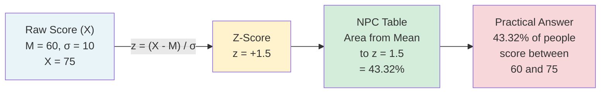
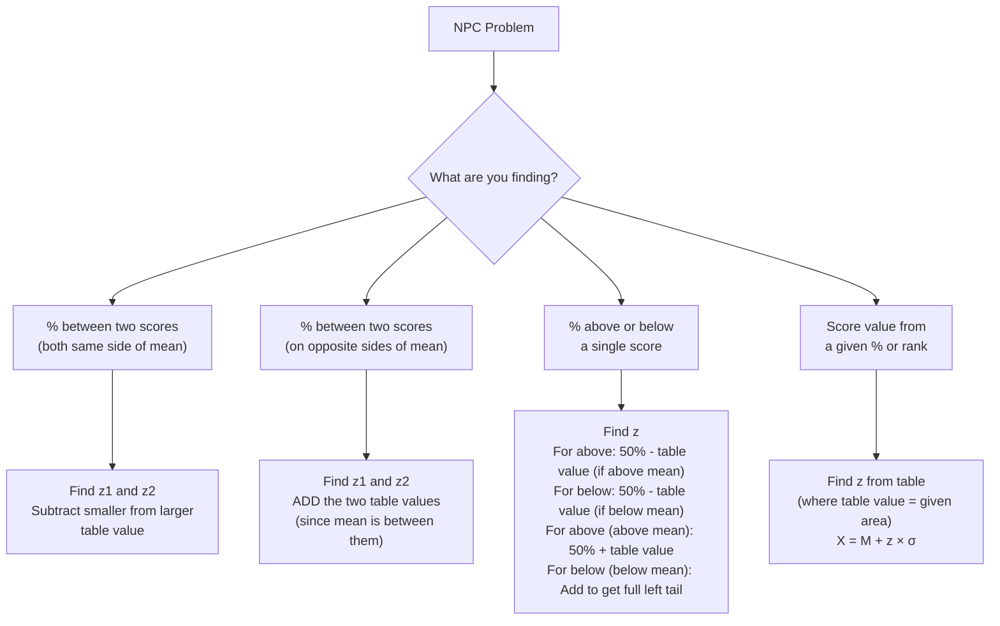

# NPC Table, Z-Scores, and the Standard Normal Distribution

> *"The z-score is the common language of all normal distributions — it translates every raw score into a universal position on the bell curve."*

The **Table of Areas Under the Normal Probability Curve** is the psychometrician's most essential tool. Once you understand how to convert raw scores to z-scores and read the NPC table, you can answer a remarkable range of practical questions: What percentage of students scored above a cutoff? How many individuals fall between two score points? What score corresponds to the 90th percentile?

This section bridges theory and practice, teaching you to **use the NPC mathematically**.

---

## 1. The Standard Normal Distribution

The NPC table is based on the **Standard Normal Distribution** — a special case of the normal distribution where:
- **Mean (μ) = 0**
- **Standard Deviation (σ) = 1**

Any normal distribution can be transformed into the standard normal by converting raw scores to **z-scores**. This standardisation allows us to use a single table for all normal distributions, regardless of the original mean and standard deviation.

---

## 2. The Z-Score Formula

The fundamental transformation from raw score to standard score is:

$$z = \frac{X - M}{\sigma}$$

Where:
- **z** = standard score (z-score)
- **X** = raw score
- **M** = mean of the distribution
- **σ** = standard deviation of the distribution

### What Does a Z-Score Mean?

| Z-score | Interpretation |
|---|---|
| z = 0 | Score exactly at the mean |
| z = +1.0 | Score is 1 SD above the mean |
| z = −1.5 | Score is 1.5 SD below the mean |
| z = +2.5 | Score is 2.5 SD above the mean (high score) |
| z = −3.0 | Score is 3 SD below the mean (very rare) |

**Key properties of z-scores:**
- The **mean of all z-scores = 0**
- The **standard deviation of z-scores = 1**
- Positive z indicates score above the mean (right side of curve)
- Negative z indicates score below the mean (left side of curve)
- Since the NPC is symmetric, we use the **absolute value of z** when consulting the table

---

## 3. Understanding the NPC Table

### 3.1 Table Structure

The NPC table provides the **area (as a proportion of 10,000 total) between the mean and a z-value**. The table has:
- **Rows**: The first decimal of z (0.0 through 5.0)
- **Columns**: The second decimal of z (.00 through .09)

| x/σ | .00 | .01 | .02 | .03 | .04 | .05 | .06 | .07 | .08 | .09 |
|---|---|---|---|---|---|---|---|---|---|---|
| 0.0 | 0000 | 0040 | 0080 | 0120 | 0160 | 0199 | 0239 | 0279 | 0319 | 0359 |
| 0.5 | 1915 | 1950 | 1985 | 2019 | 2054 | 2088 | 2123 | 2157 | 2190 | 2224 |
| 1.0 | 3413 | 3438 | 3461 | 3485 | 3508 | 3531 | 3554 | 3577 | 3599 | 3621 |
| 1.5 | 4332 | 4345 | 4357 | 4370 | 4383 | 4394 | 4406 | 4418 | 4429 | 4441 |
| 2.0 | 4772 | 4778 | 4783 | 4788 | 4793 | 4798 | 4803 | 4808 | 4812 | 4817 |
| 2.5 | 4938 | 4940 | 4941 | 4943 | 4945 | 4946 | 4948 | 4949 | 4951 | 4952 |
| 3.0 | 4986.5 | … | … | … | … | … | … | … | … | 4990.0 |

### 3.2 How to Read the Table

**Step 1:** Calculate z = (X − M) / σ  
**Step 2:** Find the row matching the first decimal of z  
**Step 3:** Find the column matching the second decimal of z  
**Step 4:** Read the area (out of 10,000 = percentage out of 100)

**Example:** Find area between mean and z = 1.56
- Row: 1.5
- Column: .06
- Value: **4406** → means **44.06%** of the distribution lies between the mean and z = 1.56

### 3.3 Converting Table Values to Percentages

Since the table uses a base of 10,000:
- Table value ÷ 100 = percentage
- Table value 3413 → **34.13%**
- Table value 4772 → **47.72%**

### 3.4 Key Reference Values to Memorise

| Z-value | Area (Mean to z) | Total within ±z | Why important |
|---|---|---|---|
| ±1.00 | 34.13% | 68.26% | 1σ rule |
| ±1.28 | 39.97% | 79.94% | 80th/20th percentile |
| ±1.64 | 44.95% | 89.90% | 90th/10th percentile |
| ±1.96 | 47.50% | 95.00% | 95% confidence interval |
| ±2.00 | 47.72% | 95.44% | 2σ rule |
| ±2.58 | 49.51% | 99.02% | 99% confidence interval |
| ±3.00 | 49.87% | 99.73% | 3σ rule |

---

## 4. Rules for Using the NPC Table

These four rules prevent errors when consulting the table:

### Rule 1: Always Convert to Z-Scores First
Every raw score must be converted to z using z = (X − M) / σ before consulting the table. The table only works with z-scores on the standard normal distribution.

### Rule 2: Mean is Always the Reference Point
All table values represent **distance from the mean (which = 0)**. The table gives area between the mean and the z-value, not between 0 and X.

### Rule 3: Convert to Percentages
Table values (in units of 10,000) can be divided by 100 to get percentages. This allows direct interpretation.

### Rule 4: Use Absolute Value of Z; Account for Sign Separately
Use the absolute value of z to look up the table value. Then apply the sign:
- **Positive z**: score is above the mean (right side)
- **Negative z**: score is below the mean (left side)

---

## 5. Types of NPC Problems and Solution Strategies

### Strategy Map

---

## 6. Step-by-Step Worked Examples

### Example A: Percentage Between Two Scores (Opposite Sides of Mean)

**Problem:** Adjustment test; N = 500, M = 40, σ = 8. What % of students scored between 36 and 48?

**Solution:**
1. z₁ = (36 − 40)/8 = −4/8 = **−0.50**
2. z₂ = (48 − 40)/8 = +8/8 = **+1.00**
3. Table value for |z| = 0.50: **1915** → 19.15%
4. Table value for |z| = 1.00: **3413** → 34.13%
5. Because scores are on **opposite sides of the mean**: ADD the areas
6. Total = 19.15 + 34.13 = **53.28%**

**Interpretation:** 53.28% of the 500 students scored between 36 and 48 on the adjustment test.

---

### Example B: Number of Cases Between Two Scores

**Problem:** Reading ability test; N = 200, M = 60, σ = 10. How many students scored between 40 and 70?

**Solution:**
1. z₁ = (40 − 60)/10 = **−2.00**
2. z₂ = (70 − 60)/10 = **+1.00**
3. Table value for |z| = 2.00: **4772** → 47.72%
4. Table value for |z| = 1.00: **3413** → 34.13%
5. Scores on opposite sides of mean → ADD: 47.72 + 34.13 = **81.85%**
6. Number of cases = (81.85/100) × 200 = **163.7 ≈ 164 students**

---

### Example C: Percentage Above or Below a Score

**Problem:** Intelligence test; N = 500, M = 100, σ = 16. How many students have IQ below 80 and above 120?

**Solution:**
1. z for X = 80: (80 − 100)/16 = **−1.25**
2. z for X = 120: (120 − 100)/16 = **+1.25**
3. Table value for |z| = 1.25: **3944** → 39.44%
4. Cases below 80: 50% − 39.44% = **10.56%**
5. Cases above 120: 50% − 39.44% = **10.56%** (by symmetry)
6. N below 80 = (10.56/100) × 500 = **52.8 ≈ 53 students**
7. N above 120 = **53 students**

**Key insight:** The symmetry of the NPC means the same z-value produces equal tails on both sides.

---

### Example D: Finding Score Limits for a Percentage

**Problem:** Achievement test; N = 75, M = 50, σ = 10. What are the score limits containing the middle 60% of students?

**Solution:**
1. Middle 60% means 30% on each side of the mean
2. Find z such that table value = 3000 (30%): z = **±0.84**
3. Lower limit: X₁ = M + z₁ × σ = 50 + (−0.84)(10) = 50 − 8.4 = **41.6 ≈ 42**
4. Upper limit: X₂ = M + z₂ × σ = 50 + (+0.84)(10) = 50 + 8.4 = **58.4 ≈ 58**
5. **Middle 60% scored between 42 and 58**

---

### Example E: Percentile Rank

**Problem:** M = 50, σ = 10. Sumit scored 75. Find his percentile rank.

**Solution:**
1. z = (75 − 50)/10 = **+2.50**
2. Table value for z = 2.50: **4938** → 49.38%
3. This is the area above the mean (right side)
4. Total area below 75 = 50% (left half) + 49.38% = **99.38% ≈ 99th percentile**

**Interpretation:** Sumit ranks at the 99th percentile — only about 1% of students scored higher.

---

## 7. The Z-Score Family: Derived Standard Scores

Z-scores serve as the foundation for several derived scoring systems commonly used in psychology:

| Score Type | Transformation | Mean | SD | Used in |
|---|---|---|---|---|
| **Z-score** | z = (X−M)/σ | 0 | 1 | Raw reference |
| **T-score** | T = 10z + 50 | 50 | 10 | MMPI, personality tests |
| **Deviation IQ** | IQ = 15z + 100 | 100 | 15 | Wechsler, Stanford-Binet |
| **Stanine** | S = 2z + 5 (bounded 1–9) | 5 | 2 | Educational testing |
| **Sten score** | 2z + 5.5 (bounded 1–10) | 5.5 | 2 | Personality inventories (16PF) |
| **Percentile** | Area below score | 50th | — | All norm-referenced tests |

**Indian context:** NIMHANS neuropsychological batteries and NCERT achievement tests use T-scores and percentiles for reporting, all derived from z-score transformations.

---

## 8. Common Student Errors and How to Avoid Them

| Error | Correct Approach |
|---|---|
| Forgetting to convert to z before using table | Always use z = (X−M)/σ first |
| Adding when should subtract (same-side scores) | Draw a sketch — if both z-values are on the same side of the mean, SUBTRACT areas |
| Subtracting when should add (opposite-side scores) | If z-values are on opposite sides (one negative, one positive), ADD areas |
| Using negative z directly in table lookup | Use absolute value of z; then account for direction separately |
| Forgetting to add 50% for "below a positive score" | Sketch the curve; shade the region you want; count systematically |

---

## 9. External Resources

### Wikipedia
- [Standard Score](https://en.wikipedia.org/wiki/Standard_score) — Z-score definition and properties
- [Standard Normal Table](https://en.wikipedia.org/wiki/Standard_normal_table) — Reading the NPC table

### Educational Videos
- [Khan Academy: Z-Scores](https://www.youtube.com/watch?v=XNgt7F6FqDU) — Computing and interpreting z-scores
- [StatQuest: Normal Distribution, Clearly Explained](https://www.youtube.com/watch?v=rzFX5NWojp0) — Visual explanation
- [Professor Leonard: Using z-Tables](https://www.youtube.com/watch?v=0I3a5dpY1xo) — Step-by-step table usage

### Research Papers
- Field, A. (2023). Discovering Statistics Using IBM SPSS Statistics. Chapter on normal distribution assumptions. Sage Publications.
- Ghasemi, A., & Zahediasl, S. (2012). Normality tests for statistical analysis: A guide for non-statisticians. *International Journal of Endocrinology and Metabolism, 10*(2), 486–489.

### Additional Resources
- [Z-Table Calculator](https://www.z-table.com/) — Interactive z-score to area converter
- [Khan Academy: Normal Distributions (full unit)](https://www.khanacademy.org/math/statistics-probability/modeling-distributions-of-data/normal-distributions-library/a/normal-distributions-review)
- [Statistics LibreTexts: The Standard Normal Distribution](https://stats.libretexts.org/Bookshelves/Introductory_Statistics/Introductory_Statistics_(Shafer_and_Zhang)/05%3A_Continuous_Random_Variables/5.02%3A_The_Standard_Normal_Distribution)
- [Real Statistics: Using the Normal Distribution](https://real-statistics.com/normal-distribution/normal-distribution-table/)
- [PSYC341 Online Statistics: Z-Scores](https://courses.washington.edu/psy315/pdf/z_scores.pdf)
- [Psychometric Resources: Score Conversions](https://psychometrics.wikia.org/wiki/Standard_score)

---

## 10. Self-Assessment Questions

**Q1 (Remember):** What is the formula for converting a raw score to a z-score? Define each symbol.

**Answer:** z = (X − M) / σ, where z = standard score, X = raw score, M = mean of the distribution, σ = standard deviation of the distribution.

**Q2 (Understand):** A student scores z = −1.5 on a psychology test. What does this mean, and is it a good or poor score?

**Answer:** A z-score of −1.5 means the student scored 1.5 standard deviations **below** the mean of the group. This places the student in approximately the bottom 6.7% of the distribution (50% − 43.32% = 6.68%), which is a relatively low score. However, whether it is "poor" depends on context — in a very competitive group, −1.5 SD might still represent a passing grade.

**Q3 (Apply):** An anxiety test has M = 50 and σ = 8. Priya scored 62. Find her percentile rank.

**Answer:**
1. z = (62 − 50)/8 = 12/8 = +1.50
2. Table value for z = 1.50: 4332 → 43.32%
3. Priya's percentile rank = 50% + 43.32% = **93.32% ≈ 93rd percentile**

Priya scores higher than approximately 93% of the standardisation sample.

**Q4 (Apply):** If M = 100 and σ = 15 (IQ test), how many students in a class of 1000 would score between 85 and 115?

**Answer:**
1. z for 85 = (85−100)/15 = −1.00 → table value: 34.13%
2. z for 115 = (115−100)/15 = +1.00 → table value: 34.13%
3. Scores on opposite sides of mean → ADD: 34.13 + 34.13 = 68.26%
4. N = (68.26/100) × 1000 = **682.6 ≈ 683 students**

**Q5 (Analyse):** Why is the mean of z-scores always 0, and the SD always 1? What is the practical value of this?

**Answer:** Z-scores standardise by subtracting the mean (centering the distribution at 0) and dividing by SD (scaling the spread to 1 unit). The practical value is that z-scores from completely different tests (different Ms and SDs) become **directly comparable**. A z = +1.5 on an anxiety test and z = +1.5 on an IQ test both represent the same relative standing — 1.5 SDs above the respective means. This enables cross-test comparisons and is the foundation of all normalised scoring systems.

---

## 11. Memory Aids

### Formula Mnemonic: "X Minus Mean, Divided by Sigma"
> **"eXercise Minus Main effort, Divided by Systematic variation"**
> z = (X − M) / σ

### Reading the Table: "Row then Column, Area from Mean"
1. **R**ow = first decimal of z (e.g., 1.5 for z = 1.56)
2. **C**olumn = second decimal (e.g., .06 for z = 1.56)
3. **A**rea = value at intersection (in units of 10,000 = %)

### Percentage Benchmarks — "28, 44, 50"
- From mean to ±1σ: **34.13** (≈ 34)
- From mean to ±2σ: **47.72** (≈ 48)
- From mean to ±3σ: **49.87** (≈ 50, practically)

---

## 12. Summary

The **NPC Table and Z-score system** enable a powerful set of calculations:
- Any raw score is converted to z = (X − M) / σ
- The table gives the **area between the mean and any z-value** (out of 10,000)
- Four rules govern correct table use: convert to z, use mean as reference, convert to percentages, use absolute z with sign applied separately
- Different problem types require different strategies: adding areas (opposite sides), subtracting areas (same side), or reverse-solving for X given a percentile
- Z-scores are the foundation for all standardised scoring systems (T-scores, IQ scales, stanines, percentiles) used in psychology and education

---

**Source PDFs**:  
- 📄 [Block-3/Unit-1.pdf - Pages 12–21](/pdfs/MPC-006%20Statistics%20in%20Psychology/Block-3/Unit-1.pdf)  
- 📚 MPC-006 Statistics in Psychology, Block 3: Normal Distribution
