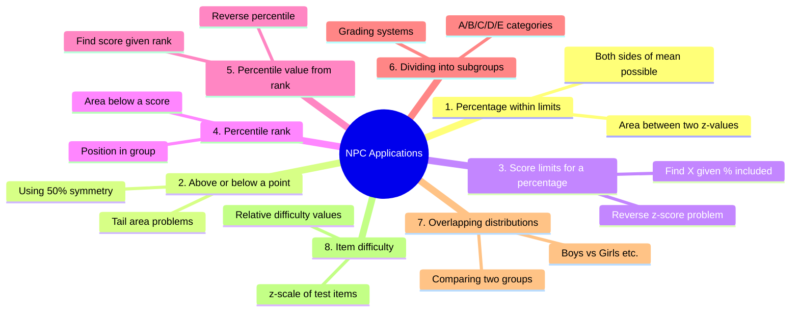
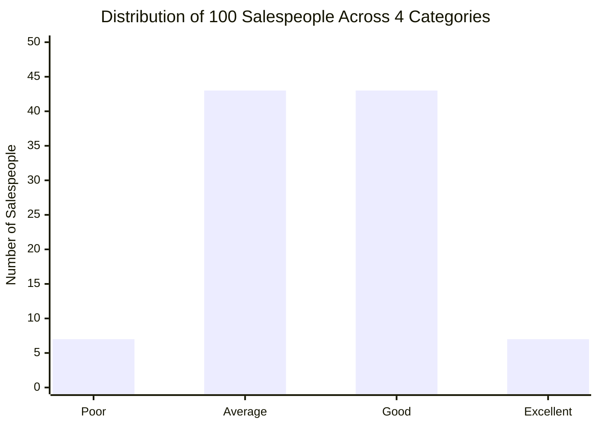

# Practical Applications of the Normal Probability Curve in Psychology and Education

> *"Statistics is not about numbers — it's about answering questions. The normal curve answers more questions about human behaviour than any other mathematical tool."*

In the previous sections, we learned what the normal distribution is and how to use the NPC table. Now we apply this knowledge to **eight real-world problems** that psychologists, teachers, and researchers routinely encounter. Each application reflects a distinct type of question you can answer using the normal curve.

---

## Overview: Eight Applications of the NPC

---

## Application 1: Percentage of Cases Within Given Limits

**Question type:** "What percentage of students scored between X₁ and X₂?"

**Procedure:**
1. Convert both scores to z-values
2. Look up table values for each |z|
3. If scores are on **opposite sides** of the mean → ADD the areas
4. If scores are on the **same side** of the mean → SUBTRACT the smaller area from the larger

### Worked Example 1

**Problem:** Adjustment test, N = 500, M = 40, σ = 8. What % scored between 36 and 48?

| Step | Calculation | Result |
|---|---|---|
| z₁ (for X=36) | (36−40)/8 = −0.50 | Area: 19.15% |
| z₂ (for X=48) | (48−40)/8 = +1.00 | Area: 34.13% |
| Type | Opposite sides of mean | ADD |
| **Answer** | 19.15 + 34.13 | **53.28%** |

### Worked Example 2

**Problem:** Reading test, N = 200, M = 60, σ = 10. How many students scored between 40 and 70?

| Step | Calculation | Result |
|---|---|---|
| z₁ (for X=40) | (40−60)/10 = −2.00 | Area: 47.72% |
| z₂ (for X=70) | (70−60)/10 = +1.00 | Area: 34.13% |
| Type | Opposite sides | ADD |
| Total % | 47.72 + 34.13 | 81.85% |
| **N in range** | (81.85/100) × 200 | **≈164 students** |

---

## Application 2: Percentage Above or Below a Given Score

**Question type:** "How many students scored above 120?" or "What % scored below 75?"

**Procedure:**
- Find z for the score
- Look up table value (area from mean to z)
- **For score ABOVE the mean:**
  - % below score = 50% + table value
  - % above score = 50% − table value
- **For score BELOW the mean:**
  - % above score = 50% + table value
  - % below score = 50% − table value

### Worked Example 3

**Problem:** IQ test, N = 500, M = 100, σ = 16. Find students with IQ below 80 and above 120.

| Score | z | Table value | Tail area | N in tail |
|---|---|---|---|---|
| X = 80 | (80−100)/16 = −1.25 | 39.44% | 50%−39.44% = 10.56% | **53 students** |
| X = 120 | (120−100)/16 = +1.25 | 39.44% | 50%−39.44% = 10.56% | **53 students** |

Both tails are equal due to the symmetry of the normal curve. Students with IQ < 80 or IQ > 120 represent the extreme 21.12% of the class.

---

## Application 3: Score Limits for a Given Percentage

**Question type:** "What are the score limits that contain the middle 60% of cases?"

**Procedure:**
1. Divide the desired percentage by 2 (since it's split equally around the mean)
2. Find the z-value in the NPC table that gives this area
3. Calculate X using: X = M ± (z × σ)

### Worked Example 4

**Problem:** Maths test, N = 75, M = 50, σ = 10. Find score limits for middle 60%.

| Step | Calculation |
|---|---|
| Half the % | 60% / 2 = 30% each side |
| z for 30% area | z = ±0.84 (from NPC table: value 3000 → z ≈ 0.84) |
| Lower limit | X₁ = 50 + (−0.84)(10) = 50 − 8.4 = **41.6 ≈ 42** |
| Upper limit | X₂ = 50 + (+0.84)(10) = 50 + 8.4 = **58.4 ≈ 58** |
| **Answer** | Middle 60% scored between **42 and 58** |

### Practice Problem

Using M = 50, σ = 10, find the score limits for:
- Middle 30% → z = ±0.39, X₁ = 46, X₂ = 54
- Middle 75% → z = ±1.15, X₁ = 38.5, X₂ = 61.5
- Middle 50% → z = ±0.67, X₁ = 43.3, X₂ = 56.7

---

## Application 4: Percentile Rank of an Individual

**Question type:** "Sumit scored 75; what is his percentile rank in the class?"

**Definition:** Percentile rank = percentage of cases that fall **below** a given score.

**Procedure:**
1. Find z = (X − M) / σ
2. Look up table value
3. For **positive z** (score above mean): PR = 50% + table value
4. For **negative z** (score below mean): PR = 50% − table value

### Worked Example 5

**Problem:** M = 50, σ = 10, Sumit scored 75. Find percentile rank.

| Step | Calculation |
|---|---|
| z | (75 − 50)/10 = +2.50 |
| Table value | 49.38% |
| PR (score above mean) | 50% + 49.38% = **99.38% ≈ 99th percentile** |

**Interpretation:** Sumit is at the 99th percentile — approximately 99% of students scored below him.

### Worked Example (Below Mean)

**Problem:** Rohit scored 85 on a 200-item test, M = 100, σ = 10. Find his percentile rank.

| Step | Calculation |
|---|---|
| z | (85 − 100)/10 = −1.50 |
| Table value | 43.32% |
| PR (score below mean) | 50% − 43.32% = **6.68% ≈ 7th percentile** |

---

## Application 5: Finding Percentile Value from Percentile Rank

**Question type:** "If Ramesh is at the 80th percentile, what score did he get?"

**Procedure:**
1. Determine area above the mean corresponding to the percentile rank
2. Find z from the NPC table (reverse lookup)
3. Compute: X = M + (z × σ)

### Worked Example 6

**Problem:** Intelligence test, M = 65, σ = 15. Ramesh's PR = 80. Find his score (P₈₀).

| Step | Calculation |
|---|---|
| Area above mean | 80% − 50% = 30% |
| z for 30% area | z = +0.85 (from table: value ≈ 3000) |
| Score | X = 65 + (0.85)(15) = 65 + 12.75 = **77.75 ≈ 78** |

**Answer:** Ramesh's P₈₀ score = 78

---

## Application 6: Dividing a Group into Subgroups (Grading)

**Question type:** "Assign 100 salespeople to 4 performance categories (Excellent, Good, Average, Poor)."

This is one of the most practically important applications — it underlies **norm-referenced grading systems** in education.

**Procedure:**
1. Determine the σ-distance of each category (total 6σ range ÷ number of categories)
2. Find the NPC table values for the cutting points
3. Calculate percentages for each category
4. Multiply by N to get numbers

### Worked Example 7: Four Categories

**Problem:** 100 salespeople, M = Rs. 10,00,000/week, σ = Rs. 500. Classify into Excellent, Good, Average, Poor.

Total range = ±3σ = 6σ. Four equal categories → each spans 6σ/4 = **1.5σ**

| Category | Limits | Area | N |
|---|---|---|---|
| Excellent | Above +1.5σ | 50% − 43.32% = 6.68% | **7** |
| Good | Mean to +1.5σ | 43.32% | **43** |
| Average | −1.5σ to Mean | 43.32% | **43** |
| Poor | Below −1.5σ | 50% − 43.32% = 6.68% | **7** |
| **Total** | | **100%** | **100** |

### Worked Example 8: Five Categories (ABCDE)

**Problem:** 1000 applicants to be classified into A, B, C, D, E in equal ability ranges.

Total range = 6σ. Five categories → each spans 6σ/5 = **1.2σ**

The middle category (C) straddles the mean: ±0.6σ around the mean.

| Category | Limits | Area | N |
|---|---|---|---|
| A (Top) | Above +1.8σ | 50% − 46.41% = 3.59% | **36** |
| B | +0.6σ to +1.8σ | 46.41% − 22.57% = 23.84% | **238** |
| C (Middle) | −0.6σ to +0.6σ | 22.57% + 22.57% = 45.14% | **452** |
| D | −1.8σ to −0.6σ | 23.84% | **238** |
| E (Bottom) | Below −1.8σ | 3.59% | **36** |
| **Total** | | **100%** | **1000** |

:::info Normal Grading in Indian Educational Context
The normal curve grading system is sometimes contrasted with **absolute grading** (fixed cutoffs) used in CBSE/ICSE boards. However, many Indian universities use normative grading for entrance tests (JEE percentiles, CAT percentiles) which directly implement the NPC logic. IGNOU uses mark ranges for letter grades, but the underlying psychometric rationale comes from normal distribution theory.
:::

---

## Application 7: Comparing Overlapping Distributions

**Question type:** "How many boys exceed the mean score of girls?"

This application is valuable for **group comparisons** in research — comparing performance of boys vs. girls, urban vs. rural students, or two treatment groups.

### Worked Example 9

**Problem:** Numerical ability test. Boys: N = 300, M = 26, σ = 6. Girls: N = 200, M = 28, σ = 8.

**Part 1: Boys who exceed the girls' mean (score > 28)**

| Step | Calculation |
|---|---|
| z for X=28 (using boys' M and σ) | (28−26)/6 = +0.33 |
| Table value | 12.93% |
| % boys above 28 | 50% − 12.93% = 37.07% |
| **N boys above 28** | (37.07/100) × 300 = **111 boys** |

**Part 2: Girls who fall below the boys' mean (score < 26)**

| Step | Calculation |
|---|---|
| z for X=26 (using girls' M and σ) | (26−28)/8 = −0.25 |
| Table value | 9.87% |
| % girls below 26 | 50% − 9.87% = 40.13% |
| **N girls below 26** | (40.13/100) × 200 = **80 girls** |

**Interpretation:** Despite boys having a lower mean, 111 boys still exceed the girls' mean due to the overlap in distributions. 80 girls score below the boys' mean. The two distributions substantially overlap.

---

## Application 8: Determining Relative Item Difficulty

**Question type:** "Which test items are hardest? By how much?"

In educational measurement, the **difficulty level** of a test item is measured by the **z-value of the percentage who answered it correctly**. The higher the z-value, the harder the item.

**Procedure:**
1. For each item, note the % who answered correctly
2. Items answered by more than 50% → scores pile up on the right → **negative z** (below mean difficulty)
3. Items answered by less than 50% → items are above average difficulty → **positive z**
4. Find z corresponding to the tail area

### Worked Example 10

**Problem:** Math test; Q.1 solved by 60%, Q.2 by 30%, Q.3 by 10%.

| Question | % Correct | Area from tail | z-value | Interpretation |
|---|---|---|---|---|
| Q.3 | 10% | 50% − 10% = 40% from mean | **+1.28σ** | Hardest item |
| Q.2 | 30% | 50% − 30% = 20% from mean | **+0.52σ** | Moderate difficulty |
| Q.1 | 60% | 60% − 50% = 10% to left of mean | **−0.25σ** | Easiest item |

**Difficulty differences:**
- Q.2 vs Q.3: 1.28 − 0.52 = **0.76σ difference**
- Q.1 vs Q.2: 0.52 − (−0.25) = **0.77σ difference**

These three items are approximately **equally spaced in difficulty** — an ideal property for a well-constructed achievement test.

---

## 9. Summary of All Eight Applications

| Application | What You Know | What You Find |
|---|---|---|
| 1. Within limits | Two scores (X₁, X₂) | % of cases between them |
| 2. Above/below | One score (X) | % above or below |
| 3. Score limits | A percentage | Score boundaries (X₁, X₂) |
| 4. Percentile rank | One score (X) | Position in group (%) |
| 5. Percentile value | A rank (PR) | Corresponding score (X) |
| 6. Grading | N and categories | N in each category |
| 7. Overlapping | Two groups | Cases exceeding/falling below each other's means |
| 8. Item difficulty | % passing each item | z-difficulty value |

---

## 10. External Resources

### Wikipedia
- [Percentile Rank](https://en.wikipedia.org/wiki/Percentile_rank) — Definition and calculation
- [Grading on a Curve](https://en.wikipedia.org/wiki/Grading_on_a_curve) — Normal curve grading systems

### Educational Videos
- [Khan Academy: Finding Percentiles](https://www.youtube.com/watch?v=M3PoPB4ZxvM) — Percentile rank from z-scores
- [StatQuest: Cumulative Probability Distributions](https://www.youtube.com/watch?v=YXLVjCKVP7U) — Visual explanation
- [CrashCourse Statistics: Probability Distributions](https://www.youtube.com/watch?v=oI3hZJqXJuc) — Real-world applications

### Research Papers
- Angoff, W. H. (1971). Scales, norms, and equivalent scores. In R. L. Thorndike (Ed.), *Educational Measurement* (2nd ed.). American Council on Education. — Classic treatment of NPC in educational measurement
- Mislevy, R. J., et al. (2020). *Psychometrics and the scholarship of teaching and learning*. In D. Sundre (Ed.), Modern Educational Measurement.

### Additional Resources
- [Khan Academy: Normal Distribution Practice Problems](https://www.khanacademy.org/math/ap-statistics/density-curves-normal-distribution-ap)
- [NCERT Statistics Textbook (Class XI)](https://ncert.nic.in/textbook/textbook.htm) — Contextual reference for Indian students
- [Statistics LibreTexts: Normal Distribution Applications](https://stats.libretexts.org/Courses)
- [Social Science Statistics: Online Normal Distribution Calculator](https://www.socscistatistics.com/tests/normaldistr/)
- [Psychometric Society](https://www.psychometricsociety.org/) — Research on psychological measurement

---

## 11. Self-Assessment Questions

**Q1 (Apply):** A personality test has M = 50, σ = 10. Ankita scored 62. What is her percentile rank?

**Answer:**
1. z = (62 − 50)/10 = +1.20
2. Table value for z = 1.20: 38.49%
3. PR = 50% + 38.49% = **88.49% ≈ 88th percentile**

Ankita scores higher than approximately 88% of the standardisation group.

**Q2 (Apply):** A teacher wants to assign A grades to the top 10% of her class (M = 60, σ = 12, N = 100). What is the minimum score to earn an A?

**Answer:**
1. Top 10% → area above mean to this point = 50% − 10% = 40% from mean
2. z for 40% area: z ≈ +1.28 (table value 3997 ≈ 40%)
3. Minimum A score: X = 60 + (1.28)(12) = 60 + 15.36 = **75.36 ≈ 75**

**Q3 (Apply):** A class of 500 students takes a math test (M = 55, σ = 15). How many scored between 40 and 70? (Note: 40 is below mean, 70 is above mean)

**Answer:**
1. z for 40 = (40−55)/15 = −1.00 → table value: 34.13%
2. z for 70 = (70−55)/15 = +1.00 → table value: 34.13%
3. Opposite sides → ADD: 34.13 + 34.13 = 68.26%
4. N = (68.26/100) × 500 = **341.3 ≈ 341 students**

**Q4 (Analyse):** On an achievement test, Item A is answered correctly by 80% of students and Item B by 15%. Which item is harder, and by how much in σ units?

**Answer:**
- Item A (80% correct): 80% > 50%, so the item is easy; area from mean = 80% − 50% = 30%; z = −0.84 (below mean difficulty — easy item)
- Item B (15% correct): 15% < 50%, so the item is hard; area from mean = 50% − 15% = 35%; z = +1.04 (above mean difficulty — hard item)
- Difficulty difference = 1.04 − (−0.84) = **1.88σ units**. Item B is substantially harder than Item A.

**Q5 (Apply):** Two groups take a verbal ability test. Group A: N=400, M=50, σ=8. Group B: N=300, M=55, σ=10. How many from Group A exceed Group B's mean?

**Answer:**
1. Group B's mean = 55. Find % of Group A scoring above 55.
2. z (using Group A's parameters) = (55−50)/8 = +0.625
3. Table value for z = 0.625: ≈ 23.41% (interpolate between z=0.62 and z=0.63)
4. % Group A above 55 = 50% − 23.41% = 26.59%
5. N = (26.59/100) × 400 = **≈106 people from Group A**

**Q6 (Evaluate):** A school assigns grades using normal curve: A = top 10%, B = next 20%, C = middle 40%, D = next 20%, F = bottom 10%. A student scored at the 62nd percentile. What grade do they get?

**Answer:**
- Bottom 10% → F (below 10th percentile)
- 10th–30th percentile → D
- 30th–70th percentile → C (middle 40%)
- 70th–90th percentile → B
- Above 90th percentile → A

**62nd percentile falls in the C range (30th–70th percentile)**. The student gets a **C**.

---

## 12. Memory Aids

### The "Tail, Middle, or Between?" Strategy
Before calculating, always ask:
1. **Between two points?** → Calculate two z's, add or subtract
2. **Above/below one point?** → Calculate one z, use 50% split
3. **Find the score?** → Reverse lookup z from area, then X = M + zσ
4. **Percentile rank?** → It's always "% below the score" → add or subtract from 50%

### Percentile Rank Quick Reference
| Score position | Formula |
|---|---|
| Above the mean | PR = 50% + table value |
| Below the mean | PR = 50% − table value |
| At the mean | PR = 50% (exactly) |

### Grading by NPC — "6 Sigma Rule"
For n equal categories: each spans **6σ / n**
- 3 categories: 2σ each (−3σ to −1σ, −1σ to +1σ, +1σ to +3σ) → 15.87%, 68.26%, 15.87%
- 5 categories: 1.2σ each → 3.59%, 23.84%, 45.14%, 23.84%, 3.59%

---

## 13. Summary

The NPC has **eight major practical applications** in psychology and education:
1. Determining the **percentage between two scores**
2. Finding **percentages above or below a cutpoint**
3. Identifying **score limits** containing a specified percentage
4. Computing **percentile ranks** (position in a group)
5. Finding the **score corresponding to a percentile rank**
6. **Classifying and grading** individuals into performance categories
7. **Comparing overlapping distributions** between two groups
8. Assessing **relative item difficulty** in test construction

All applications follow the same core workflow: compute z-scores, consult the NPC table, apply the 50% bilateral split, and interpret in context.

---

**Source PDFs**:  
- 📄 [Block-3/Unit-1.pdf - Pages 14–28](/pdfs/MPC-006%20Statistics%20in%20Psychology/Block-3/Unit-1.pdf)  
- 📚 MPC-006 Statistics in Psychology, Block 3: Normal Distribution
