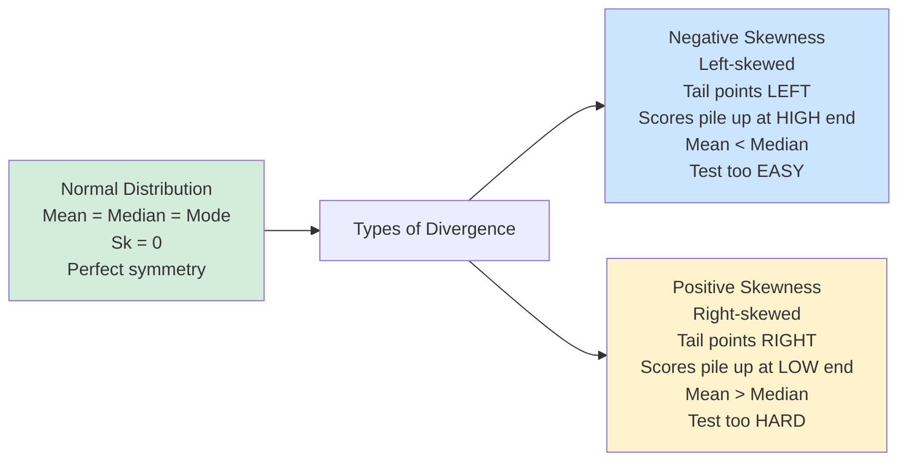
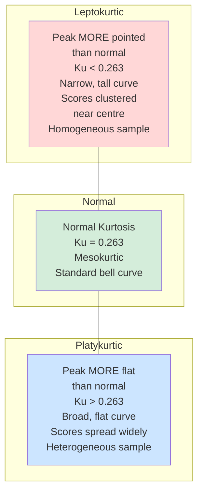
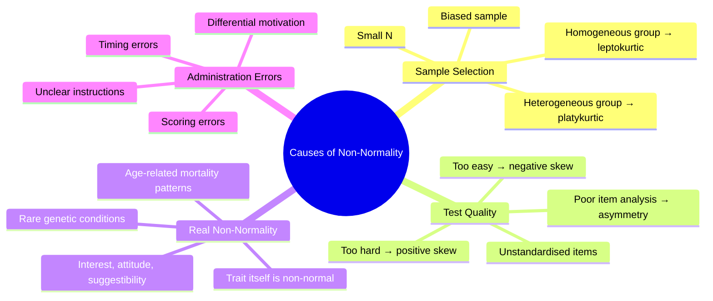

# Skewness, Kurtosis, and Non-Normal Distributions in Psychology

> *"The shape of a distribution is not cosmetic — it tells you something fundamental about the nature of the trait, the quality of the test, and the composition of the sample."*

Real-world psychological data is rarely perfectly normal. When distributions deviate from the bell curve, we call this **divergence in normality**. Understanding skewness (asymmetry) and kurtosis (peakedness) is essential for test construction, interpreting research data, and making valid statistical inferences. This unit covers both concepts in depth.

---

## 1. What Is Divergence in Normality?

In the normal curve model, the mean, median, and mode all coincide, and the distribution is perfectly symmetric with characteristic peakedness. When real data deviates from this ideal, two main types of divergence occur:

1. **Skewness** — asymmetry (lack of balance between left and right halves)
2. **Kurtosis** — abnormal peakedness or flatness of the distribution

Both can occur independently or simultaneously. A distribution can be both skewed and show abnormal kurtosis.

---

## 2. Skewness: Asymmetry in the Distribution

### 2.1 Definition

A distribution is said to be **skewed** when the mean and median fall at different points — that is, the balance point is shifted to one side. In a perfect normal distribution, Sₖ = 0 (no skewness). In practice, skewness tells us whether scores are piling up at one end of the scale.

:::info Three Measures of Central Tendency in Skewed Distributions
- **Normal**: Mean = Median = Mode
- **Positively skewed**: Mode < Median < Mean (mean is pulled toward the long right tail)
- **Negatively skewed**: Mean < Median < Mode (mean is pulled toward the long left tail)
:::

### 2.2 Types of Skewness

### 2.3 Negative Skewness (Left-Skewed)

**Characteristics:**
- Scores are **massed at the high end** of the scale
- The **left tail is longer** (more extreme low scores stretch out leftward)
- **Median > Mean** (the mean is pulled down by the few extreme low scores)
- The "hump" of the distribution is on the right side

**When does this occur?**
- Test is **too easy** — most students score high, few score very low
- Selection effect: If only high-achieving students are sampled
- Ceiling effect: The test cannot measure beyond a certain top score
- Mature adults in developmental tasks

**Example:** If you administer a basic arithmetic test to graduate students, most will score near 100%, and only a few will score low — creating a left-skewed distribution.

**Diagram description:** The peak of the curve is shifted to the right; a long tail extends to the lower (left) end.

### 2.4 Positive Skewness (Right-Skewed)

**Characteristics:**
- Scores are **massed at the low end** of the scale
- The **right tail is longer** (more extreme high scores stretch rightward)
- **Mean > Median** (the mean is pulled up by a few very high scores)
- The "hump" of the distribution is on the left side

**When does this occur?**
- Test is **too difficult** — most students score low, only a few score very high
- Floor effect: The test cannot distinguish between low-scoring individuals
- Rare, highly valued traits (extreme wealth, exceptional intelligence)
- Reaction time distributions (most responses are fast; a few are very slow)

**Example:** In a very difficult competitive examination, most students score low and only a handful score high, creating a right-skewed distribution.

---

## 3. Kurtosis: Abnormal Peakedness

### 3.1 Definition

**Kurtosis** refers to divergence in the **height and peakedness** of the curve relative to the normal distribution. It specifically describes whether the distribution is more pointed or flatter than the normal bell curve.

**Normal kurtosis:** Kᵤ = **0.263** (using the percentile formula)

### 3.2 Types of Kurtosis

### 3.3 Leptokurtosis

**Characteristics:**
- Distribution is **more peaked** (narrow, tall) than normal
- **Kᵤ < 0.263**
- Scores are **tightly clustered near the mean**
- Tails are thinner than normal (fewer extreme scores)
- Suggests a **homogeneous sample**

**Analogy (from IGNOU text):** Imagine a normal curve made of steel wire. If you **push both ends toward the centre**, the peak rises and narrows — this is leptokurtosis.

**When does it occur?**
- Small, homogeneous group (similar ability levels)
- Test designed for a specific, narrow ability range
- Restricted range in the sample

**Real-world example:** Testing a group of expert radiologists on radiograph interpretation — since they are all experts, scores cluster tightly near the top with little spread.

### 3.4 Platykurtosis

**Characteristics:**
- Distribution is **flatter** (broader, lower peak) than normal
- **Kᵤ > 0.263**
- Scores are **spread across the full range**
- Tails are heavier than normal (more extreme scores)
- Suggests a **heterogeneous sample**

**Analogy (from IGNOU text):** Imagine pressing down on the **top** of the wire curve — the peak flattens out and spreads → platykurtosis.

**When does it occur?**
- Large, heterogeneous group (wide range of ability levels)
- Broad-range test measuring diverse skills
- Mixed sample from different educational or demographic backgrounds

**Real-world example:** Administering the same IQ test to a combined group of primary school students, college students, and professors — scores spread widely, creating a flat distribution.

### 3.5 Kurtosis Decision Table

| Kᵤ Value | Distribution Type | What It Suggests |
|---|---|---|
| Kᵤ = 0.263 | **Mesokurtic** (Normal) | Normal peakedness |
| Kᵤ < 0.263 | **Leptokurtic** | Peaked; homogeneous sample |
| Kᵤ > 0.263 | **Platykurtic** | Flat; heterogeneous sample |

:::tip Visual Memory Aid
- **Lepto**kurtic = **L**ean and **T**all (like a leptoskeptic professor, very pointy-headed 🔺)
- **Platy**kurtic = **P**ancake-**F**lat (platypus is flat 🦆)
:::

---

## 4. Measuring Divergence

### 4.1 Measuring Skewness

**Method 1 — Observation (Inspection of Frequency Polygon):**
- Look at the tails of the distribution graph
- **Longer tail toward high values** (right) → **positive skewness**
- **Longer tail toward low values** (left) → **negative skewness**

**Method 2 — Statistical Formula (using Mean and Median):**

$$S_K = \frac{3(\text{Mean} - \text{Median})}{\sigma}$$

| Sₖ Value | Interpretation |
|---|---|
| Sₖ = 0 | Perfect normal distribution |
| Sₖ > 0 | Positively skewed (mean > median) |
| Sₖ < 0 | Negatively skewed (mean < median) |

**Method 3 — Percentile Formula:**

$$S_K = \frac{P_{90} + P_{10} - 2P_{50}}{P_{90} - P_{10}}$$

Where P₁₀, P₅₀, P₉₀ are the 10th, 50th, and 90th percentiles.

**Note:** The two skewness formulas are **not mathematically equivalent** and may yield slightly different values. Both are used in psychological research.

### 4.2 Measuring Kurtosis

**Method 1 — Inspection:**
- Compare the peak of the distribution to the normal bell shape
- More narrow and peaked → leptokurtic
- More flat and spread → platykurtic

**Method 2 — Statistical Formula:**

$$K_U = \frac{Q}{P_{90} - P_{10}}$$

Where:
- **Q** = Quartile Deviation (semi-interquartile range = (Q₃ − Q₁)/2)
- **P₁₀** = 10th percentile
- **P₉₀** = 90th percentile

**Decision rule:**
- Kᵤ = 0.263 → Normal
- Kᵤ < 0.263 → Leptokurtic
- Kᵤ > 0.263 → Platykurtic

---

## 5. Factors Causing Divergence from Normality

Four major causes explain why distributions deviate from the ideal normal shape:

### 5.1 Selection of Sample

- **Small sample**: Skewness and extreme kurtosis are common by chance
- **Biased sample**: Non-representative selection introduces systematic distortion
- **Homogeneous group**: Narrow ability range → **leptokurtic**
- **Heterogeneous group**: Wide ability range → **platykurtic**

### 5.2 Poorly Made Tests

- **Test too easy**: Most students score at the high end → **negative skewness**
- **Test too difficult**: Most students score at the low end → **positive skewness**
- Poor item selection (items without good discrimination) → asymmetric distributions
- Unstandardised test administration → random deviations

### 5.3 Non-Normal Traits

Some psychological and social traits are **genuinely non-normally distributed**:
- **Attitude and interest scores**: Often show bimodal or skewed distributions (people tend to have strong opinions one way or another)
- **Socioeconomic status**: Positively skewed (wealth is not normally distributed)
- **Death rates** from certain conditions in extreme ages: Skewed toward specific age ranges
- **Reaction time**: Positively skewed (most responses fast; some very slow)
- **Psychopathology measures**: Often skewed (most people score low/healthy, few score very high)

### 5.4 Errors in Test Construction and Administration

- Unclear instructions create variable interpretations → random distribution distortion
- Timing errors (too much/little time) affect who finishes and how
- Scoring errors introduce systematic bias
- Differential motivation across subgroups creates artificial skewness

---

## 6. Significance for Teachers and Researchers

Understanding skewness and kurtosis allows a teacher or researcher to:

| What You Observe | What You Conclude | What You Do |
|---|---|---|
| Positive skew in test results | Test was too difficult | Revise to add easier items |
| Negative skew in test results | Test was too easy | Add more challenging items |
| Leptokurtic distribution | Group is too homogeneous | Sample more broadly |
| Platykurtic distribution | Group is highly heterogeneous | Consider stratifying the sample |
| High Sₖ but normal Kᵤ | Systematic scoring bias | Check for administration errors |
| Distribution far from normal | Parametric tests may be violated | Use non-parametric alternatives |

### 6.1 Implications for Statistical Analysis

When distributions deviate significantly from normality:
- **Parametric tests** (t-test, ANOVA, Pearson r) may give inaccurate results
- **Non-parametric alternatives** (Mann-Whitney U, Kruskal-Wallis, Spearman ρ) should be considered
- **Data transformation** (log, square root, reciprocal) can sometimes normalise data
- Modern software (SPSS, R) tests normality automatically (Kolmogorov-Smirnov, Shapiro-Wilk tests)

---

## 7. Indian Context: Non-Normality in Indian Psychological Research

Non-normal distributions are particularly common in Indian research contexts due to:

1. **Achievement score distributions**: In India's highly competitive educational system, test scores often show **positive skewness** in competitive examinations (JEE, NEET, CAT) because most examinees score low relative to the topper, with a few extreme scorers at the high end.

2. **Socioeconomic measures**: India's significant wealth inequality means SES measures show strong **positive skewness** — most families cluster at lower-middle income, with a long right tail of wealthy families.

3. **Rural-urban samples**: Studies mixing rural and urban participants often show **platykurtic** distributions because these two groups differ substantially on many psychological measures.

4. **NIMHANS research**: Studies on psychopathology in India typically show highly right-skewed distributions on symptom measures — most community participants score low (healthy), with a small tail of clinically significant cases.

5. **Standardisation studies**: NCERT and other bodies routinely check achievement test distributions for skewness and kurtosis as part of quality control.

---

## 8. External Resources

### Wikipedia
- [Skewness](https://en.wikipedia.org/wiki/Skewness) — Mathematical definitions and measures
- [Kurtosis](https://en.wikipedia.org/wiki/Kurtosis) — Types and formulas
- [Normal Distribution — Departures from normality](https://en.wikipedia.org/wiki/Normal_distribution#Normality_tests)

### Educational Videos
- [StatQuest: Skewness and Kurtosis Explained](https://www.youtube.com/watch?v=HnMGKsupF8Q) — Clear visual explanation
- [CrashCourse Statistics: Shapes of Distributions](https://www.youtube.com/watch?v=bPFNxD3Yg6U) — Introductory overview
- [Khan Academy: Comparing Distributions](https://www.khanacademy.org/math/ap-statistics/quantitative-data-ap/comparing-distributions/v/comparing-distributions) — Visual comparisons

### Research Papers
- Westfall, P. H. (2014). Kurtosis as peakedness, 1905–2014. R.I.P. *The American Statistician, 68*(3), 191–195. — Important reframing of kurtosis
- DeCarlo, L. T. (1997). On the meaning and use of kurtosis. *Psychological Methods, 2*(3), 292–307. — Essential reading for psychologists

### Additional Resources
- [Statistics How To: Skewness](https://www.statisticshowto.com/probability-and-statistics/skewed-distribution/)
- [Statistics How To: Kurtosis](https://www.statisticshowto.com/probability-and-statistics/statistics-definitions/kurtosis-leptokurtic-platykurtic/)
- [SPSS Tutorials: Skewness and Kurtosis](https://www.spss-tutorials.com/skewness/)
- [Real Statistics: Testing for Normality](https://real-statistics.com/tests-normality-and-symmetry/)
- [Psych Stats: Non-Normal Distributions](https://statistics.laerd.com/statistical-guides/measures-skewness-kurtosis.php)

---

## 9. Self-Assessment Questions

**Q1 (Remember):** What is the formula for measuring skewness using mean, median, and standard deviation? What value indicates a perfectly normal distribution?

**Answer:** Sₖ = 3(Mean − Median) / σ. A perfectly normal distribution has **Sₖ = 0** (mean equals median, no asymmetry).

**Q2 (Understand):** A teacher administers a test and finds that the mean score is 45 and the median is 55. What type of skewness is present, and what does this tell the teacher about the test?

**Answer:** When Mean (45) < Median (55), the distribution is **negatively skewed** (left-skewed). This tells the teacher that the test was **too easy** — most students scored high, and only a few scored low. The long tail extends to the left (low end). The teacher should revise the test to add more difficult items to improve discrimination.

**Q3 (Apply):** A distribution has Kᵤ = 0.18. Is it leptokurtic, mesokurtic, or platykurtic? What does this suggest about the sample?

**Answer:** Since Kᵤ = 0.18 < 0.263 (normal value), the distribution is **leptokurtic** — more peaked than normal. This suggests the sample is **homogeneous** — individuals are similar in the trait being measured, so scores cluster tightly near the mean with fewer extreme scores. This may result from a biased sample selection or testing a specialised group.

**Q4 (Analyse):** A psychology researcher finds positive skewness (Sₖ = +0.8) in a measure of depression in a community sample. Provide three possible explanations for this skewness.

**Answer:**
1. **Nature of the trait**: Depression is genuinely positively skewed in community samples — most people score low (not depressed), and only a minority score high (clinically depressed). The trait itself is non-normal.
2. **Floor effect**: The measurement scale may have a floor (minimum = 0) that limits how low scores can go, while the scale extends higher.
3. **Sampling bias**: If the sample disproportionately included healthy individuals or if those with severe depression dropped out, the distribution would show positive skew.

**Q5 (Evaluate):** When a distribution is both positively skewed and platykurtic, what challenges does this pose for a researcher using parametric statistical tests?

**Answer:** Parametric tests (t-test, ANOVA, Pearson r) assume normality. Positive skewness violates the symmetry assumption, and platykurtosis indicates heavier tails than expected — both increase the likelihood of **Type I errors** (falsely detecting significant effects). The researcher should: (1) test normality formally (Shapiro-Wilk test), (2) consider data transformation (log or square root) to normalise, or (3) use **non-parametric alternatives** (Mann-Whitney U, Kruskal-Wallis) that do not require normality assumptions.

---

## 10. Memory Aids

### Skewness — "Where the Tail Goes, That's Where the Skew Goes"
- Long tail on the **RIGHT** → **Positive** skewness (right-skewed)
- Long tail on the **LEFT** → **Negative** skewness (left-skewed)
- Test **TOO HARD** → most scores **LOW** → right tail → **POSITIVE skew**
- Test **TOO EASY** → most scores **HIGH** → left tail → **NEGATIVE skew**

### Kurtosis — "LEPTO is Thin, PLATY is Flat"
| Type | Shape | Sample | Kᵤ |
|---|---|---|---|
| **Lepto**kurtic | Thin, tall peak | Homogeneous | < 0.263 |
| **Meso**kurtic | Normal bell | Normal sample | = 0.263 |
| **Platy**kurtic | Flat, wide | Heterogeneous | > 0.263 |

**Memory hook:** 
- "**Lepto**" comes from Greek *leptos* = thin/slender
- "**Platy**" comes from Greek *platys* = flat/wide (like a platypus)

### The Mean-Median Skewness Rule
| Relationship | Skewness | Direction |
|---|---|---|
| Mean = Median | None (Sₖ = 0) | Normal |
| Mean > Median | Positive | Right tail |
| Mean < Median | Negative | Left tail |

---

## 11. Comprehensive Comparison Table

| Feature | Normal | Positive Skewness | Negative Skewness | Leptokurtosis | Platykurtosis |
|---|---|---|---|---|---|
| Shape | Bell | Right-tailed | Left-tailed | Tall/narrow | Flat/wide |
| Mean-Median | Equal | Mean > Median | Mean < Median | Equal | Equal |
| Peak | Normal | Shifted left | Shifted right | Higher | Lower |
| Tails | Normal | Long right tail | Long left tail | Thin tails | Heavy tails |
| Kᵤ | 0.263 | Varies | Varies | < 0.263 | > 0.263 |
| Sₖ | 0 | > 0 | < 0 | 0 | 0 |
| Cause | Good test | Test too hard | Test too easy | Homogeneous group | Heterogeneous group |

---

## 12. Summary

Distributions diverge from normality in two primary ways:

**Skewness** (asymmetry) occurs when mean and median differ. **Positive skewness** (right tail, mean > median) suggests the test was too difficult or the trait is rare. **Negative skewness** (left tail, mean < median) suggests the test was too easy. Skewness is measured by Sₖ = 3(Mean − Median)/σ; a normal distribution has Sₖ = 0.

**Kurtosis** (peakedness) reflects the concentration of scores. **Leptokurtosis** (Kᵤ < 0.263) indicates a tall, narrow peak from a homogeneous sample. **Platykurtosis** (Kᵤ > 0.263) indicates a flat, wide distribution from a heterogeneous sample. Normal kurtosis is Kᵤ = 0.263.

Common causes include biased sampling, poorly constructed tests (too easy or hard), genuinely non-normal traits, and administration errors. Both types of divergence have critical implications for test construction, statistical analysis, and the interpretation of psychological research findings.

---

**Source PDFs**:  
- 📄 [Block-3/Unit-1.pdf - Pages 29–35](/pdfs/MPC-006%20Statistics%20in%20Psychology/Block-3/Unit-1.pdf)  
- 📚 MPC-006 Statistics in Psychology, Block 3: Normal Distribution
