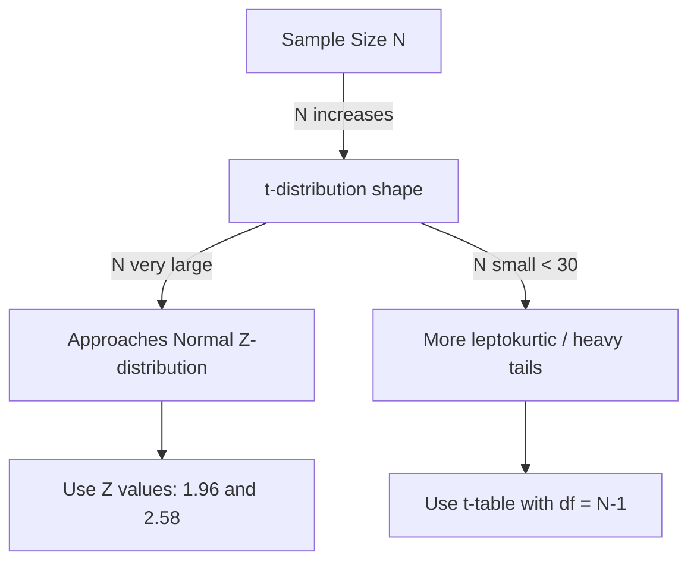

import Tabs from '@theme/Tabs';
import TabItem from '@theme/TabItem';

# Parameters, Statistics, and Standard Error of the Mean

> *"Statistics is the grammar of science."* — Karl Pearson

In psychological research, we rarely study entire populations. Instead, we draw samples and use sample-based measurements—called **statistics**—to estimate population-level truths called **parameters**. The bridge between these two worlds is the **Standard Error of the Mean**, a foundational concept in inferential statistics.

---

## 📄 Source Material

**Source PDFs:**
- 📄 [Block-3/Unit-2.pdf — Pages 36–55](/pdfs/MPC-006%20Statistics%20in%20Psychology/Block-3/Unit-2.pdf)
- 📚 MPC-006 Statistics in Psychology, Block 3

---

## 1. The Core Problem: From Sample to Population

Imagine you want to know the average IQ of all Class VIII students in your city. You cannot test every single student — that's the **population**. Instead, you test 50 students (your **sample**) and find their mean IQ is 105.

Can you use this sample mean to say something about the entire population? **Yes — under specific conditions.** That condition is: *how well does the sample mean represent the population mean?*

This question is the heart of **inferential statistics**.

---

## 2. Estimates vs. Parameters

### 2.1 Estimates (Statistics)
Statistical measurements obtained **from a sample** are called **estimates** or **statistics**.

| Statistic | Symbol |
|-----------|--------|
| Sample Mean | M |
| Sample Standard Deviation | S.D. or σ |
| Sample Correlation | r |

### 2.2 Parameters
Statistical measurements derived from the **entire population** are called **parameters** or **true measures**.

| Parameter | Symbol |
|-----------|--------|
| Population Mean | M̄ or μ (Mu) |
| Population Standard Deviation | σ̄ |
| Population Correlation | r̄ or η |

**Key insight:** In practice, we almost never know the true parameters. We *estimate* them from samples, and the reliability of this estimation is measured by the **Standard Error**.

---

## 3. Significance and Level of Significance

### 3.1 What is Significance?
The **significance** of a sample statistic refers to the degree of *trustworthiness* — how confidently we can use the sample mean to estimate the population mean (Mpop).

When a sample is drawn, the sample mean (M) may differ from Mpop simply due to chance differences in who ended up in the sample. If this gap is small and negligible, the sample mean is **significant** (trustworthy).

### 3.2 Levels of Significance
In psychology and behavioural sciences, two levels of significance are predominantly used:

| Level | Probability | Critical Z Value | Meaning |
|-------|-------------|------------------|---------|
| 0.05 level (95%) | p = 0.05 | ±1.96 | 5 times in 100, results due to chance |
| 0.01 level (99%) | p = 0.01 | ±2.58 | 1 time in 100, results due to chance |

:::important Key Rule
- If a result is significant at 0.01, it is **automatically significant at 0.05**
- If significant at 0.05, it may **NOT** be significant at 0.01
- The 0.01 level is the **more rigorous standard**
:::

---

## 4. Sampling Error and Standard Error

Every observed score contains two types of errors:

```
True Score (X_T) = Observed Score (X_0) ± Error (E)
Error (E) = Measurement Error + Statistics Error
```

### 4.1 Sampling Error
The **sampling error** is the difference between the population mean (Mpop) and the sample mean (M).

$$\text{Sampling Error} = M_{pop} - M$$

The smaller this difference, the better the sample represents the population.

### 4.2 Standard Error (S.E.)
Standard error is the **standard deviation of the sampling distribution of means** — it measures the variability of sample means around the population mean across repeated sampling.

$$S.E._M = \frac{\sigma}{\sqrt{N}}$$

Where:
- σ = standard deviation of the population (or sample, in practice)
- N = sample size

**Standard error depends on TWO factors:**
1. **Variability of scores** (σ): More homogeneous population → smaller S.E.
2. **Sample size** (N): Larger sample → smaller S.E.

:::note Conceptual Summary
If the population is homogeneous AND the sample is large (N > 500), the S.E. approaches zero — meaning the sample mean is a near-perfect estimate of Mpop.
:::

---

## 5. The 't' Ratio

### 5.1 What is the t-Ratio?
The **t-ratio** (also called Student's t) is a standardized score that indicates how far the sample mean deviates from the population mean, measured in S.E. units:

$$t = \frac{M - M_{pop}}{S.E._M}$$

- **Large t**: Sample mean is unreliable / far from Mpop
- **Small t**: Sample mean is reliable / close to Mpop

:::info History
The t-ratio was developed by **W.S. Gossett** (1908), an English statistician working for the Guinness brewery, who published under the pen name **"Student"** — which is why it's called *Student's t*.
:::

### 5.2 The t-Distribution
The t-distribution is a family of bell-shaped distributions that:
- Has **mean = 0** and **SD = ±σ_t**
- Varies in **kurtosis** depending on sample size
- Becomes **increasingly leptokurtic** as N decreases
- Approaches **normal distribution** as N → large (N > 500)



### 5.3 Degrees of Freedom (df)
**Degrees of freedom** represent the number of values free to vary after a constraint is imposed.

For most one-sample tests: **df = N – 1**

**Conceptual Example:** If 4 numbers must sum to 20, only 3 can be freely chosen — the 4th is constrained. So df = 3 (= N – 1 = 4 – 1).

**Why it matters:**
- In large samples (N > 30): N and N-1 give virtually identical S.E. values
- In small samples (N ≤ 30): Using N instead of N-1 causes significant error in S.E. calculation — always use N-1

| Sample Context | df Formula |
|---------------|------------|
| One-sample t-test | N – 1 |
| Independent two-sample t-test | (N₁ – 1) + (N₂ – 1) = N₁ + N₂ – 2 |
| Computing SD | N – 1 |
| Computing correlation | N – 2 |

---

## 6. Standard Error: Large vs. Small Samples

### 6.1 Large Sample (N > 30)

$$S.E._M = \frac{\sigma}{\sqrt{N}}$$

**Example:** A reasoning test given to 225 boys; M = 40, σ = 12.
$$S.E._M = \frac{12}{\sqrt{225}} = \frac{12}{15} = 0.80$$

At 95% confidence: Range = M ± 1.96 × S.E. = 40 ± 1.57 → [38.43, 41.57]

### 6.2 Small Sample (N ≤ 30)

$$S.E._M = \frac{\sigma}{\sqrt{N-1}}$$

**Example:** 17 students on a word cancellation test; M = 58, σ = 8.
$$S.E._M = \frac{8}{\sqrt{16}} = \frac{8}{4} = 2.0$$

For 16 df at .01 level, t-table value = 2.92. Our obtained t = 2.00 < 2.92 → sample mean is trustworthy at 99% confidence.

---

## 7. Diagram: Full Inferential Logic


---

## 8. Real-World Applications in Psychology

### Clinical Research
Standard error is used to determine whether a therapy-induced change in symptom scores reflects a **real treatment effect** or mere sampling fluctuation. A small S.E. means greater confidence that the observed mean change is genuine.

### Educational Assessment
IGNOU, NCERT, and NIMHANS studies use S.E. to set **confidence intervals around national averages** for academic achievement, IQ, and mental health screening scores.

### Indian Context
In large-scale psychological surveys across India's heterogeneous population (rural/urban, linguistic diversity), researchers must carefully account for S.E. — smaller samples from homogeneous sub-groups may be more reliable than large, heterogeneous national samples.

---

## 🌐 External Resources

### Wikipedia
- [Standard Error](https://en.wikipedia.org/wiki/Standard_error) — Foundational overview
- [Student's t-distribution](https://en.wikipedia.org/wiki/Student%27s_t-distribution) — Mathematical properties
- [Degrees of freedom (statistics)](https://en.wikipedia.org/wiki/Degrees_of_freedom_(statistics)) — Conceptual explanation

### Educational Videos
- 🎥 [Standard Error of the Mean — StatQuest (Josh Starmer)](https://www.youtube.com/watch?v=XNgt7F6FqDU) — Highly visual, beginner-friendly
- 🎥 [t-Tests — CrashCourse Statistics](https://www.youtube.com/watch?v=0Pd3dc1GcHc)

### Research Articles (2020–2024)
- Lakens, D. (2021). [Practical recommendations for using effect sizes and confidence intervals](https://doi.org/10.1016/j.jecp.2021.105233). *Journal of Experimental Child Psychology.*
- Cumming, G. (2022). The new statistics: Estimation thinking for better research. *Psychological Science.*

### Textbooks
- [NIST/SEMATECH e-Handbook of Statistical Methods](https://www.itl.nist.gov/div898/handbook/pmc/section3/pmc321.htm) — Standard error of the mean
- [OpenStax Statistics — Confidence Intervals](https://openstax.org/books/statistics/pages/8-introduction)
- [Khan Academy — Sampling Distributions](https://www.khanacademy.org/math/statistics-probability/sampling-distributions-library)
- [Scribbr — Standard Error Guide](https://www.scribbr.com/statistics/standard-error/)

---

## 🧠 Memory Aids

### Mnemonic: "PSET" for Inferential Statistics Steps
> **P**arameter → **S**ample → **E**stimate → **T**est

1. **P**arameter: What you want to know (population truth)
2. **S**ample: What you actually measure
3. **E**stimate: Sample statistic (M, SD, r)
4. **T**est: Use S.E. to evaluate trustworthiness

### Formula Memory Aid
$$S.E._M = \frac{\sigma}{\sqrt{N}} \quad \text{"Sigma over Root N"}$$

Remember: **S.E. goes DOWN when N goes UP** — bigger samples = more precision.

### Level of Significance Visual
```
     Reject Zone    | Accept Zone (95%) | Reject Zone
     ←2.5%          |                   |          2.5%→
──────────────────────────────────────────────────
                   -1.96              +1.96
```

---

## ✅ Self-Assessment Questions

### Recall Level
1. What is the difference between a **statistic** and a **parameter**? Give two examples of each.
2. What formula is used to calculate S.E.M for a large sample (N > 30)?
3. Who developed the t-ratio, and why is it called "Student's t"?

### Application Level
4. A sample of 100 psychology students has M = 57, σ = 15. Calculate S.E.M and interpret whether the sample mean is trustworthy at the 95% confidence level.
5. Why must we use N–1 (instead of N) in the formula for S.E. of a small sample? Explain conceptually using degrees of freedom.

### Analysis Level
6. A researcher conducts a study with N = 15. The t-table value for df = 14 at 0.05 level is 2.14, and the calculated t = 1.87. What decision should be made about the null hypothesis, and what type of error risk does this involve?

---

## 📝 Key Formulas Summary

| Formula | Purpose | When |
|---------|---------|------|
| S.E.M = σ/√N | SE of large sample mean | N > 30 |
| S.E.M = σ/√(N–1) | SE of small sample mean | N ≤ 30 |
| t = (M – Mpop) / S.E.M | t-ratio | Any N |
| df = N – 1 | Degrees of freedom (1-sample) | Standard |
| Significance at 0.05 → Z = ±1.96 | Critical value | Large N |
| Significance at 0.01 → Z = ±2.58 | Critical value | Large N |
