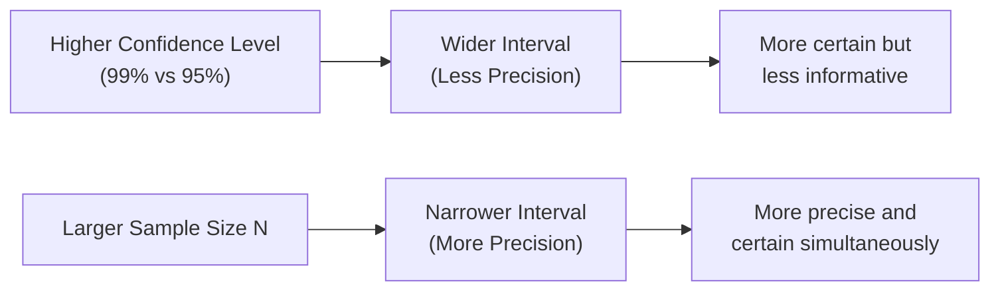
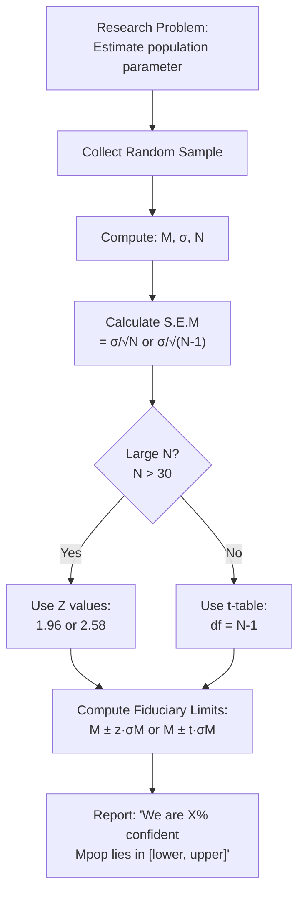

import Tabs from '@theme/Tabs';
import TabItem from '@theme/TabItem';

# Fiduciary Limits and Estimation of Population Parameters

> *"The goal of estimation is not a single number, but an honest range of plausible values."*

One of the most powerful applications of Standard Error is to **estimate population parameters** from sample statistics. Rather than guessing a single value for the population mean (a *point estimate*), we establish a **range** within which the true population mean likely falls — this is the **confidence interval**, called **fiduciary limits** in classical statistics.

---

## 📄 Source Material

**Source PDFs:**
- 📄 [Block-3/Unit-2.pdf — Pages 51–55](/pdfs/MPC-006%20Statistics%20in%20Psychology/Block-3/Unit-2.pdf)
- 📚 MPC-006 Statistics in Psychology, Block 3

---

## 1. Why Range Estimation Rather Than Point Estimation?

A student cannot predict with certainty: "I will score exactly 87 in statistics." But they can say: "I am 95% confident I will score between 80 and 94."

Similarly, a researcher cannot say: "The population mean is exactly 56." But they can say: "At 99% confidence, the population mean lies between 54 and 58."

**Point estimation** gives a single value — simple but overconfident.  
**Interval estimation** (fiduciary limits) gives an honest range — more realistic and scientifically rigorous.

---

## 2. Fiduciary Limits: Definition and Origin

**Fiduciary limits** (also called **confidence intervals**) are the lower and upper boundaries within which the true population parameter (Mpop) is expected to lie, at a given probability level.

:::info Who Coined This Term?
The term **"Fiduciary limits"** was introduced by **R.A. Fisher** (1935), one of the founders of modern statistics. "Fiduciary" comes from Latin *fiducia*, meaning trust or confidence — aptly named, as these limits express *how much trust we place* in our estimation.
:::

### Formula for Fiduciary Limits

**At 0.01 level (99% confidence):**
$$M_{pop} = M \pm 2.58 \times \sigma_M$$

**At 0.05 level (95% confidence):**
$$M_{pop} = M \pm 1.96 \times \sigma_M$$

For **small samples** (N ≤ 30), replace 2.58 and 1.96 with the appropriate **t-table value** for (N–1) degrees of freedom.

---

## 3. Worked Examples

### Example A: Large Sample (N = 400)
A language test was given to 400 Class VIII boys; M = 56, σ = 14.

**Step 1: Calculate S.E.M**
$$\sigma_M = \frac{14}{\sqrt{400}} = \frac{14}{20} = 0.70$$

**Step 2: Apply 99% confidence formula**
$$M_{pop} = 56 \pm 2.58 \times 0.70 = 56 \pm 1.81$$

**Fiduciary Limits (99%):** 54.19 to 57.81 ≈ **54 to 58**

*Interpretation:* We are 99% confident the true population mean lies between 54 and 58. Only 1% chance the true mean falls outside this range.

---

### Example B: Small Sample (N = 26)
26 Class VI students; M = 35 kg, σ = 10 kg.

**Step 1: S.E.M for small sample**
$$\sigma_M = \frac{10}{\sqrt{26-1}} = \frac{10}{\sqrt{25}} = \frac{10}{5} = 2.0$$

**df = 25**

**Step 2: Look up t-table**
- At 0.01 level, df = 25: **t = 2.79**
- At 0.05 level, df = 25: **t = 2.06**

**Step 3: Calculate limits**

*At 99% confidence:*
$$M_{pop} = 35 \pm 2.79 \times 2.0 = 35 \pm 5.58 \Rightarrow [29.42, 40.58]$$

*At 95% confidence:*
$$M_{pop} = 35 \pm 2.06 \times 2.0 = 35 \pm 4.12 \Rightarrow [30.88, 39.12]$$

**Notice:** The 99% interval is **wider** — we pay for more certainty with less precision.

---

## 4. The Confidence-Precision Trade-Off

This is a fundamental principle: **You cannot simultaneously maximize confidence AND precision without increasing sample size.**

| Confidence Level | Z / t Critical Value | Interval Width |
|-----------------|---------------------|----------------|
| 90% | 1.65 | Narrow |
| 95% | 1.96 | Medium |
| 99% | 2.58 | Wide |

---

## 5. Determining the Optimal Sample Size

Standard Error also tells us **how large our sample needs to be** to achieve a desired level of precision. This is critical for research design.

### Formula for Required Sample Size

$$N = \left(\frac{\sigma \times z}{\text{Acceptable S.E.}}\right)^2$$

Or equivalently, from S.E.M = σ/√N:
$$\sqrt{N} = \frac{\sigma}{S.E._M} \Rightarrow N = \left(\frac{\sigma}{S.E._M}\right)^2$$

### Worked Example
**Problem:** σ = 20. How many cases ensure S.E.M ≤ 2?

$$N = \left(\frac{20}{2}\right)^2 = 10^2 = 100$$

Answer: At least **100 cases** are needed.

---

### Advanced Sample Size Problem (With Confidence Level)

**Problem:** σ = 16 (adolescent intelligence scores). Maximum acceptable S.E.M = 1.90. Required level: 99% confidence.

At 99% level, the acceptable maximum deviation = 2.58 × S.E.M

$$N = \left(\frac{\sigma \times 2.58}{\text{Max Acceptable Error}}\right)^2 = \left(\frac{16 \times 2.58}{1.90}\right)^2 = \left(\frac{41.28}{1.90}\right)^2 \approx (21.73)^2 \approx 472$$

Answer: A sample of **at least 472 cases** is needed to reliably represent this population at 99% confidence.

---

## 6. Practical Applications in Psychological Research

---

## 7. Why This Matters in Indian Psychology Research

In large ICSSR (Indian Council of Social Science Research) funded studies, researchers routinely set **fiduciary limits** around national estimates — for instance, estimating average cognitive development scores across Indian states. Given India's diverse population, larger samples from heterogeneous groups yield wider fiduciary limits, prompting researchers to either increase N or restrict to more homogeneous sub-groups.

**NIMHANS epidemiological surveys** on mental health prevalence in India use confidence intervals heavily to report that, for example, "the prevalence of depression in urban adults is estimated at 4.5% [95% CI: 3.8% – 5.2%]."

---

## 🌐 External Resources

### Wikipedia
- [Confidence Interval](https://en.wikipedia.org/wiki/Confidence_interval) — Definition, logic, and misinterpretations
- [Ronald Fisher](https://en.wikipedia.org/wiki/Ronald_Fisher) — Biography and statistical contributions
- [Sample Size Determination](https://en.wikipedia.org/wiki/Sample_size_determination) — How to power studies

### Educational Videos
- 🎥 [Confidence Intervals — Khan Academy](https://www.khanacademy.org/math/statistics-probability/confidence-intervals-one-sample)
- 🎥 [Fiducial Inference and Confidence Intervals — StatQuest](https://www.youtube.com/watch?v=TqOeMYtOc1w)

### Research Articles
- Greenland, S. et al. (2020). [Statistical tests, P values, confidence intervals, and power: a guide to misinterpretations](https://doi.org/10.1007/s10654-016-0149-3). *European Journal of Epidemiology.*
- Cumming, G. (2022). Understanding the new statistics: Effect sizes, confidence intervals, and meta-analysis. *Routledge.*

### Additional Resources
- [OpenStax Statistics — Confidence Intervals](https://openstax.org/books/statistics/pages/8-introduction)
- [Scribbr — Confidence Interval Guide](https://www.scribbr.com/statistics/confidence-interval/)
- [Statistics How To — Fiducial Interval](https://www.statisticshowto.com/fiducial-interval/)
- [NIST — Confidence Intervals](https://www.itl.nist.gov/div898/handbook/eda/section3/eda352.htm)

---

## 🧠 Memory Aids

### "WIDE-NARROW" Rule
> More **Confidence** = **WIDER** interval  
> Larger **N** = **NARROWER** interval

### The Shooting Range Analogy
Think of fiduciary limits like a shooting range target:
- **99% confidence interval** = Large circle (you're very likely to hit it)
- **95% confidence interval** = Smaller circle (still likely, but tighter)
- **Larger sample** = Gives you a steadier aim → smaller circle at same confidence

### Formula Shortcut
$$\text{Fiduciary Limits} = M \pm \underbrace{\text{Critical Value}}_{\text{from Z or t}} \times \underbrace{S.E._M}_{\sigma/\sqrt{N}}$$

---

## ✅ Self-Assessment Questions

### Recall Level
1. What are **fiduciary limits**? Who first used this term?
2. State the formulas for fiduciary limits at 99% and 95% confidence levels for a large sample.
3. What is the difference between **point estimation** and **interval estimation**?

### Application Level
4. A sample of 100 students: M = 26.40, σ = 5.20. Compute fiduciary limits at both 99% and 95% confidence levels.
5. A sample of 16 subjects: M = 100, σ = 24. What are the fiduciary limits at the 0.05 level? (Use t-table: df = 15, t = 2.13)

### Analysis Level
6. A researcher needs to estimate a population mean with S.E.M ≤ 2, and the population σ = 20. How large should the sample be? What if they want 99% confidence with maximum error of 2.58?
7. Why does increasing the confidence level from 95% to 99% *widen* the interval, even if the sample stays the same? Explain conceptually.
