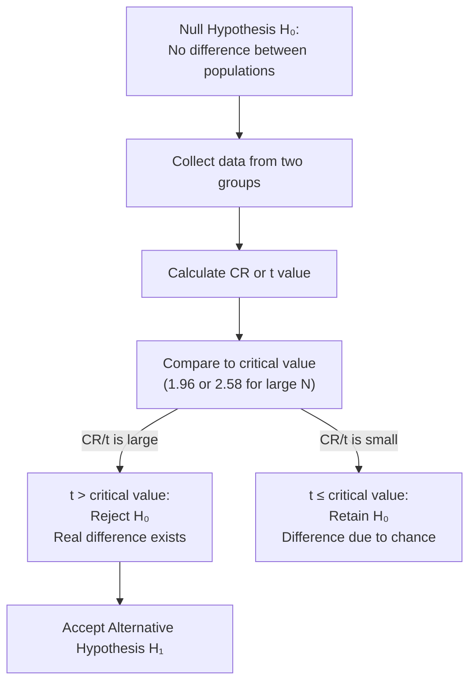
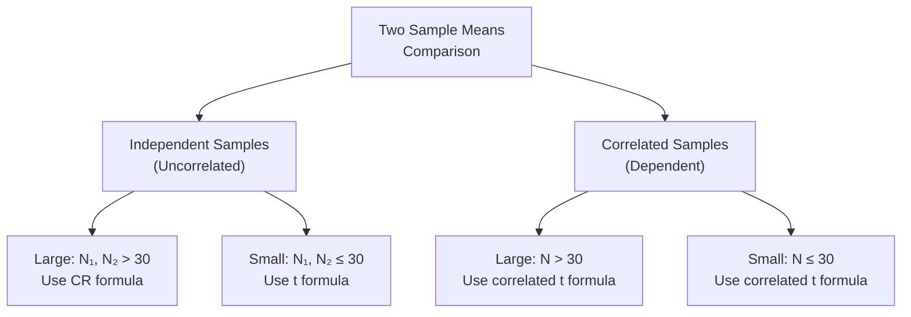

import Tabs from '@theme/Tabs';
import TabItem from '@theme/TabItem';

# Testing Significance of Difference Between Two Means

> *"The null hypothesis is never proved or established, but is possibly disproved, in the course of experimentation."* — R.A. Fisher

When researchers compare two groups — boys vs. girls, trained vs. untrained, urban vs. rural — they need to determine whether the observed **difference in means** is **real** or merely due to chance. This is the domain of the **significance test for two means**.

---

## 📄 Source Material

**Source PDFs:**
- 📄 [Block-3/Unit-2.pdf — Pages 55–67](/pdfs/MPC-006%20Statistics%20in%20Psychology/Block-3/Unit-2.pdf)
- 📚 MPC-006 Statistics in Psychology, Block 3

---

## 1. The Core Research Question

Scenario: You test the linguistic ability of 65 boys and 60 girls. Boys score M = 52 (SD = 13); girls score M = 48 (SD = 12). Girls score lower. Is this difference **real** — reflecting a genuine population difference — or could it easily have arisen from **chance sampling**?

To answer this, you must:
1. Quantify the *expected random variation* in mean differences (S.E.DM)
2. Compare your *observed difference* to this expected variation (Critical Ratio or t)
3. Make a decision using a pre-set significance threshold

---

## 2. Sampling Distribution of Mean Differences

Imagine drawing 100 pairs of samples from two populations and computing the mean difference each time. The distribution of these 100 differences is the **sampling distribution of mean differences**.

Key properties:
- **Shape:** Normal (bell-shaped)
- **Mean:** Equal to the true difference between population means (Mpop₁ – Mpop₂)
- **Spread:** Measured by **Standard Error of the Difference of Means (S.E.DM)**

---

## 3. Standard Error of the Difference of Means (S.E.DM)

For **two independent populations**:

$$\sigma_{DM} = \sqrt{\frac{\sigma_1^2}{N_1} + \frac{\sigma_2^2}{N_2}}$$

Where:
- σ₁, σ₂ = Standard deviations of samples 1 and 2
- N₁, N₂ = Sample sizes

This S.E.DM represents *how much variability we'd expect* in the difference between two sample means purely due to chance.

---

## 4. The Critical Ratio (CR)

The **Critical Ratio (CR)** is the Z-score of the observed mean difference in the sampling distribution of differences:

$$CR = \frac{M_1 \sim M_2}{\sigma_{DM}} = \frac{M_1 \sim M_2}{\sqrt{\frac{\sigma_1^2}{N_1} + \frac{\sigma_2^2}{N_2}}}$$

- When two populations are the same regarding a trait: **M₁ ~ M₂ = 0** (null hypothesis)
- CR tells you: *How many standard errors does our observed difference deviate from zero?*

:::note CR vs t
Both CR and t are critical ratios. However:
- **CR** uses the Z-distribution — appropriate for large samples
- **t** uses the t-distribution — required for small samples (N < 30)
- All t-values are critical ratios, but not all CR values are t-values
:::

---

## 5. The Null Hypothesis (H₀)

### Definition
The **null hypothesis (H₀)** states that there is **no true difference** between two population means — any observed sample difference is due to chance.

> H₀: M₁ = M₂ (i.e., M₁ ~ M₂ = 0)

### Alternative Hypothesis (H₁/Hₐ)
If H₀ is rejected, the **alternative hypothesis** is accepted:
> H₁: M₁ ≠ M₂ (two-tailed) OR M₁ > M₂ (one-tailed)

### The Logic
The null hypothesis works like the legal principle: *"Innocent until proven guilty."*

- We assume no difference exists (innocent)
- We collect evidence (sample data)
- If evidence is strong enough, we reject the assumption (guilty verdict)

---

## 6. Levels of Significance for Two-Mean Tests

| Level | Critical Value (large N) | Decision Rule |
|-------|--------------------------|---------------|
| .05 (95%) | ±1.96 | Reject H₀ if |CR| ≥ 1.96 |
| .01 (99%) | ±2.58 | Reject H₀ if |CR| ≥ 2.58 |

**If CR = 1.79** (as in the boys/girls intelligence example below): 1.79 < 1.96 → **Retain H₀** — difference is not significant.

---

## 7. Two-Tailed vs. One-Tailed Tests

### Two-Tailed Test
Used when you are interested in **any difference** — either group could be higher.

- H₀: M₁ = M₂
- H₁: M₁ ≠ M₂
- Rejection region: Both tails (2.5% each at .05 level)
- Critical value at .05 = ±1.96

**Use when:** Testing for sex differences in intelligence, comparing two therapies for effectiveness, etc.

### One-Tailed Test
Used when you predict a **specific direction** of difference.

- H₀: M₁ = M₂
- H₁: M₁ > M₂ (only positive direction interests you)
- Rejection region: Only one tail (5% at .05 level)
- Critical value at .05 = 1.645 (not 1.96)

**Use when:** Testing whether training improves performance (you only care about gains, not losses), studying whether a drug *increases* reaction time, etc.

:::caution One-Tailed Test Caution
Using a one-tailed test when a two-tailed is appropriate inflates the chance of false positives. Always justify the directional prediction theoretically *before* data collection.
:::

---

## 8. Basic Assumptions for Testing Two Means

1. The variable being measured is **normally distributed** in the population
2. **No pre-existing difference** between population means (H₀: M₁ = M₂)
3. Samples drawn by **random method** from the population
4. Sample sizes are **reasonably large** (especially for independent samples)

If these assumptions are violated, standard t/CR tests cannot be used — **non-parametric alternatives** (Mann-Whitney U, Wilcoxon) are then appropriate.

---

## 9. Types of Sample Comparisons

### Independent (Uncorrelated) Samples
Two groups are selected **separately and randomly** — boys from one school, girls from another. No pairing between individuals.

**Example:** Comparing IQ of urban boys vs. rural girls in separate random samples.

### Correlated (Dependent) Samples
- Same group tested **twice** (pre-test / post-test design)
- OR two groups **matched** on relevant variables (e.g., age-matched pairs)

**Example:** Testing vocabulary scores of the same 30 students before and after a language course.

The correlated formula accounts for the **relationship (r) between the two sets of scores**, giving a more sensitive test.

---

## 10. Worked Example: Two Large Independent Samples

**Data:**

| Group | N | M | SD |
|-------|---|---|---|
| Boys | 65 | 52 | 13 |
| Girls | 60 | 48 | 12 |

**H₀:** No sex difference in intelligence (M_Boys = M_Girls)  
**Test:** Two-tailed, large independent samples

**Step 1: Calculate σ_DM**
$$\sigma_{DM} = \sqrt{\frac{13^2}{65} + \frac{12^2}{60}} = \sqrt{\frac{169}{65} + \frac{144}{60}} = \sqrt{2.6 + 2.4} = \sqrt{5} \approx 2.24$$

**Step 2: Calculate CR**
$$CR = \frac{52 - 48}{2.24} = \frac{4}{2.24} \approx 1.79$$

**Step 3: Decision** (df = 123, use df = 125 from table)
- t at .05 level (df=125) = 1.98
- t at .01 level (df=125) = 2.62
- CR = 1.79 < 1.98 → **Retain H₀**

**Interpretation:** No significant sex difference in intelligence at either .05 or .01 level. The observed mean difference (52 vs. 48) is attributable to chance sampling fluctuations.

---

## 🌐 External Resources

### Wikipedia
- [Student's t-test](https://en.wikipedia.org/wiki/Student%27s_t-test) — Full theoretical treatment
- [Null hypothesis](https://en.wikipedia.org/wiki/Null_hypothesis) — Logic and history
- [One- and two-tailed tests](https://en.wikipedia.org/wiki/One-_and_two-tailed_tests) — Visualization

### Educational Videos
- 🎥 [Hypothesis Testing — CrashCourse Statistics](https://www.youtube.com/watch?v=bf3egy7TQ2Q)
- 🎥 [One vs Two Tailed Tests — Statistics Made Easy](https://www.youtube.com/watch?v=mvye6X_0upA)

### Research Articles
- Benjamin, D.J. et al. (2021). [Redefine statistical significance](https://doi.org/10.1038/s41562-017-0189-z). *Nature Human Behaviour.*
- Lakens, D. (2022). [Sample size justification](https://doi.org/10.1525/collabra.33267). *Collabra: Psychology.*

### Additional Resources
- [Khan Academy — Hypothesis Testing](https://www.khanacademy.org/math/statistics-probability/significance-tests-one-sample)
- [Scribbr — Null and Alternative Hypothesis](https://www.scribbr.com/statistics/null-and-alternative-hypothesis/)
- [Statistics How To — Critical Ratio](https://www.statisticshowto.com/critical-value/)
- [NIST — Two-Sample t-test](https://www.itl.nist.gov/div898/handbook/eda/section3/eda353.htm)

---

## 🧠 Memory Aids

### Mnemonic for Decision Rules: "REACT"
> **R**eject H₀ when **E**vidence **A**ccumulates **C**learly beyond **T**hreshold

- Evidence = CR or t value
- Threshold = 1.96 (at .05) or 2.58 (at .01)

### Two-Tailed vs One-Tailed: "BOTH or ONE?"
> **BOTH directions possible?** → Two-tailed  
> **ONE direction only predicted?** → One-tailed

### CR Formula in Words
> "Observed difference ÷ Expected random variation = How surprising is this result?"

### The Jury Analogy
| Legal System | Statistics |
|-------------|-----------|
| Defendant | Null Hypothesis |
| Innocent until proven guilty | H₀ assumed true |
| Evidence beyond reasonable doubt | CR/t exceeds critical value |
| Verdict: Guilty | Reject H₀ |
| Verdict: Not guilty | Retain H₀ |

---

## ✅ Self-Assessment Questions

### Recall Level
1. What is the **null hypothesis**? Why is it called "null"?
2. State the formula for the **Critical Ratio (CR)** for two large independent samples.
3. What is the difference between a **one-tailed** and **two-tailed** test? When is each appropriate?

### Application Level
4. Two independent groups are tested on memory: Group A (N=80, M=60, σ=10) and Group B (N=70, M=55, σ=12). Test whether the difference is significant at .05 and .01 levels.
5. A researcher predicts that meditation will *increase* (not just change) attention scores. Which test direction should be used, and what critical value applies at .05 level?

### Analysis Level
6. A study finds CR = 2.01. Interpret the result at both .05 and .01 levels. What type of error is possible in each case?
7. Two researchers study the same dataset: Researcher A uses a two-tailed test; Researcher B uses a one-tailed test. Researcher B finds significance at .05; Researcher A does not. How is this possible, and what are the ethical implications?
