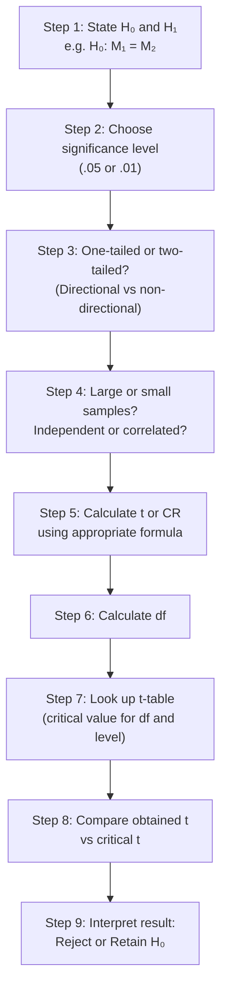
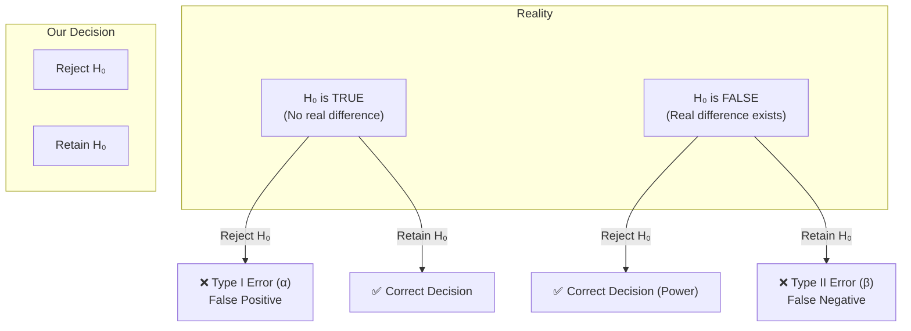

import Tabs from '@theme/Tabs';
import TabItem from '@theme/TabItem';

# t-Tests for Independent and Correlated Samples

> *"To call in the statistician after the experiment is done may be no more than asking him to perform a post-mortem examination."* — R.A. Fisher

The four variants of the t-test for two means cover every practical research scenario in psychology — small or large samples, independent or paired groups. Mastering these formulas and the step-by-step testing process is essential for IGNOU MAPC exams and real-world research.

---

## 📄 Source Material

**Source PDFs:**
- 📄 [Block-3/Unit-2.pdf — Pages 60–76](/pdfs/MPC-006%20Statistics%20in%20Psychology/Block-3/Unit-2.pdf)
- 📚 MPC-006 Statistics in Psychology, Block 3

---

## 1. The Four Situations: Overview

| Situation | Sample Type | Size | Formula Used |
|-----------|-------------|------|--------------|
| 1 | Independent (Uncorrelated) | Large (N > 30) | CR with Z distribution |
| 2 | Independent (Uncorrelated) | Small (N ≤ 30) | t formula with pooled SD |
| 3 | Correlated (Dependent) | Large (N > 30) | t with r₁₂ correction |
| 4 | Correlated (Dependent) | Small (N ≤ 30) | Difference method or r₁₂ method |

---

## 2. Situation 1: Two Large Independent Samples (N > 30)

Already covered in the previous section (CR formula). Use:
$$CR = \frac{M_1 \sim M_2}{\sqrt{\frac{\sigma_1^2}{N_1} + \frac{\sigma_2^2}{N_2}}}$$

Compare CR to ±1.96 (at .05) or ±2.58 (at .01). Use t-table for df = N₁ + N₂ – 2 when N is close to 30.

---

## 3. Situation 2: Two Small Independent Samples (N ≤ 30)

For small samples, we use a **pooled standard deviation** estimate:

### Formula (when raw scores are given):
$$t = \frac{M_1 \sim M_2}{\sqrt{\frac{\sum d_1^2 + \sum d_2^2}{N_1 + N_2 - 2} \times \frac{N_1 + N_2}{N_1 \times N_2}}}$$

Where d₁ = (X₁ – M₁) and d₂ = (X₂ – M₂)

### Formula (when statistics are given, no raw data):
$$t = \frac{M_1 \sim M_2}{\sqrt{\frac{\sigma_1^2(N_1-1) + \sigma_2^2(N_2-1)}{N_1 + N_2 - 2} \times \frac{N_1 + N_2}{N_1 \times N_2}}}$$

**df = (N₁ – 1) + (N₂ – 1) = N₁ + N₂ – 2**

---

### Worked Example: Urban vs. Rural Boys (N < 30)

Attitude toward vocational courses test:

**Urban Boys (N₁ = 10):** Scores = 6, 7, 8, 10, 15, 16, 9, 10, 9, 10  
→ M₁ = 10, Σd₁² = 92

**Rural Boys (N₂ = 5):** Scores = 4, 3, 2, 1, 5  
→ M₂ = 3, Σd₂² = 10

**H₀:** No difference in attitude (M_urban = M_rural)  
**Level:** .05, two-tailed

$$t = \frac{10 - 3}{\sqrt{\frac{92 + 10}{10 + 5 - 2} \times \frac{10 + 5}{10 \times 5}}} = \frac{7}{\sqrt{\frac{102}{13} \times 0.30}} = \frac{7}{\sqrt{7.85 \times 0.30}} = \frac{7}{\sqrt{2.355}} = \frac{7}{1.535} \approx 4.46$$

**df = 13; t-table at .05, df=13: 2.16**

**Obtained t = 4.46 >> 2.16 → Reject H₀**

*Interpretation:* Urban and rural boys differ significantly in their attitude toward vocational courses (p < .05). This is a real difference, not due to chance.

---

## 4. Situation 3: Two Large Correlated Samples (N > 30)

When the same group is tested twice (pre-post), or matched pairs are used, the two sets of scores are **correlated**. The standard formula must be **adjusted using the correlation coefficient (r₁₂)**:

$$t = \frac{M_1 \sim M_2}{\sqrt{\sigma_{M_1}^2 + \sigma_{M_2}^2 - 2r_{12}\sigma_{M_1}\sigma_{M_2}}}$$

Where:
$$\sigma_{M_1} = \frac{\sigma_1}{\sqrt{N}}, \quad \sigma_{M_2} = \frac{\sigma_2}{\sqrt{N}}$$

**df = N – 1** (since it's the same group)

### Why Include r₁₂?
In correlated designs, individual differences are controlled — a high scorer at pre-test tends to score high at post-test too. The r₁₂ term *removes* this shared variance, giving a **more sensitive (powerful) test**.

---

### Worked Example: Training Achievement (Large Correlated)

64 students tested before and after vocational training:

| | M | σ |
|--|---|---|
| Before training | 52.50 | 7.25 |
| After training | 58.70 | 5.30 |
| r₁₂ = 0.50, N = 100 (implied) |

**Step 1: Calculate σM values**
$$\sigma_{M_1} = \frac{7.25}{\sqrt{100}} = 0.725, \quad \sigma_{M_2} = \frac{5.30}{\sqrt{100}} = 0.530$$

**Step 2: Apply correlated formula**
$$t = \frac{58.70 - 52.50}{\sqrt{(0.725)^2 + (0.530)^2 - 2(0.50)(0.725)(0.530)}}$$
$$= \frac{6.2}{\sqrt{0.5256 + 0.2809 - 0.3848}} = \frac{6.2}{\sqrt{0.4217}} = \frac{6.2}{0.6494} \approx 9.54$$

**df = 99; t at .01 = 2.36; Obtained t = 9.54 >> 2.36 → Reject H₀**

*Interpretation (One-tailed):* The gain after training is highly significant. Vocational training produced real improvement (p < .01).

---

## 5. Situation 4: Two Small Correlated Samples (Difference Method)

When N ≤ 30 and you have paired/correlated data, use the **difference method** — simpler and does not require computing r₁₂:

### Steps:
1. Compute D = (Post – Pre) for each subject
2. Calculate MD = ΣD / N
3. Compute SD = √[Σd²/(N–1)] where d = D – MD
4. Calculate SE_DM = SD / √N
5. Compute t = MD / SE_DM
6. **df = N – 1**

---

### Worked Example: Pre-test / Post-test (N = 12)

12 subjects; Pre-test and Post-test scores given.

| Subject | Post | Pre | D = Post-Pre | d = D–MD | d² |
|---------|------|-----|-------------|----------|-----|
| 1 | 40 | 42 | -2 | -10 | 100 |
| 2 | 62 | 50 | 12 | +4 | 16 |
| 3 | 61 | 51 | 10 | +2 | 4 |
| 4 | 35 | 26 | 9 | +1 | 1 |
| 5 | 30 | 35 | -5 | -13 | 169 |
| 6 | 52 | 42 | 10 | +2 | 4 |
| 7 | 68 | 60 | 8 | 0 | 0 |
| 8 | 51 | 41 | 10 | +2 | 4 |
| 9 | 84 | 70 | 14 | +6 | 36 |
| 10 | 50 | 38 | 12 | +4 | 16 |
| 11 | 72 | 62 | 10 | +2 | 4 |
| 12 | 63 | 55 | 8 | 0 | 0 |
| **Total** | | | **ΣD=96** | | **Σd²=354** |

$$MD = \frac{96}{12} = 8$$
$$SD = \sqrt{\frac{354}{11}} = \sqrt{32.18} = 5.67$$
$$SE_{DM} = \frac{5.67}{\sqrt{12}} = \frac{5.67}{3.46} = 1.64$$
$$t = \frac{8}{1.64} = 4.88, \quad df = 11$$

**t-table at .01, df=11: 3.11 (approximately); Obtained t = 4.88 → Reject H₀**

*Interpretation:* The gain on post-test is real and statistically significant in 99 out of 100 cases.

---

## 6. Step-by-Step Process for Significance Testing



---

## 7. Type I and Type II Errors

Every decision in hypothesis testing risks one of two errors:

### Type I Error (α Error)
- **Definition:** Rejecting H₀ when it is actually **TRUE**
- **Also called:** False positive / Alpha error
- **Probability:** = Level of significance (p = .05 or .01)
- **Example:** Concluding training improves performance when it actually doesn't

### Type II Error (β Error)
- **Definition:** Retaining H₀ when it is actually **FALSE**
- **Also called:** False negative / Beta error
- **Probability:** Higher when significance threshold is very strict (e.g., .001)
- **Example:** Failing to detect a real training effect because your test was too conservative



### The Trade-Off
- Stricter significance level (.01 vs .05) → **reduces Type I error** BUT **increases Type II error**
- More lenient level (.05) → **reduces Type II error** BUT **increases Type I error**
- **Larger N** → reduces both errors simultaneously

| | H₀ True | H₀ False |
|---|---------|----------|
| **Reject H₀** | Type I Error (α) | ✅ Correct (Power = 1-β) |
| **Retain H₀** | ✅ Correct | Type II Error (β) |

---

## 8. Application in Indian Psychological Research

### IGNOU Research Context
IGNOU's own research evaluations often compare student performance across different instructional conditions (print-based vs. multimedia). When sample sizes are small (as in experimental sub-groups), the **small-sample t-test** with pooled SD is essential.

### Clinical Psychology (NIMHANS)
Pre-post comparisons are the backbone of treatment efficacy research in Indian hospitals. A psychologist testing CBT effectiveness on 20 patients would use the **difference method** (small correlated samples) with df = 19.

### Educational Psychology
Studies comparing rural vs. urban students on achievement tests in India routinely use **two large independent sample t-tests**, with the assumption of approximate normality (valid for N > 30 per group).

---

## 🌐 External Resources

### Wikipedia
- [Welch's t-test](https://en.wikipedia.org/wiki/Welch%27s_t-test) — Extension for unequal variances
- [Type I and type II errors](https://en.wikipedia.org/wiki/Type_I_and_type_II_errors) — Classic summary
- [Paired difference test](https://en.wikipedia.org/wiki/Paired_difference_test) — Correlated samples

### Educational Videos
- 🎥 [t-Test for Two Independent Samples — Khan Academy](https://www.khanacademy.org/math/statistics-probability/significance-tests-two-samples)
- 🎥 [Paired t-Test — StatQuest](https://www.youtube.com/watch?v=bPBx_IXQeGM)

### Research Articles
- Funder, D.C. & Ozer, D.J. (2019). [Evaluating effect size in psychological research](https://doi.org/10.1177/2515245919847202). *Advances in Methods and Practices in Psychological Science.*
- Open Science Collaboration (2020). [Estimating the reproducibility of psychological science](https://doi.org/10.1126/science.aac4716). *Science.*

### Additional Resources
- [Scribbr — t-Test Guide](https://www.scribbr.com/statistics/t-test/)
- [Statistics How To — Pooled Standard Deviation](https://www.statisticshowto.com/pooled-standard-deviation/)
- [Khan Academy — Type I & II Errors](https://www.khanacademy.org/math/statistics-probability/significance-tests-one-sample/idea-of-significance-tests/a/types-of-errors-review)
- [Real Statistics — Dependent Samples t-test](https://real-statistics.com/students-t-distribution/paired-samples-t-test/)

---

## 🧠 Memory Aids

### SIMPLE mnemonic for Hypothesis Testing Steps
> **S**tate hypothesis → **I**dentify level → **M**atch formula → **P**lug in values → **L**ook up table → **E**valuate result

### Independent vs Correlated: "SAME or DIFFERENT?"
> **Same** group tested twice → **Correlated** (use r₁₂ or difference method)  
> **Different** groups compared → **Independent** (use pooled SD)

### Type Errors Poem
> "Type ONE is fun — rejecting true null (false alarm!)  
> Type TWO is blue — missing a real effect (missed the norm!)"

### Formula Navigator
```
Is N large (>30)?
    YES → Use CR/Z formulas
    NO  → Use t formulas with df = N₁+N₂-2 (independent) or N-1 (correlated)

Are groups independent?
    YES → Use S.E.DM with σ₁²/N₁ + σ₂²/N₂
    NO  → Use r₁₂ correction OR difference method
```

---

## ✅ Self-Assessment Questions

### Recall Level
1. What are the four situations in which two means are compared? Give an example for each.
2. State the formula for t when testing two **small independent** samples.
3. What is **Type I error**? Give an example in the context of clinical psychology.

### Application Level
4. A music interest test is given to 30 girls (M=40.39, σ=8.69) and 25 boys (M=35.81, σ=8.33). Calculate t and interpret results at .05 level (df = 53, t-table = 2.01).
5. 10 subjects are tested before and after a memory training program (pre-test scores: 5, 15, 9, 11, 4, 9, 8, 13, 6, 16; post-test: 7, 9, 4, 15, 6, 13, 9, 5, 6, 12). Using the difference method, test if the gain is significant.

### Analysis Level
6. A clinical psychologist sets the significance level at .001 to be "extra sure." What are the consequences for Type I and Type II errors? When might this strict level be justified?
7. A researcher claims to use a one-tailed test because "training can only improve performance." Is this reasoning sound? What happens if the training actually *harms* performance — what error is the researcher vulnerable to?
