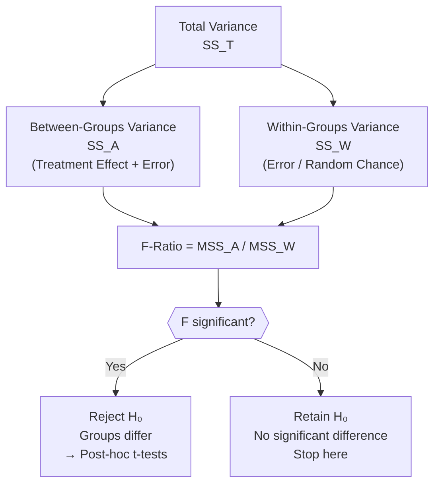
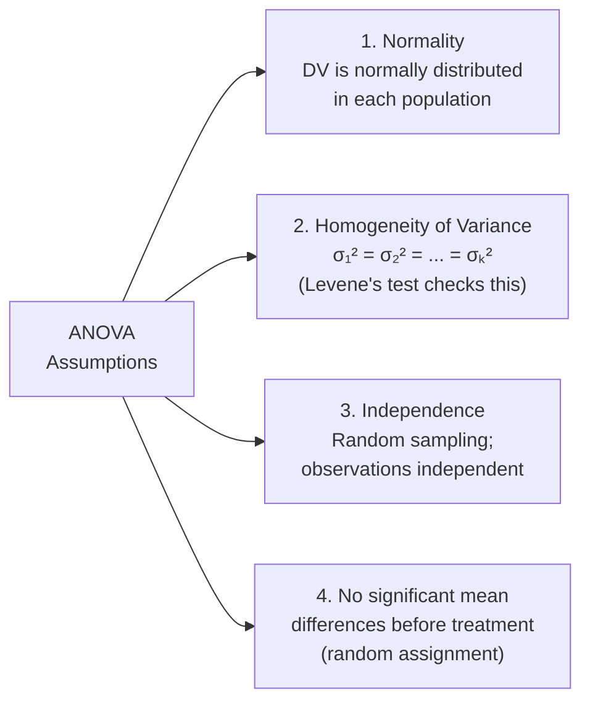

import Tabs from '@theme/Tabs';
import TabItem from '@theme/TabItem';

# One-Way Analysis of Variance (ANOVA)

:::info Unit Overview
**Course**: MPC-006 Statistics in Psychology · Block 3 · Unit 3  
**Pages**: 77–95 · 📄 [Download PDF](/pdfs/MPC-006%20Statistics%20in%20Psychology/Block-3/Unit-3.pdf)  
**Prerequisite**: [t-Test for Independent & Correlated Samples](/mpc-006/block-3/t-test-independent-correlated-samples) | [Significance of Difference Between Two Means](/mpc-006/block-3/significance-difference-two-means)
:::

---

## Why ANOVA? The Problem with Multiple t-Tests

Suppose you are comparing the effectiveness of three teaching methods across three groups of students. Your instinct might be to run multiple t-tests: Method A vs B, Method B vs C, Method A vs C — three tests in total. With eight groups this balloons to **28 comparisons**. Two serious problems emerge:

**1. Inflated Type I Error (Alpha Inflation)**  
Each t-test carries a 5% chance of a false positive at α = .05. Running three tests means the overall probability of making *at least one* false rejection is approximately:

$$1 - (1 - 0.05)^3 = 1 - 0.857 = 0.143 \approx 14\%$$

The error rate has nearly *tripled*. With 28 tests it approaches 76% — virtually guaranteeing a spurious finding. This phenomenon is called **familywise error rate (FWER)** inflation.

**2. t-Test Ignores Within-Group Variance**  
Consider this dataset from the PDF (p. 78):

| Group | Scores | Sum | Mean |
|-------|--------|-----|------|
| Girls | 15, 20, 5, 10, 35 | 85 | 17 ms |
| Boys | 20, 15, 20, 20, 10 | 85 | 17 ms |

Both groups have *identical means* (17 ms). A t-test would find no significant difference. Yet girls show extreme variability (range 5–35) while boys are tightly clustered (range 10–20). The groups differ meaningfully, but the t-test misses this because it only compares means — not the *spread* within each group.

**ANOVA solves both problems** by testing all group differences simultaneously, using the ratio of between-group variance to within-group variance as its test statistic — the **F-ratio**.

:::tip Historical Note
ANOVA was invented by **Sir Ronald A. Fisher** (1890–1962), widely regarded as the father of modern statistics. He first published the method in 1923, originally applying it to agricultural field experiments. The "F" in F-ratio stands for Fisher. His foundational text *Statistical Methods for Research Workers* (1925) transformed hypothesis testing across the sciences. [Wikipedia: Ronald Fisher](https://en.wikipedia.org/wiki/Ronald_Fisher)
:::

---

## The Logic of ANOVA

ANOVA partitions the **total variance** in a dataset into two independent components:

$$SS_{Total} = SS_{Between} + SS_{Within}$$



**Between-groups variance (SS_A)** captures differences *among* group means — this reflects the treatment effect plus random error.

**Within-groups variance (SS_W)** captures variability *inside* each group — this is pure random/error variance (individual differences, measurement error).

If the treatment truly has an effect, the between-groups variance will be large *relative to* within-groups variance. The **F-ratio** quantifies this:

$$F = \frac{MSS_A \text{ (Between-Groups Mean Square)}}{MSS_W \text{ (Within-Groups Mean Square)}}$$

When $F \approx 1$, between-group variation is no larger than random noise — no treatment effect. When $F \gg 1$, the groups differ beyond what chance can explain.

---

## Variance: The Foundation

Before computing ANOVA, you must have a solid grasp of **variance** — the measure at the heart of the analysis.

**Standard Deviation (σ)** measures spread as average distance from the mean, in the *same units* as the data. **Variance (σ²)** is its square:

$$\sigma^2 = \frac{\sum(X - M)^2}{N}$$

Or using degrees of freedom (sample variance):

$$s^2 = \frac{\sum(X - M)^2}{N - 1}$$

### Key Characteristics of Variance

| Property | Explanation |
|----------|-------------|
| Always positive (≥ 0) | Squaring eliminates negative deviations |
| Units are squared | Variance in ms² if data is in ms |
| Unaffected by adding/subtracting a constant | $Var(X + c) = Var(X)$ |
| Additive for independent components | $Var(A + B) = Var(A) + Var(B)$ |
| σ = √σ² | Standard deviation recovers original units |

:::note SD vs Variance
SD has *direction* (like length): it tells you how far scores typically stray from the mean.  
Variance is an *area* (length²): it lives on the normal curve as a surface, not a distance. ANOVA works with variances — not SDs — precisely because variances *add* (SDs do not).
:::

---

## Step-by-Step ANOVA Procedure

### Notation

| Symbol | Meaning |
|--------|---------|
| $k$ | Number of groups |
| $n$ | Cases per group (equal groups) |
| $N$ | Total cases = $n \times k$ |
| $\sum X_a, \sum X_b ...$ | Group sums |
| $\sum X^2$ | Sum of all squared scores |
| $M_a, M_b ...$ | Group means |
| $Cx$ | Correction term |

### The 8-Step Formula Sequence

**Step 1: Correction Term**
$$Cx = \frac{(\sum X)^2}{N}$$

**Step 2: Total Sum of Squares**
$$SS_T = \sum X^2 - Cx$$

**Step 3: Between-Groups Sum of Squares**
$$SS_A = \frac{(\sum X_a)^2}{n_a} + \frac{(\sum X_b)^2}{n_b} + \cdots + \frac{(\sum X_k)^2}{n_k} - Cx$$

**Step 4: Within-Groups Sum of Squares**
$$SS_W = SS_T - SS_A$$

**Step 5: Between-Groups Mean Square**
$$MSS_A = \frac{SS_A}{k - 1}$$

**Step 6: Within-Groups Mean Square**
$$MSS_W = \frac{SS_W}{N - k}$$

**Step 7: F-Ratio**
$$F = \frac{MSS_A}{MSS_W}$$

**Step 8: ANOVA Summary Table**

| Source | df | SS | MSS | F |
|--------|----|----|-----|---|
| Between Groups | $k-1$ | $SS_A$ | $MSS_A$ | $F$ |
| Within Groups (Error) | $N-k$ | $SS_W$ | $MSS_W$ | — |
| **Total** | **$N-1$** | **$SS_T$** | — | — |

---

## Worked Example 1: Intelligence Across Streams

*Source: PDF p. 83–85*

Three groups of 5 students each (Arts, Commerce, Science) took an intelligence test. Do the streams differ?

**Data:**

| S.No. | Arts ($X_1$) | Commerce ($X_2$) | Science ($X_3$) |
|-------|------------|----------------|---------------|
| 1 | 15 | 12 | 12 |
| 2 | 14 | 14 | 15 |
| 3 | 11 | 10 | 14 |
| 4 | 12 | 13 | 10 |
| 5 | 10 | 11 | 10 |
| **Σ** | **62** | **60** | **61** |
| **M** | **12.40** | **12.00** | **12.20** |

$k = 3$, $n = 5$, $N = 15$  
$H_0$: $\mu_{Arts} = \mu_{Commerce} = \mu_{Science}$

**Step 1:** $Cx = \frac{(62+60+61)^2}{15} = \frac{183^2}{15} = \frac{33489}{15} = 2232.60$

**Step 2:** $\sum X^2 = (225+196+121+144+100) + (144+196+100+169+121) + (144+225+196+100+100)$  
$= 786 + 730 + 765 = 2281$  
$SS_T = 2281 - 2232.60 = 48.40$

**Step 3:** $SS_A = \frac{62^2}{5} + \frac{60^2}{5} + \frac{61^2}{5} - 2232.60$  
$= \frac{3844+3600+3721}{5} - 2232.60 = 2233.00 - 2232.60 = 0.40$

**Step 4:** $SS_W = 48.40 - 0.40 = 48.00$

**Step 5:** $MSS_A = \frac{0.40}{3-1} = \frac{0.40}{2} = 0.20$

**Step 6:** $MSS_W = \frac{48.00}{15-3} = \frac{48.00}{12} = 4.00$

**Step 7:** $F = \frac{0.20}{4.00} = 0.05$

**Summary Table:**

| Source | df | SS | MSS | F |
|--------|----|----|-----|---|
| Between Groups | 2 | 0.40 | 0.20 | 0.05 |
| Within Groups | 12 | 48.00 | 4.00 | — |
| Total | 14 | 48.40 | — | — |

**Decision:** $F_{critical}$ for df₁ = 2, df₂ = 12 at .05 level = 3.88. Obtained F = 0.05 < 3.88.  
**Retain H₀.** The three streams do not differ significantly in intelligence.

---

## Worked Example 2: Four Drugs & Physical Growth (with Post-Hoc)

*Source: PDF p. 85–88*

20 rats randomly assigned to 4 drug groups (5 each). Gain in weight (oz) after 1 month:

| S.No. | Drug P | Drug Q | Drug R | Drug S |
|-------|--------|--------|--------|--------|
| 1 | 4 | 9 | 2 | 7 |
| 2 | 5 | 10 | 6 | 7 |
| 3 | 1 | 9 | 6 | 4 |
| 4 | 0 | 6 | 5 | 2 |
| 5 | 2 | 6 | 2 | 7 |
| **Σ** | **12** | **40** | **21** | **27** |
| **M** | **2.40** | **8.00** | **4.20** | **5.40** |

$k = 4$, $n = 5$, $N = 20$  
$H_0$: $\mu_P = \mu_Q = \mu_R = \mu_S$

**Cx** $= \frac{(12+40+21+27)^2}{20} = \frac{100^2}{20} = \frac{10000}{20} = 500$

**$SS_T$** $= (46+334+105+167) - 500 = 652 - 500 = 152$

**$SS_A$** $= \frac{12^2+40^2+21^2+27^2}{5} - 500 = \frac{144+1600+441+729}{5} - 500 = \frac{2914}{5} - 500 = 582.80 - 500 = 82.80$

**$SS_W$** $= 152 - 82.80 = 69.20$

**$MSS_A$** $= \frac{82.80}{4-1} = \frac{82.80}{3} = 27.60$

**$MSS_W$** $= \frac{69.20}{20-4} = \frac{69.20}{16} = 4.325$

**$F$** $= \frac{27.60}{4.325} = 6.38$

| Source | df | SS | MSS | F |
|--------|----|----|-----|---|
| Between Groups | 3 | 82.80 | 27.60 | **6.38** |
| Within Groups | 16 | 69.20 | 4.325 | — |
| Total | 19 | 152.00 | — | — |

**Decision:** $F_{.01}$ for df₁ = 3, df₂ = 16 = 5.29. Obtained F = 6.38 > 5.29.  
**Reject H₀ at .01 level.** The four drugs are *not* equally effective.

### Post-Hoc Comparisons (Paired t-Tests)

Since F is significant, we use t-tests to identify *which* drugs differ:

$$t = \frac{M_1 - M_2}{SE_{DM}}$$

$$SE_{DM} = \sqrt{MSS_W} \cdot \sqrt{\frac{1}{n_1} + \frac{1}{n_2}} = \sqrt{4.325} \cdot \sqrt{\frac{2}{5}} = 2.079 \times 0.632 = 1.31$$

| Comparison | Difference | t-value | df | Significant? |
|------------|------------|---------|-----|--------------|
| P vs Q | 5.60 | 4.28 | 16 | ✅ .01 level |
| P vs R | 1.80 | 1.37 | 16 | ❌ n.s. |
| P vs S | 3.00 | 2.29 | 16 | ✅ .05 level |
| Q vs R | 3.80 | 2.90 | 16 | ✅ .05 level |
| Q vs S | 2.60 | 1.98 | 16 | ❌ n.s. |
| R vs S | 1.20 | 0.92 | 16 | ❌ n.s. |

**Conclusion:** Drug Q (mean = 8.00) is significantly superior to P and R. Drug Q and Drug S are approximately equivalent. Drug P is least effective.

---

## ANOVA Assumptions

ANOVA is a **parametric** test built on four assumptions. Violating them can invalidate conclusions:



**What happens when assumptions are violated?**

| Assumption | Violation Effect | Remedy |
|------------|-----------------|--------|
| Normality | F-test becomes inaccurate with small N | Use Welch ANOVA or non-parametric Kruskal-Wallis |
| Homogeneity | F inflated or deflated | Welch's correction; Brown-Forsythe ANOVA |
| Independence | Severely biased results | Redesign study; use repeated measures ANOVA |

ANOVA is generally **robust** to mild normality violations when group sizes are equal and large (N ≥ 30 per group), due to the central limit theorem. Homogeneity of variance is more critical — especially with unequal sample sizes.

[Wikipedia: Homoscedasticity](https://en.wikipedia.org/wiki/Homoscedasticity_and_heteroscedasticity)

---

## F-Test and t-Test: The Mathematical Relationship

The F-test and t-test are not independent tests — they are mathematically linked:

$$F = t^2 \quad \text{and} \quad t = \sqrt{F}$$

This means when you have exactly **two groups**, the one-way ANOVA F-test gives *identical* results to the independent samples t-test. The F-ratio with df₁ = 1 equals the square of the t-value.

**Why use ANOVA over multiple t-tests then?**

| Feature | Multiple t-Tests | One-Way ANOVA |
|---------|-----------------|---------------|
| Number of tests | $\binom{k}{2}$ | 1 |
| Type I error control | Poor (inflated) | Excellent (familywise) |
| Within-group variance | Ignored | Explicitly modeled |
| Efficiency | Low | High |
| Post-hoc flexibility | N/A | Many options (Tukey, Scheffé, Bonferroni) |

The relationship $F = t^2$ also confirms that **within-group variance** is embedded in the F-test in a way it never is in simple t-tests — that is why F is the preferred approach when comparing 3+ groups.

---

## Using the F-Table

F-tables have two df dimensions:
- **df₁** (columns) = $k - 1$ = between-groups df = "greater mean squares"  
- **df₂** (rows) = $N - k$ = within-groups df = "smaller mean squares"

Most tables show two values per cell: the normal-print value is for **.05 level** and the **bold/dark-print** value is for **.01 level**.

**Reading the table (Example 1):** df₁ = 2, df₂ = 12  
→ Find column 2, row 12 → F₀₅ = 3.88, F₀₁ = 6.93  
→ Obtained F = 0.05 → much less than 3.88 → **not significant**

**Reading the table (Example 2):** df₁ = 3, df₂ = 16  
→ F₀₅ = 3.24, F₀₁ = 5.29  
→ Obtained F = 6.38 → exceeds F₀₁ → **significant at .01 level**

:::tip Exam Shortcut
df₁ = (number of groups – 1)  
df₂ = (total N – number of groups)  
df_total = N – 1 = df₁ + df₂  
:::

---

## Merits and Limitations

<Tabs>
<TabItem value="merits" label="✅ Merits">

- **Simultaneous comparison** of 3+ groups without inflating Type I error
- **Evaluates both** between-group *and* within-group variance — more complete picture than t-test
- **Economical**: one overall F-test replaces $\binom{k}{2}$ pairwise tests
- **Foundation for complex designs**: two-way ANOVA, repeated measures, MANOVA all build on one-way ANOVA
- **Versatile**: applicable to experimental (random assignment) and quasi-experimental designs
- Supports **interaction effects** in factorial extensions

</TabItem>
<TabItem value="limitations" label="⚠️ Limitations">

- **Assumption-sensitive**: normality and homogeneity of variance required
- **Omnibus test only**: significant F tells you *that* groups differ, not *which pairs* differ — post-hoc tests needed
- **Time-consuming** with large k: post-hoc comparisons multiply rapidly
- **Requires F-table**: cannot interpret results without critical value reference
- Cannot be used when **groups are severely unequal in size** without adjustment
- Sensitive to **outliers**, which can distort the F-ratio substantially

</TabItem>
</Tabs>

---

## Post-Hoc Tests: Beyond the F-Ratio

When F is significant, you need **post-hoc (after the fact) comparisons** to pinpoint which groups differ. The PDF uses simple paired t-tests (the Least Significant Difference or LSD approach). Modern alternatives with better error control include:

| Post-Hoc Test | Error Control | Best When |
|---------------|--------------|-----------|
| **LSD (t-tests)** | None (liberal) | All pairs planned a priori |
| **Bonferroni** | Adjusts α by m = number of comparisons | Few planned comparisons |
| **Tukey's HSD** | Familywise .05 | All pairwise comparisons |
| **Scheffé** | Most conservative | Complex contrasts |
| **Games-Howell** | Unequal variances | Heteroscedastic data |

[Wikipedia: Post-hoc analysis](https://en.wikipedia.org/wiki/Post_hoc_analysis)

---

## Indian Research Context

ANOVA is among the most commonly used statistical techniques in Indian psychological research. Some applications:

**Educational Psychology**: ANOVA studies comparing academic performance across government, aided, and private school students are a staple of M.Ed. and M.A. (Education) dissertations across Indian universities. Studies regularly examine whether stream selection (Science/Arts/Commerce) interacts with socioeconomic background in predicting academic self-efficacy.

**Clinical Psychology**: Indian researchers have used one-way ANOVA to compare depression and anxiety scores across diagnostic groups (clinical, at-risk, control) in hospitals affiliated with NIMHANS (Bengaluru) and AIIMS (New Delhi).

**Occupational Psychology**: ANOVA comparing job satisfaction scores across public sector, private sector, and self-employed workers has been a recurrent theme in Indian organizational research, particularly in states with diverse employment landscapes (Maharashtra, Tamil Nadu, Kerala).

**Agrarian Research Heritage**: Fisher developed ANOVA for agriculture — and Indian agricultural universities (e.g., IARI, ICAR-affiliated colleges) have used it extensively since the 1950s for comparing crop yield across fertilizer treatments, mirroring the original Fisherian applications.

---

## Real-World Applications in Psychology

- **Clinical trials**: Comparing outcomes across a control group, low-dose, and high-dose drug groups — standard in RCTs
- **Educational interventions**: Testing whether three instructional formats (lecture, flipped classroom, peer learning) differ in learning outcomes
- **Neuropsychology**: Comparing reaction times across healthy controls, MCI patients, and Alzheimer's patients
- **Consumer psychology**: Measuring purchase intent across five advertisement formats
- **Occupational psychology**: Comparing burnout scores across three shift-work schedules

---

## Memory Aids

### 🧠 The ANOVA Acronym: **B-W-F**
> **B**etween ÷ **W**ithin = **F**-ratio  
> "Between and Within give you F"

### 🎵 The Steps Rhyme
> "Correct, Square Total, Subtract Among,  
> Within's what's left when variance belongs.  
> Mean-Squares by df, then F you see,  
> Check the table — reject or keep H₀ free."

### 🔢 The df Triangle
```
     N - 1  (total)
    /        \
  k - 1    N - k
(between)  (within)
```
*Total df splits into between-groups df and within-groups df — they always add up.*

### ⚡ F vs t Quick Rule
> If you have **2 groups** → t-test  
> If you have **3+ groups** → ANOVA (F-test)  
> After a significant F with 3+ groups → Post-hoc t-tests  
> Always: $F = t^2$

---

## External Resources

### 📖 Essential Reading
- [Wikipedia: Analysis of Variance](https://en.wikipedia.org/wiki/Analysis_of_variance) — comprehensive overview with history and extensions
- [Wikipedia: F-test](https://en.wikipedia.org/wiki/F-test) — mathematical foundations of the F-distribution
- [Statistics How To: One-Way ANOVA](https://www.statisticshowto.com/probability-and-statistics/f-statistic-value-test/) — step-by-step tutorials with examples

### 🎓 Video Lectures
- [Crash Course Statistics #33: ANOVA](https://www.youtube.com/watch?v=oOuu8IBd-yo) — conceptual introduction, highly accessible
- [StatQuest: One-Way ANOVA (Josh Starmer)](https://www.youtube.com/watch?v=0Vj2V2qRU10) — visual explanation of between vs within variance
- [Khan Academy: ANOVA](https://www.khanacademy.org/math/statistics-probability/analysis-of-variance-anova-library) — interactive problem sets with F-ratio interpretation

### 📚 Research Papers (2020–2025)
- Blanca, M.J., et al. (2023). ANOVA versus Kruskal-Wallis: Which test to use when the normality assumption is violated? *Psicothema*, 35(1). — examines robustness across conditions
- Delacre, M., et al. (2019). Taking parametric assumptions seriously. *International Review of Social Psychology*, 32(1). [doi:10.5334/irsp.198] — argues for Welch's ANOVA as default
- Sullivan, G.M., & Feinn, R. (2012). Using effect size — or why the P value is not enough. *Journal of Graduate Medical Education*, 4(3), 279–282. — on reporting eta-squared (η²) alongside F

### 🛠 Online Tools
- [Social Science Statistics: One-Way ANOVA Calculator](https://www.socscistatistics.com/tests/anova/default2.aspx) — free browser-based calculator
- [Real Statistics: ANOVA in Excel](https://real-statistics.com/one-way-analysis-of-variance-anova/one-way-anova-basic-concepts/) — includes Excel formulas and interpretation guidance

---

## Self-Assessment Questions

### 🟢 Knowledge (Recall)

1. **Define variance** and state how it differs from standard deviation. Why is variance (not SD) the preferred measure in ANOVA?

2. **State all four assumptions** underlying one-way ANOVA. What test can be used to verify the homogeneity of variance assumption?

3. **Complete the ANOVA summary table** for a study with k = 4 groups and N = 24 total observations, given SS_A = 36 and SS_T = 108.  
   *(Calculate df, SS_W, MSS_A, MSS_W, and F.)*

### 🟡 Comprehension (Understanding)

4. **Explain why** ANOVA is preferred over multiple t-tests when comparing more than two group means. Use the concept of familywise error rate in your answer.

5. **In the drugs example** (Example 2), the F-ratio was 6.38 and significant at .01 level. But post-hoc comparisons showed that Groups B and D (Drugs Q and S) did *not* differ significantly from each other. How is it possible that the overall F is significant but some pairs are not?

6. **What does an F-ratio of 1.0 indicate?** What does an F-ratio of 15.0 suggest about between-group vs within-group variance?

### 🔴 Application (Problem-Solving)

7. **Solve this problem**: Four methods of stress management were tested on 4 groups of 6 participants each. The group anxiety scores (post-treatment) were:

| Method A | Method B | Method C | Method D |
|----------|----------|----------|----------|
| 12, 10, 14, 13, 11, 12 | 8, 7, 9, 8, 6, 10 | 15, 14, 16, 15, 13, 14 | 10, 9, 11, 10, 8, 10 |

Apply one-way ANOVA and determine whether the methods differ significantly in reducing anxiety (use F-table if available, or compare your calculated F with F₀₅ for appropriate df).

---

## Summary

| Concept | Key Point |
|---------|-----------|
| ANOVA vs t-test | ANOVA tests 3+ groups simultaneously; avoids alpha inflation |
| F-ratio | $MSS_A / MSS_W$ — between ÷ within variance |
| SS partition | $SS_T = SS_A + SS_W$ (always) |
| df partition | $df_T = df_A + df_W$ = $(k-1) + (N-k)$ |
| Significant F | Reject H₀ → proceed to post-hoc comparisons |
| Non-significant F | Retain H₀ → stop; no pair differences are significant |
| F and t relationship | $F = t^2$; for two groups, results are identical |
| Assumptions | Normality, homogeneity of variance, independence, random sampling |
| Invented by | Sir Ronald Fisher (1923) — originally for agricultural experiments |

---

**Source PDFs**:
- 📄 [Block-3/Unit-3.pdf — Pages 77–95](/pdfs/MPC-006%20Statistics%20in%20Psychology/Block-3/Unit-3.pdf)
- 📚 MPC-006 Statistics in Psychology, IGNOU
