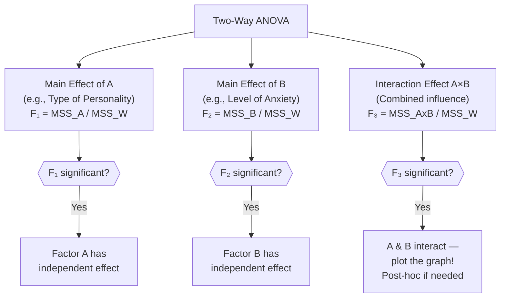
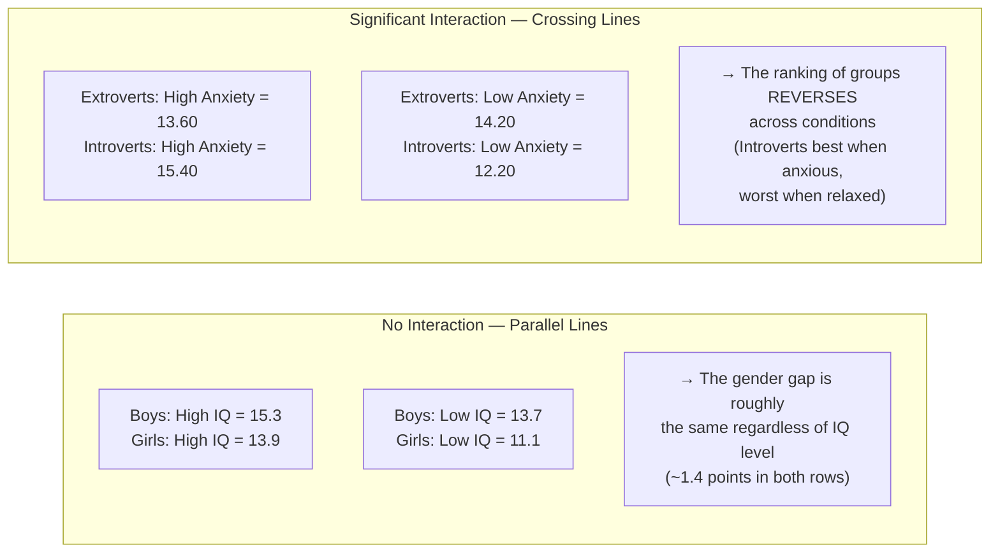

import Tabs from '@theme/Tabs';
import TabItem from '@theme/TabItem';

# Two-Way Analysis of Variance (ANOVA)

:::info Unit Overview
**Course**: MPC-006 Statistics in Psychology · Block 3 · Unit 4  
**Pages**: 96–112 · 📄 [Download PDF](/pdfs/MPC-006%20Statistics%20in%20Psychology/Block-3/Unit-4.pdf)  
**Prerequisite**: [One-Way ANOVA](/mpc-006/block-3/one-way-anova) | [t-Test for Independent & Correlated Samples](/mpc-006/block-3/t-test-independent-correlated-samples)
:::

---

## From One Factor to Two: Why We Need Two-Way ANOVA

One-way ANOVA answers: *"Do groups differ on this outcome variable?"* — but it can only examine **one independent variable (IV)** at a time. Real-world behaviour is shaped by multiple factors acting simultaneously, and often the *combination* of factors produces an effect that neither factor alone could predict.

Consider a pharmaceutical company testing a new drug to reduce smoking:
1. What is the **independent effect of Drug A** on smoking?
2. What is the **independent effect of Drug B** on smoking?
3. What is the **joint (interaction) effect of Drug A × Drug B** together?

No single one-way ANOVA can answer all three questions. We need **Two-Way ANOVA** — a technique that simultaneously tests:
- The main effect of **Factor A** (e.g., Type of Personality)
- The main effect of **Factor B** (e.g., Level of Anxiety)
- The **interaction effect A × B** (the combined influence of both factors)

This is the essence of **factorial experimental designs** — studying how variables interact, not just act in isolation.

:::tip Historical Note
Two-way (and multi-way) ANOVA grew from Fisher's foundational agricultural research in the 1920s, where he needed to simultaneously test the effect of multiple soil treatments and crop varieties. The extension to psychology was pioneered by researchers at American universities in the 1940s–50s. [Wikipedia: Factorial experiment](https://en.wikipedia.org/wiki/Factorial_experiment)
:::

---

## The Structure of Two-Way ANOVA

### Factorial Design Notation

Two-way ANOVA uses a **factorial design** notation: **a × b**, where:
- **a** = number of levels of Factor A
- **b** = number of levels of Factor B
- Total cells = a × b

| Design | Factors | Cells | Example |
|--------|---------|-------|---------|
| 2 × 2 | 2 IVs, 2 levels each | 4 | Gender × Anxiety (each High/Low) |
| 3 × 2 | IV₁ has 3 levels, IV₂ has 2 | 6 | SES (High/Average/Low) × Gender |
| 4 × 3 | IV₁ has 4 levels, IV₂ has 3 | 12 | 4 teaching methods × 3 intelligence levels |

### Three Effects Tested Simultaneously



---

## The Two-Way ANOVA Summary Table

| Source of Variance | df | SS | MSS | F Ratio |
|-------------------|----|----|-----|---------|
| Among All Groups | (k−1) | SS_A | — | — |
| Between Groups: Factor A | (k_a − 1) | SS_BFactorA | MSS_A | F₁ = MSS_A / MSS_W |
| Between Groups: Factor B | (k_b − 1) | SS_BFactorB | MSS_B | F₂ = MSS_B / MSS_W |
| Interaction A × B | (k_a−1)(k_b−1) | SS_AxB | MSS_AxB | F₃ = MSS_AxB / MSS_W |
| Within Groups (Error) | (N − k) | SS_W | MSS_W | — |
| **Total** | **N − 1** | **SS_T** | — | — |

The **within-groups (error) variance** is the denominator for all three F-ratios — it represents the variability that cannot be attributed to any experimental factor.

---

## Variance Partitioning in Two-Way ANOVA

The total variance is carved into more components than in one-way ANOVA:

$$SS_{Total} = SS_{Between\,Groups} + SS_{Within\,Groups}$$

$$SS_{Between\,Groups} = SS_{Factor\,A} + SS_{Factor\,B} + SS_{A \times B}$$

Therefore:

$$SS_T = SS_A + SS_B + SS_{A \times B} + SS_W$$

This elegant partition means that two-way ANOVA *accounts for more sources of variance* than one-way ANOVA, leaving a smaller (and more accurate) error term. This increases **statistical power** — the ability to detect true effects.

---

## Step-by-Step Computation

### Notation for a 2 × 2 Design

| Symbol | Meaning |
|--------|---------|
| $k$ | Total number of cells/groups |
| $k_a$ | Levels of Factor A |
| $k_b$ | Levels of Factor B |
| $n$ | Cases per cell |
| $N$ | Total cases = $k \times n$ |
| $\sum X_1, \sum X_2 ...$ | Cell sums |
| $Cx$ | Correction term |

### The Computation Steps

**Step 1: Correction Term**
$$Cx = \frac{(\sum X)^2}{N}$$

**Step 2: Total Sum of Squares**
$$SS_T = \sum X^2 - Cx$$

**Step 3: Sum of Squares Among All Groups** (treats all $k$ cells as separate groups)
$$SS_{Among} = \frac{(\sum X_1)^2}{n} + \frac{(\sum X_2)^2}{n} + \cdots + \frac{(\sum X_k)^2}{n} - Cx$$

**Step 4: SS for Factor A** (combine cells that share the same level of A)
$$SS_A = \frac{(\sum X_{A_1})^2}{n_{A_1}} + \frac{(\sum X_{A_2})^2}{n_{A_2}} + \cdots - Cx$$

**Step 5: SS for Factor B** (combine cells that share the same level of B)
$$SS_B = \frac{(\sum X_{B_1})^2}{n_{B_1}} + \frac{(\sum X_{B_2})^2}{n_{B_2}} + \cdots - Cx$$

**Step 6: Interaction SS**
$$SS_{A \times B} = SS_{Among} - SS_A - SS_B$$

**Step 7: Within-Groups SS (Error)**
$$SS_W = SS_T - SS_{Among}$$

**Step 8: Degrees of Freedom**
- $df_A = k_a - 1$
- $df_B = k_b - 1$
- $df_{A \times B} = (k_a - 1)(k_b - 1)$
- $df_W = N - k$
- $df_T = N - 1$

**Step 9: Mean Squares**
$$MSS_A = \frac{SS_A}{df_A}, \quad MSS_B = \frac{SS_B}{df_B}, \quad MSS_{A \times B} = \frac{SS_{A \times B}}{df_{A \times B}}, \quad MSS_W = \frac{SS_W}{df_W}$$

**Step 10: F-Ratios**
$$F_A = \frac{MSS_A}{MSS_W}, \quad F_B = \frac{MSS_B}{MSS_W}, \quad F_{A \times B} = \frac{MSS_{A \times B}}{MSS_W}$$

---

## Worked Example 1: Anxiety × Personality Type on Academic Achievement

*Source: PDF p. 99–102*

A researcher studied 20 undergraduates in a 2 × 2 design (Type of Personality × Level of Anxiety). Academic achievement scores:

| | High Anxiety | Low Anxiety |
|---|---|---|
| **Extroverts** | 12, 13, 14, 15, 14 | 14, 14, 13, 15, 15 |
| **Introverts** | 14, 16, 16, 16, 15 | 11, 10, 12, 12, 16 |

**Cell Statistics:**

| Cell | Σ | M |
|------|---|---|
| Extroverts × High Anxiety (X₁) | 68 | 13.60 |
| Extroverts × Low Anxiety (X₂) | 71 | 14.20 |
| Introverts × High Anxiety (X₃) | 77 | 15.40 |
| Introverts × Low Anxiety (X₄) | 61 | 12.20 |

$k = 4$, $n = 5$, $N = 20$

**Step 1:** $Cx = \frac{(68+71+77+61)^2}{20} = \frac{277^2}{20} = \frac{76729}{20} = 3836.45$

**Step 2:** $\sum X^2 = 930 + 1011 + 1189 + 765 = 3895$  
$SS_T = 3895 - 3836.45 = 58.55$

**Step 3:** $SS_{Among} = \frac{68^2+71^2+77^2+61^2}{5} - 3836.45 = \frac{4624+5041+5929+3721}{5} - 3836.45 = 3863.00 - 3836.45 = 26.55$

**Step 4 (Personality Type — rows):**  
Extroverts total = 68 + 71 = 139 (n = 10); Introverts total = 77 + 61 = 138 (n = 10)  
$SS_{Personality} = \frac{139^2}{10} + \frac{138^2}{10} - 3836.45 = 1932.10 + 1904.40 - 3836.45 = 0.05$

**Step 5 (Anxiety Level — columns):**  
High Anxiety total = 68 + 77 = 145 (n = 10); Low Anxiety total = 71 + 61 = 132 (n = 10)  
$SS_{Anxiety} = \frac{145^2}{10} + \frac{132^2}{10} - 3836.45 = 2102.50 + 1742.40 - 3836.45 = 8.45$

**Step 6:** $SS_{A \times B} = 26.55 - 0.05 - 8.45 = 18.05$

**Step 7:** $SS_W = 58.55 - 26.55 = 32.00$

**Summary Table:**

| Source | df | SS | MSS | F |
|--------|----|----|-----|---|
| Among Groups | 3 | 26.55 | — | — |
| Personality Type (A) | 1 | 0.05 | 0.05 | **0.025** |
| Anxiety Level (B) | 1 | 8.45 | 8.45 | **4.225** |
| A × B Interaction | 1 | 18.05 | 18.05 | **9.025** |
| Within Groups (Error) | 16 | 32.00 | 2.00 | — |
| Total | 19 | 58.55 | — | — |

**Critical F values** (df₁ = 1, df₂ = 16): F₀₅ = 4.49, F₀₁ = 8.53

**Decisions:**
- **Personality Type**: F = 0.025 < 4.49 → **Not significant** — personality type alone does not affect academic achievement
- **Anxiety Level**: F = 4.225 < 4.49 → **Not significant** — anxiety level alone does not affect academic achievement
- **Interaction A × B**: F = 9.025 > 8.53 → **Significant at .01 level** ✅ — the *combination* of personality type and anxiety level matters!

**Interpretation:** Although neither personality type nor anxiety individually predicts achievement, their *joint effect* does. Specifically: Introverts with *high* anxiety perform best (M = 15.40), while Introverts with *low* anxiety perform worst (M = 12.20). Extroverts show a more moderate, reversed pattern. This cross-over interaction is the hallmark of a significant A × B effect.

---

## Worked Example 2: Sex × Intelligence on Mathematical Creativity

*Source: PDF p. 103–106*

40 high school students in a 2 × 2 design: Sex (Boys/Girls) × Intelligence (High/Low). Dependent variable: mathematical creativity test scores.

**Cell Summary:**

| Cell | n | Σ | M |
|------|---|---|---|
| Boys × High Intelligence | 10 | 153 | 15.30 |
| Boys × Low Intelligence | 10 | 137 | 13.70 |
| Girls × High Intelligence | 10 | 139 | 13.90 |
| Girls × Low Intelligence | 10 | 111 | 11.10 |

**Key Computations:**

$Cx = \frac{(153+137+139+111)^2}{40} = \frac{540^2}{40} = 7290$

$SS_T = (2381+1889+1939+1247) - 7290 = 166$

$SS_{Among} = \frac{153^2+137^2+139^2+111^2}{10} - 7290 = 92$

$SS_{Sex} = \frac{(153+137)^2}{20} + \frac{(139+111)^2}{20} - 7290 = \frac{290^2+250^2}{20} - 7290 = 40.00$

$SS_{Intelligence} = \frac{(153+139)^2}{20} + \frac{(137+111)^2}{20} - 7290 = \frac{292^2+248^2}{20} - 7290 = 48.40$

$SS_{A \times B} = 92 - 40 - 48.40 = 3.60$

$SS_W = 166 - 92 = 74.00; \quad MSS_W = \frac{74}{36} = 2.056$

**Summary Table:**

| Source | df | SS | MSS | F |
|--------|----|----|-----|---|
| Sex (A) | 1 | 40.00 | 40.00 | **19.46** ✅ |
| Intelligence (B) | 1 | 48.40 | 48.40 | **23.54** ✅ |
| Sex × Intelligence (A×B) | 1 | 3.60 | 3.60 | **1.75** ❌ |
| Within Groups (Error) | 36 | 74.00 | 2.056 | — |
| Total | 39 | 166.00 | — | — |

**Critical F** (df₁ = 1, df₂ = 36): F₀₅ = 4.12, F₀₁ = 7.42

**Decisions:**
- **Sex**: F = 19.46 > 7.42 → **Significant at .01** — Boys score higher in mathematical creativity (M = 14.50 vs 12.50)
- **Intelligence**: F = 23.54 > 7.42 → **Significant at .01** — High-intelligence students score higher (M = 14.60 vs 12.40)
- **Sex × Intelligence**: F = 1.75 < 4.12 → **Not significant** — the advantage of high intelligence is roughly equal for both boys and girls

---

## Understanding Interaction Effects

The **interaction effect** is the most conceptually rich aspect of two-way ANOVA. It answers: *"Does the effect of Factor A depend on the level of Factor B?"*

### Visualising Interaction: Parallel vs Crossing Lines



**Rule of thumb for interaction graphs:**
- **Parallel lines** → No interaction (the effect of A is the same at every level of B)
- **Non-parallel / crossing lines** → Possible or significant interaction

### Practical Examples of Interaction

| Domain | Factor A | Factor B | Possible Interaction |
|--------|----------|----------|---------------------|
| Clinical | Drug dosage | Patient age group | Drug effective for adults but not children |
| Education | Teaching method | Intelligence level | Discussion works for bright students; drilling works for others |
| Organisational | Work schedule | Job type | Flexible hours boosts satisfaction for creative jobs but not routine ones |
| Developmental | Parenting style | Child temperament | Authoritative parenting helps anxious children more than easy-going ones |

The fertiliser analogy from the PDF is instructive: Urea and Phosphate each have independent effects on crop growth, but their *combined* application in the right ratio produces results neither achieves alone — the joint effect (interaction) is not predictable from individual effects.

[Wikipedia: Interaction (statistics)](https://en.wikipedia.org/wiki/Interaction_(statistics))

---

## Decision Rules for Two-Way ANOVA Results

Three possible outcomes and what to do:

<Tabs>
<TabItem value="all-ns" label="All F Non-Significant">

All three obtained F values (F_A, F_B, F_AxB) are below the critical value.

**Conclusion:** Neither variable alone nor in combination has a significant effect on the dependent variable. Retain all null hypotheses. No post-hoc tests needed. Report results and stop.

*Example:* In Example 2, if the interaction F (1.75) had also been non-significant, you would conclude that neither sex, intelligence, nor their combination affects mathematical creativity.

</TabItem>
<TabItem value="all-sig" label="All F Significant">

All three F values exceed the critical value.

**Conclusion:** Each variable has an independent effect AND they interact. Reject all null hypotheses. If either variable has more than two levels, proceed to post-hoc pairwise t-tests to identify *which* levels differ. The interaction should be graphed and interpreted — which combination of levels produces the highest/lowest outcome?

</TabItem>
<TabItem value="some-sig" label="Partial Significance">

One or two F values are significant; others are not.

**Conclusion:** Null hypotheses are partially retained. This is the most common outcome in real research. Significant main effects are interpreted directly. A significant interaction is always explored further — it is typically the most theoretically interesting finding. Non-significant effects are reported as having no detectable influence.

*Example:* Example 1 showed this pattern: personality and anxiety individually were non-significant, but their combination (A × B interaction) was highly significant (.01 level).

</TabItem>
</Tabs>

---

## One-Way vs Two-Way ANOVA: A Comparison

| Feature | One-Way ANOVA | Two-Way ANOVA |
|---------|--------------|---------------|
| Independent variables | 1 | 2 |
| Effects tested | 1 (main effect) | 3 (2 main + 1 interaction) |
| Design type | Simple random design | Factorial design |
| Interaction analysis | Not possible | Core feature |
| F-ratios computed | 1 | 3 |
| Efficiency | Tests one IV at a time | Tests two IVs simultaneously |
| Statistical power | Lower (error includes B variance) | Higher (partitions more variance) |
| Complexity | Moderate | High |

**Key insight:** Two-way ANOVA is more *efficient* than running two separate one-way ANOVAs because: (a) it controls for the second factor when testing the first, and (b) it reveals interaction effects that separate analyses cannot detect.

---

## Assumptions of Two-Way ANOVA

Two-way ANOVA inherits all the assumptions of one-way ANOVA:

1. **Normality**: The dependent variable is normally distributed within each cell
2. **Homogeneity of variance**: All cells have equal population variance (Levene's test)
3. **Independence**: Observations are independent within and across cells
4. **Equal cell sizes** (balanced design): Makes computation simpler and the test more robust

**Additional consideration for two-way designs**: With very small cell sizes (n < 5), the test is especially sensitive to violations. Balanced designs (equal n per cell) are strongly preferred.

[Wikipedia: Analysis of variance — Assumptions](https://en.wikipedia.org/wiki/Analysis_of_variance#Assumptions)

---

## Merits and Limitations

<Tabs>
<TabItem value="merits" label="✅ Merits">

- Tests **two main effects and one interaction** in a single analysis — three hypotheses for the price of one
- **Reveals interaction effects** that would be completely invisible to separate one-way ANOVAs
- **Higher statistical power** than one-way ANOVA — partitioning the B variance out of error reduces the error term
- Ideal for **factorial designs** (2×2, 3×2, 4×3 etc.) which closely mimic real-world multi-causal phenomena
- Produces a **richer interpretation**: not just "does A matter?" but "does A matter more at some levels of B?"
- Foundation for more complex designs: three-way ANOVA, MANCOVA, mixed-model ANOVA all build on this

</TabItem>
<TabItem value="limitations" label="⚠️ Limitations">

- **Complexity escalates rapidly**: 4 independent variables → 15 effects to interpret
- **F-ratio is omnibus**: significant F for a factor with 3+ levels still requires post-hoc tests
- **Requires equal (or proportional) cell sizes** for clean computation; unequal cells require Type III SS
- **Assumption-sensitive**: violations of normality and homogeneity of variance can invalidate all three F-ratios
- **Interpretation of interaction is difficult** and requires graphing, especially when both factors have 3+ levels
- **Time-consuming**: data organisation, computation, and interpretation all multiply with complexity

</TabItem>
</Tabs>

---

## Indian Research Context

Two-way ANOVA is the backbone of much factorial research in Indian educational and social psychology:

**Educational Psychology**: Studies examining the joint effects of **gender × school type** (government vs private) on academic performance are ubiquitous in Indian M.Ed. dissertations. Frequently, the interaction reveals that gender gaps are larger in private schools than government ones — a finding invisible to separate one-way analyses.

**Clinical Psychology**: Indian clinical researchers have used 2×2 designs to study how **diagnosis × socioeconomic status** jointly affect treatment adherence — finding significant interactions at NIMHANS, PGI Chandigarh, and affiliated centres.

**Developmental Psychology**: Research on **parenting style × child birth order** as predictors of adolescent self-concept is a recurring theme in Indian family psychology, reflecting the culturally distinct role of joint families and sibling hierarchies in India.

**Occupational Psychology**: Studies on **job sector (public vs private) × gender** as determinants of work-life balance report consistent interaction effects, with gender differentials far more pronounced in the private sector — a pattern with significant policy implications.

---

## Real-World Applications

- **Pharmacology RCTs**: Testing drug efficacy across gender × dosage cells — the interaction reveals if a drug works differently for men vs women
- **Educational interventions**: Instruction method × learning style combinations to personalise teaching
- **Neuropsychology**: Memory training × age group interactions in cognitive rehabilitation
- **Consumer psychology**: Ad format × product category interactions in purchase decision research
- **Health psychology**: Exercise type × dietary regimen combinations in weight loss interventions

---

## Memory Aids

### 🧠 The "Main + Interaction" Triangle
```
         Two-Way ANOVA
        /              \
   Main Effect A    Main Effect B
        \              /
         Interaction
           (A × B)
```
*Two-Way ANOVA always gives you THREE effects. Never forget the third — the interaction.*

### 🎵 Parallel Lines Rule
> **Parallel lines = No interaction** (the gap stays the same)  
> **Crossing lines = Interaction present** (the relationship reverses)  
> *"Lines that cross mean factors interact; lines that don't means they act apart."*

### 🔢 df Quick Reference for 2×2 Designs
| Effect | df |
|--------|-----|
| Factor A (2 levels) | $2-1=1$ |
| Factor B (2 levels) | $2-1=1$ |
| A × B interaction | $1 \times 1=1$ |
| Within groups (N=20) | $20-4=16$ |
| Total (N=20) | $19$ |

### ⚡ Interaction vs Main Effect Quick Rule
> If main effects are **not** significant but interaction **is** significant → The factors only matter *together*, not alone (Example 1: Personality × Anxiety)  
> If main effects **are** significant but interaction is **not** → The factors work *additively*, not jointly (Example 2: Sex + Intelligence)

---

## External Resources

### 📖 Essential Reading
- [Wikipedia: Two-way analysis of variance](https://en.wikipedia.org/wiki/Two-way_analysis_of_variance) — comprehensive mathematical treatment
- [Wikipedia: Interaction (statistics)](https://en.wikipedia.org/wiki/Interaction_(statistics)) — conceptual and graphical explanation
- [Statistics How To: Two-Way ANOVA](https://www.statisticshowto.com/two-way-anova/) — step-by-step worked examples with Excel output

### 🎓 Video Lectures
- [Crash Course Statistics #34: Two-Way ANOVA](https://www.youtube.com/watch?v=pkNhFUgfcAU) — accessible conceptual introduction
- [StatQuest: Two-Way ANOVA (Josh Starmer)](https://www.youtube.com/watch?v=6jB3N-i4r7w) — visual variance partitioning
- [Khan Academy: Interactions in factorial ANOVA](https://www.khanacademy.org/math/statistics-probability/analysis-of-variance-anova-library) — interactive exercises

### 📚 Research Papers (2020–2025)
- Lakens, D. (2022). Sample size justification. *Collabra: Psychology*, 8(1). [doi:10.1525/collabra.33267] — covers power for factorial designs
- Maxwell, S.E., Delaney, H.D., & Kelley, K. (2018). *Designing Experiments and Analyzing Data: A Model Comparison Perspective* (3rd ed.). Routledge. — standard advanced reference for factorial ANOVA
- Shieh, G. (2020). Power analysis for two-way balanced ANOVA. *Journal of Statistical Computation and Simulation*, 90(7). — for planning two-way designs

### 🛠 Online Tools
- [Social Science Statistics: Two-Way ANOVA Calculator](https://www.socscistatistics.com/tests/anova/default3.aspx) — free browser-based computation
- [Real Statistics: Two-Factor ANOVA in Excel](https://real-statistics.com/two-way-anova/) — detailed Excel tutorials with interpretation
- [JASP Software](https://jasp-stats.org/) — free, user-friendly statistics software with beautiful ANOVA output for students

---

## Self-Assessment Questions

### 🟢 Knowledge (Recall)

1. **Define two-way ANOVA** and explain how it differs from one-way ANOVA. What additional information does it provide?

2. **Name the three effects** tested in a two-way ANOVA. Define each one clearly.

3. **State the formula for the interaction sum of squares** ($SS_{A \times B}$) in terms of other SS components. Why is the interaction variance calculated this way?

### 🟡 Comprehension (Understanding)

4. **Explain the interaction effect** using a concrete example from psychology. What does it mean when two lines on an interaction graph are parallel versus when they cross?

5. **In Example 1** (Anxiety × Personality), the main effects of both factors were non-significant, yet the interaction was highly significant at .01 level. How is this possible? What does this tell us about the relationship between personality type, anxiety, and academic achievement?

6. **Compare Example 1 and Example 2** in terms of their interaction findings. In which example do the two factors act *additively*? In which do they *interact*? How do the graphs for each differ?

### 🔴 Application (Problem-Solving)

7. **Solve this problem**: A researcher studies the effect of teaching method (Traditional vs Activity-based) and class size (Small: ≤20 vs Large: >40) on student satisfaction scores. Data from a 2×2 design with n = 6 per cell:

| | Traditional | Activity-Based |
|---|---|---|
| **Small Class** | 14, 13, 15, 12, 14, 13 | 17, 18, 16, 19, 17, 18 |
| **Large Class** | 10, 11, 9, 12, 10, 10 | 12, 13, 11, 14, 12, 12 |

Apply two-way ANOVA. Calculate $Cx$, $SS_T$, $SS_{Among}$, $SS_{Method}$, $SS_{ClassSize}$, $SS_{M \times C}$, and $SS_W$. Complete the summary table and determine significance for each effect.

---

## Summary

| Concept | Key Point |
|---------|-----------|
| Two-way ANOVA | Tests 2 main effects + 1 interaction simultaneously |
| Factorial design | a × b notation (levels of A × levels of B) |
| Main effect | Effect of one IV while controlling for the other |
| Interaction effect | Effect of A *depends on* the level of B (and vice versa) |
| $SS_{A \times B}$ | $SS_{Among} - SS_A - SS_B$ |
| Parallel lines (graph) | No interaction — effects are additive |
| Crossing lines (graph) | Significant interaction — effects are multiplicative/conditional |
| All F non-significant | Retain all H₀; no further testing |
| Some F significant | Partial rejection; post-hoc t-tests for factors with 3+ levels |
| Advantage over 1-way | Detects interaction; higher power; tests two IVs in one analysis |
| Assumption | Normality, homogeneity of variance, independence, balanced cells |

---

**Source PDFs**:
- 📄 [Block-3/Unit-4.pdf — Pages 96–112](/pdfs/MPC-006%20Statistics%20in%20Psychology/Block-3/Unit-4.pdf)
- 📚 MPC-006 Statistics in Psychology, IGNOU
