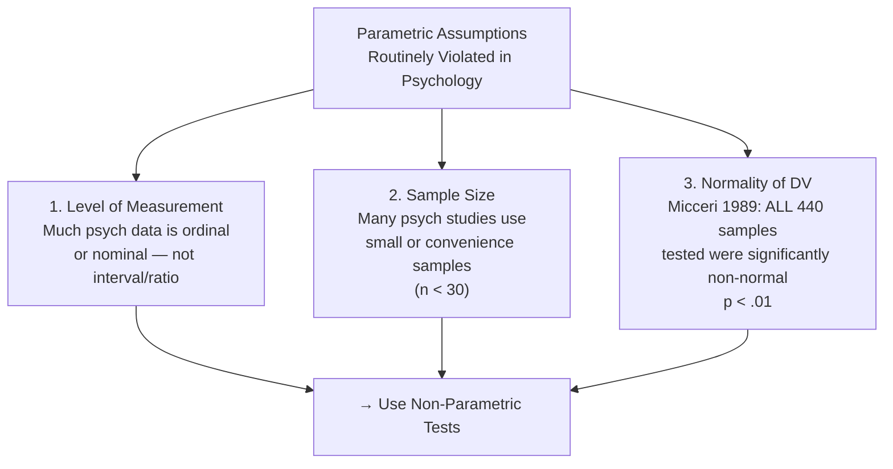
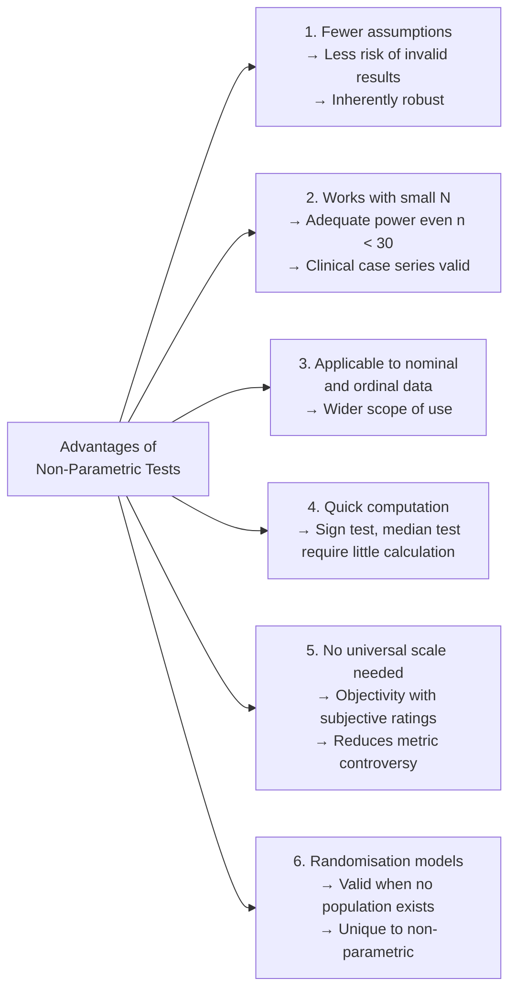

import Tabs from '@theme/Tabs';
import TabItem from '@theme/TabItem';

# Rationale for Non-Parametric Statistics

:::info Unit Overview
**Course**: MPC-006 Statistics in Psychology · Block 4 · Unit 1  
**Pages**: 5–20 · 📄 [Download PDF](/pdfs/MPC-006%20Statistics%20in%20Psychology/Block-4/Unit-1.pdf)  
**Prerequisite**: [Parameters, Statistics & Standard Error](/mpc-006/block-3/parameters-statistics-standard-error) | [One-Way ANOVA](/mpc-006/block-3/one-way-anova)
:::

---

## The Problem with "Assuming Normal"

Throughout the earlier units of MPC-006, every inferential technique — z-tests, t-tests, ANOVA — rested on a critical assumption: **the data come from a normally distributed population**. This assumption is so deeply embedded in classical statistics that researchers sometimes forget it is an assumption at all, not a fact.

Consider some common psychological measurement situations:

- A researcher ranks 12 therapy approaches from most to least effective — the data are **ordinal** (ranks), not interval
- A clinician records whether each patient improved "yes/no" — the data are **nominal** (categories)
- A survey asks participants to rate pain on a 1–5 scale — the intervals between 1, 2, 3, 4, 5 may *not* be equal
- A study draws only 8 participants from a rare clinical population — the **sample is too small** to assume normality

In all these situations, classical (parametric) statistics are technically invalid. **Non-parametric statistics** offer a principled alternative — a family of tests that make fewer assumptions about the data's distribution, work with nominal and ordinal scales, and remain valid even with small samples.

:::tip Etymology
"Parametric" comes from *parameter* — a fixed characteristic of a population (e.g., the population mean μ). Parametric tests make hypotheses *about* parameters. "Non-parametric" tests focus instead on ranks, medians, or frequencies — not population parameters. Hence the alternative name: **distribution-free tests**.
:::

---

## What Is Non-Parametric Statistics?

**Non-parametric statistics** is a branch of statistics that:

1. **Does not assume** a specific distribution (normal, binomial, etc.) for the population
2. **Works with ranks** of observations, rather than their absolute values
3. **Applies to nominal and ordinal data**, not only interval/ratio data
4. **Makes no claim** about population parameters like μ or σ

> *"Non-parametric statistics is defined to be a function on a sample that has no dependency on a parameter. The interpretation does not depend on the population fitting any parametrized distributions."* — PDF, p. 6

Two key branches exist within non-parametric statistics:
- **Distribution-free methods**: Test hypotheses without assuming any particular distribution shape
- **Non-structural (nonparametric model) methods**: The model itself grows in complexity to fit the data, rather than imposing a fixed structure

[Wikipedia: Non-parametric statistics](https://en.wikipedia.org/wiki/Nonparametric_statistics)

---

## Parametric vs Non-Parametric: A Direct Comparison

| Dimension | Parametric Tests | Non-Parametric Tests |
|-----------|-----------------|---------------------|
| **Assumed distribution** | Normal | Any (distribution-free) |
| **Assumed variance** | Homogeneous | Homogeneous or heterogeneous |
| **Typical data type** | Interval or Ratio | Ordinal or Nominal |
| **Central measure used** | Mean | Median |
| **Hypothesis about** | Population parameters (μ, σ) | Ranks, medians, frequencies |
| **Sample size requirement** | Large (≥30 per group recommended) | Flexible; works with small N |
| **Power when assumptions met** | Higher | Slightly lower |
| **Power when assumptions violated** | Can be severely reduced | Robust — power maintained |
| **Complexity of computation** | Moderate to high | Often simple |
| **Typical examples** | t-test, ANOVA, Pearson r | Mann-Whitney U, Kruskal-Wallis, Spearman r |

---

## The Three Violated Assumptions: Why Non-Parametric Tests Are Needed

Three parametric assumptions are *routinely* violated in psychological research:



### 1. Level of Measurement

The **level of measurement** of your data dictates which statistical tests are legitimate. Stevens' (1946) classic taxonomy defines four levels:

[Wikipedia: Level of measurement](https://en.wikipedia.org/wiki/Level_of_measurement)

<Tabs>
<TabItem value="nominal" label="Nominal (Categorical)">

**Definition**: Categories with no implied order or numerical meaning.

**Examples in psychology**:
- Gender: male / female / non-binary
- Diagnosis: schizophrenia / bipolar / depression
- Employment status: employed / unemployed
- Preference: Yes / No

**Key property**: Numbers are labels only — you cannot compute a mean or rank.  
**Required test type**: Non-parametric (Chi-square, Fisher's exact test)

*Back pain survey example from PDF:*  
*"Does your back problem affect your employment status? Yes / No"* — purely nominal.

</TabItem>
<TabItem value="ordinal" label="Ordinal (Rank-Order)">

**Definition**: Categories with a meaningful order, but *unequal intervals* between positions.

**Examples in psychology**:
- Pain intensity: 1 (mild) → 5 (severe) — the gap between 1 and 2 may not equal the gap between 4 and 5
- Likert scales: Strongly Disagree → Strongly Agree
- Class rank, army ranks, university grades

**Key property**: You know A > B, but not *by how much*.  
**Required test type**: Non-parametric (Spearman r, Mann-Whitney U, Wilcoxon)

*Walking intensity example from PDF (Oswestry Disability Index)*: Each step up the scale represents more pain, but the psychological distance between levels is unknown.

</TabItem>
<TabItem value="interval" label="Interval">

**Definition**: Equal intervals between values, but **no true zero** (zero is arbitrary).

**Examples**:
- Temperature in Celsius (0°C ≠ absence of heat)
- IQ scores (IQ 0 is not "no intelligence")
- Calendar years

**Key property**: 80°C is not "twice as hot" as 40°C.  
**Allows**: Mean, SD, t-tests, ANOVA  
**Requires**: Parametric tests (at minimum)

</TabItem>
<TabItem value="ratio" label="Ratio">

**Definition**: Equal intervals **and** a true zero (zero = absence of the property).

**Examples in psychology**:
- Reaction time in milliseconds (0 ms = no reaction)
- Number of errors on a task
- Weight, height, blood pressure

**Key property**: 200 ms is genuinely twice as slow as 100 ms.  
**Allows**: All arithmetic operations, all parametric tests  
**Most information-rich** level of measurement

</TabItem>
</Tabs>

### 2. Sample Size

Parametric tests assume large samples (N ≥ 30 per group is a common guideline). With small N:
- The **central limit theorem** does not yet guarantee a normal sampling distribution
- **Type II error** risk rises — true effects go undetected
- Non-parametric tests, which work with ranks rather than raw values, **maintain adequate power** even with N as small as 5–10

Research by **Blair et al. (1985)** compared the t-test (parametric) with the Wilcoxon Signed-Rank Test (non-parametric) across samples of N = 10, 25, and 50. Crucially, the Wilcoxon was *more powerful* than the t-test in a greater number of conditions — and its power advantage actually *increased* with larger samples. Blair concluded: "It is difficult to justify the use of a t-test in situations where the shape of the sampled population is unknown."

### 3. Normality of the Data

The most sobering evidence comes from **Micceri et al. (1989)**, who examined the distribution of 440 large-sample achievement and psychometric measures. The finding: **every single sample was significantly non-normal** (p < .01). The assumption of normality, they concluded, appears to be "fallacious for the commonly used data in these samples."

What non-normal distributions look like in practice:
- **Rare clinical conditions**: skewed heavily right (most people unaffected, a few severely so)
- **Likert-scale survey data**: discrete, bounded, often bimodal
- **Reaction time data**: right-skewed (fast responses cluster near zero, slow responses have no upper bound)
- **Anxiety/depression scores in general population**: floor effect (most people score low)

---

## The Non-Parametric Family: What Test to Use

The most important practical skill is matching your research question and data type to the right test. For every parametric test, there is a non-parametric equivalent:

| Research Question | Parametric Test | Non-Parametric Equivalent |
|-------------------|----------------|--------------------------|
| Correlation between 2 variables | Pearson r | **Spearman Rho** / Kendall Tau |
| 2 independent groups | Independent t-test | **Mann-Whitney U Test** |
| 3+ independent groups | One-Way ANOVA | **Kruskal-Wallis H Test** |
| 2 related/paired measurements | Paired t-test | **Wilcoxon Signed-Rank Test** |
| 3+ related measurements | Repeated Measures ANOVA | **Friedman's Two-Way ANOVA** |
| 2 groups, dichotomous DV | — | **McNemar's Chi-Square** |
| 2×2 contingency table | — | **Chi-Square / Fisher's Exact Test** |
| Inter-rater agreement (ranks) | — | **Kendall's Coefficient of Concordance** |

---

## Four Categories of Non-Parametric Problems

The PDF (p. 13–14) organises non-parametric tests into four practical problem types:

### 1. Differences Between Independent Groups

*When groups are unrelated — different people in each group.*

- **2 groups**: **Mann-Whitney U Test** (also: Wald-Wolfowitz Runs Test, Kolmogorov-Smirnov two-sample test)
- **3+ groups**: **Kruskal-Wallis H Test** (rank-based equivalent of one-way ANOVA; multiple comparisons available)

*Example*: Comparing anxiety scores across three diagnostic groups (healthy, sub-clinical, clinical) when samples are small and non-normal.

### 2. Differences Between Dependent (Paired) Groups

*When the same people are measured twice, or matched pairs are compared.*

- **2 conditions**: **Wilcoxon Signed-Rank Test** or **Sign Test**
- **Dichotomous outcome**: **McNemar's Chi-Square**
- **3+ repeated conditions**: **Friedman's Two-Way ANOVA** (non-parametric equivalent of repeated measures ANOVA)
- **Proportion changes over time**: **Cochran Q Test**

*Example*: Measuring depression scores before and after therapy in 8 participants — too small for a t-test, but Wilcoxon is valid.

### 3. Relationships Between Variables

*Measuring how strongly two variables co-vary.*

- **Rank-based correlation**: **Spearman R** or **Kendall Tau**
- **Two categorical variables**: **Chi-Square Test** or **Phi Coefficient**
- **Multiple judges ranking same stimuli**: **Kendall's Coefficient of Concordance**
- **Small sample with categorical data**: **Fisher's Exact Test**

### 4. Descriptive Statistics for Non-Normal Data

When data does not follow a normal distribution, standard parametric descriptives can be misleading. Non-parametric alternatives include:
- **Median** instead of mean (robust to outliers)
- **Interquartile range (IQR)** instead of standard deviation
- **Geometric mean** for logarithmically-distributed data (e.g., psychophysical stimulus intensity ratings)

---

## Advantages of Non-Parametric Statistics



**Key insight on power**: Non-parametric tests are *not* inherently less powerful. When parametric assumptions are violated, the parametric test loses validity and power. A non-parametric test that honestly uses the available information (ranks) will outperform an invalid parametric test. Power parity is achieved under normality; non-parametric tests gain the advantage under non-normality.

---

## Disadvantages of Non-Parametric Statistics

Two genuine limitations exist:

**1. No parameter estimates or confidence intervals**  
When a parametric t-test finds a significant difference, it tells you the mean difference and its confidence interval. The Mann-Whitney U test tells you the groups differ — but not by *how much*. Quantitative effect size statements are harder to make.  
*(Newer software like R can compute confidence intervals for medians and median differences, but this remains more complex.)*

**2. Information loss through ranking**  
Converting scores to ranks discards magnitude information. If Group A scores 10, 11, 12 and Group B scores 10, 50, 100 — both groups get ranks 1–3. The dramatic difference in the raw scores is partially invisible after ranking. This means non-parametric tests are marginally less sensitive than parametric tests *when all parametric assumptions are met*.

---

## Misconceptions About Non-Parametric Tests

Despite their utility, non-parametric tests are underused due to persistent myths:

| Misconception | Reality |
|--------------|---------|
| "Non-parametric tests are always less powerful" | False — they match or exceed parametric power when assumptions are violated |
| "Non-parametric tests are only for small samples" | False — they are valid and useful for large samples too |
| "There are only a few simple non-parametric designs" | False — non-parametric equivalents exist for virtually every parametric design, including structural equation modelling |
| "Reviewers won't understand them" | This is a social/institutional problem, not a statistical one |
| "They have no assumptions" | False — independence of observations is still required; continuity of variable is assumed |
| "They're less rigorous" | False — they are rigorously derived from mathematical principles; they are simply more honest about what the data can tell us |

---

## When to Choose: Parametric vs Non-Parametric Decision Guide

Use this decision process before choosing a statistical test:

1. **What is the level of measurement of your DV?**
   - Nominal → Non-parametric (Chi-square family)
   - Ordinal → Non-parametric (Wilcoxon, Spearman, etc.)
   - Interval/Ratio → Continue to step 2

2. **Is your sample large enough?**
   - N < 20 per group → Consider non-parametric
   - N ≥ 30 per group → Parametric generally acceptable

3. **Does your DV approximate a normal distribution?**
   - Yes (or large N by CLT) → Parametric acceptable
   - No / Unknown → Non-parametric preferred

4. **Are variances approximately equal across groups?**
   - Yes → Standard parametric test
   - No → Welch's correction OR non-parametric equivalent

5. **Are there notable outliers?**
   - Yes → Non-parametric (rank-based methods are robust to outliers)

*"If in doubt, try both. If both give the same conclusion, report the parametric result. If they differ, investigate why — the discrepancy itself is informative."* — consistent with PDF advice (p. 12)

---

## Indian Research Context

Non-parametric statistics have particular relevance in Indian psychological research contexts:

**Clinical Psychology**: India's clinical research often works with small patient populations (rare disorders, niche clinical presentations at specialist centres like NIMHANS or AIIMS). Wilcoxon tests and Kruskal-Wallis H are commonly reported in Indian clinical journals where sample sizes rarely exceed 30.

**Educational Research**: Many Indian rural school studies use convenience samples drawn from a single school or district. Spearman correlations and Mann-Whitney comparisons of urban vs rural student groups are standard when sample sizes and measurement quality cannot support parametric assumptions.

**Psychometric Adaptation**: Adapting Western psychological scales (e.g., Beck Depression Inventory, WHO-5) to Indian populations often reveals non-normal distributions — ceiling/floor effects, cultural response biases — making non-parametric validation approaches essential.

**Qualitative-to-Quantitative Interface**: India has a strong tradition of qualitative psychology (particularly in community and counselling settings). Non-parametric methods — working with ranked preferences, category frequencies, Likert ratings — serve as a natural bridge when quantifying qualitative data.

---

## Real-World Applications

- **Medical/clinical trials** with small rare-disease samples → Wilcoxon tests for pre-post comparison
- **Customer satisfaction surveys** using 1–5 star ratings → Kruskal-Wallis to compare across demographics
- **Educational evaluation** of teaching methods using Likert-scale student ratings → Mann-Whitney U
- **Sensory psychology** rating stimulus intensity → Spearman correlation between physical intensity and perceived intensity
- **Sports psychology** ranking athletic performance → Kendall's coefficient of concordance for inter-judge agreement
- **Neuropsychology** with very small clinical populations (N=6 stroke patients) → Sign test or Wilcoxon

---

## Memory Aids

### 🧠 The "NOIRS" Levels of Measurement Mnemonic
> **N**ominal → **O**rdinal → **I**nterval → **R**atio → **S**tronger  
> Each level adds one more property:  
> Nominal: names · Ordinal: names + order · Interval: + equal gaps · Ratio: + true zero

### 🎯 The "WHEN to Go Non-Parametric" Checklist
> **S**mall sample (< 30)?  
> **O**rdinal or nominal data?  
> **N**ot normally distributed?  
> **I**nequal variances?  
> **C**lear outliers present?  
> If **ANY** of the above = YES → Consider non-parametric tests  
> *("SONIC" — non-parametric is the sound choice!)*

### 🔢 Parametric-to-Non-Parametric Swap Table (Quick Reference)
```
t (independent)  →  Mann-Whitney U
t (paired)       →  Wilcoxon Signed-Rank
One-Way ANOVA    →  Kruskal-Wallis H
Repeated ANOVA   →  Friedman's Test
Pearson r        →  Spearman Rho / Kendall Tau
```

---

## External Resources

### 📖 Essential Reading
- [Wikipedia: Non-parametric statistics](https://en.wikipedia.org/wiki/Nonparametric_statistics) — history, categories, and key tests
- [Wikipedia: Level of measurement](https://en.wikipedia.org/wiki/Level_of_measurement) — Stevens' four scales with psychological examples
- [Wikipedia: Statistical hypothesis testing](https://en.wikipedia.org/wiki/Statistical_hypothesis_testing) — parametric vs non-parametric in context

### 🎓 Video Lectures
- [Crash Course Statistics #28: Non-Parametric Tests](https://www.youtube.com/watch?v=0-rhT1r7ZwE) — clear conceptual overview
- [StatQuest: Mann-Whitney U Test (Josh Starmer)](https://www.youtube.com/watch?v=BR9yKm8Hk9Q) — visual walkthrough of the most common non-parametric test
- [Khan Academy: Chi-Square Tests](https://www.khanacademy.org/math/statistics-probability/inference-categorical-data-chi-square-tests) — for nominal data analysis

### 📚 Research Papers (2020–2025)
- Fagerland, M.W. (2012). t-tests, non-parametric tests, and large studies — a paradox of statistical practice. *BMC Medical Research Methodology*, 12, 78. [doi:10.1186/1471-2288-12-78] — directly addresses the parametric/non-parametric choice debate
- Richter, S.J., & Payton, M.E. (2020). A simulation study comparing the power of several rank tests under various distributional alternatives. *Communications in Statistics – Simulation and Computation*. — modern power comparison study
- Siegel, S., & Castellan, N.J. (1988). *Non-parametric Statistics for the Behavioral Sciences* (2nd ed.). McGraw-Hill. — the definitive reference cited in the PDF

### 🛠 Online Tools
- [Social Science Statistics: Mann-Whitney U Calculator](https://www.socscistatistics.com/tests/mannwhitney/default2.aspx) — compute non-parametric tests online
- [GraphPad: Non-parametric test guide](https://www.graphpad.com/guides/prism/latest/statistics/index.htm) — when to use each non-parametric test
- [JASP Software](https://jasp-stats.org/) — free statistics software with excellent non-parametric test support and output

---

## Self-Assessment Questions

### 🟢 Knowledge (Recall)

1. **Define non-parametric statistics** and distinguish it from parametric statistics. What does "distribution-free" mean?

2. **List the four levels of measurement** (Stevens' scales) with one psychological example of each. Which levels require non-parametric tests?

3. **State the assumptions** of (a) parametric tests and (b) non-parametric tests. Which parametric assumptions are most commonly violated in psychology research?

### 🟡 Comprehension (Understanding)

4. **Micceri et al. (1989)** found that all 440 samples in their study were significantly non-normal. What are the implications of this finding for researchers who routinely apply parametric tests to psychological data?

5. **Explain the "power misconception"** regarding non-parametric tests. Under what conditions are non-parametric tests equally or more powerful than their parametric counterparts?

6. **For each of the following research scenarios**, state whether you would use a parametric or non-parametric test and name the specific test:
   - Comparing depression scores (rated 1–10) between 2 groups of 8 participants each
   - Measuring correlation between study hours and exam grades (both interval scale, N = 150)
   - Testing whether 3 groups of patients improve/do not improve after treatment (dichotomous outcome)
   - Comparing rank-ordered quality ratings of 5 products by 20 judges

### 🔴 Application (Critical Thinking)

7. **A researcher argues**: *"My sample has N = 200, so I don't need to worry about normality — the central limit theorem takes care of it."* Evaluate this argument. Under what circumstances would you still recommend a non-parametric test even with N = 200?

---

## Summary

| Concept | Key Point |
|---------|-----------|
| Non-parametric statistics | Distribution-free; based on ranks/frequencies, not population parameters |
| Parametric tests require | Normal distribution, interval/ratio data, adequate N, homogeneous variance |
| Non-parametric tests require | Independence of observations; continuity of variable |
| Nominal data | Categories, no order — use Chi-square, Fisher's exact |
| Ordinal data | Ranked, unequal intervals — use Spearman, Mann-Whitney, Wilcoxon |
| Interval/Ratio data | Equal gaps (interval) or true zero (ratio) — parametric generally acceptable |
| Power myth | Non-parametric tests are NOT inherently less powerful; they match or exceed power when parametric assumptions are violated |
| Three violated assumptions | Measurement level, sample size, normality |
| When to use non-parametric | Small N, ordinal/nominal data, non-normal distribution, outliers, unknown distribution |
| Disadvantages | No parameter estimates; information loss from ranking |
| Key researchers | Micceri (1989) — normality myth; Blair et al. (1985) — power comparison; Pierce (1970) — validity argument |

---

**Source PDFs**:
- 📄 [Block-4/Unit-1.pdf — Pages 5–20](/pdfs/MPC-006%20Statistics%20in%20Psychology/Block-4/Unit-1.pdf)
- 📚 MPC-006 Statistics in Psychology, IGNOU
