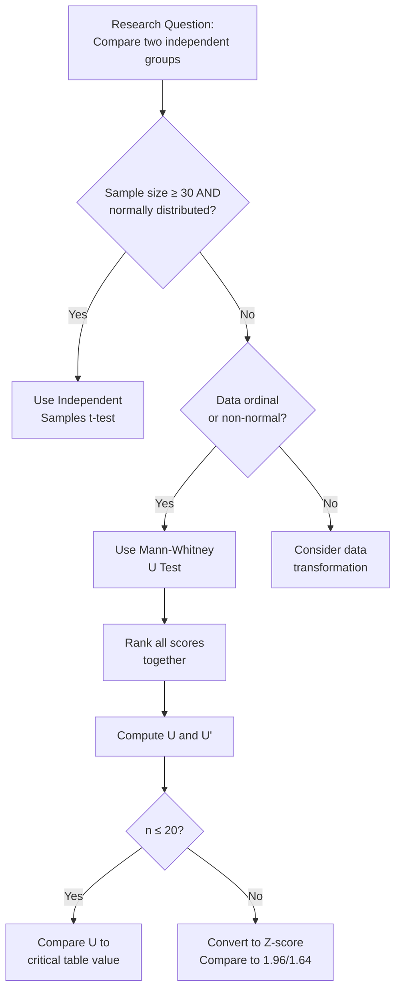

import Tabs from '@theme/Tabs';
import TabItem from '@theme/TabItem';

# Mann-Whitney U Test: Non-Parametric Analysis for Two Independent Samples

## Overview

When comparing two independent groups in psychological research, the **Mann-Whitney U test** is the non-parametric counterpart to the independent samples t-test. Originally developed independently by Mann and Whitney (1947) and Wilcoxon (1949), it compares the *medians* of two groups by ranking all scores together and examining the degree of separation between groups — no assumption of normality required.

This unit covers the complete workflow: theoretical foundations, step-by-step hand calculation for small and large samples, SPSS execution, and a direct comparison with the t-test.

:::info Key Terms at a Glance
- **Two-sample test**: Compares two independent groups on a single variable
- **Rank-sum**: Ranking all scores together before computing the test statistic
- **U statistic**: The count of times scores from one group exceed scores from the other group
- **Ordinal data**: Data that can be ranked but does not meet interval/ratio assumptions
:::

---

## 2.2 What Are Two-Sample Tests?

Two-sample tests assess whether two independent groups differ on a variable of interest. The **null hypothesis** takes the form:

> *H₀: The two populations from which the samples are drawn are identical (X and Y are independent).*

### When to Use Non-Parametric Two-Sample Tests

The parametric independent-samples t-test requires:
- Sample size ≥ 30 in each group (or normally distributed data)
- Homogeneity of variance
- Interval/ratio level measurement

When these assumptions are **violated** — small samples, skewed distributions, ordinal data, or gross variance inequality — the **Mann-Whitney U test** steps in as the appropriate alternative.

### Classic Scenarios

| Research Question | Groups | Measurement |
|---|---|---|
| Do males and females differ in History exam scores? | Male / Female (nominal) | Scores 0–100 (ordinal if n < 30) |
| Does teaching method affect final exam performance? | Method 1 / Method 2 | Exam scores |
| Do two surgical groups differ in hospital stay? | Standard / Experimental surgery | Days (continuous, but small n) |

---

## 2.3 The Mann-Whitney U Test: Core Logic

The Mann-Whitney U test analyses the **degree of separation** (or overlap) between an Experimental (E) group and a Control (C) group by counting how many times E scores exceed C scores and vice versa.

$$U_1 = N_1 N_2 + \frac{N_1(N_1 + 1)}{2} - \Sigma R_1$$

$$U_2 = N_1 N_2 + \frac{N_2(N_2 + 1)}{2} - \Sigma R_2$$

Where:
- $N_1$, $N_2$ = sample sizes of Group 1 and Group 2
- $\Sigma R_1$, $\Sigma R_2$ = sum of ranks for each group
- $U$ = smaller of $U_1$ and $U_2$
- $U'$ = larger of $U_1$ and $U_2$

The statistic $U_1$ literally counts the number of times a score from Group 1 exceeds a score from Group 2. If there is no difference between groups, both counts should be approximately equal.

### Directional Interpretation

| Hypotheses | Description |
|---|---|
| **H₀ (Null)** | The two sets of scores come from the same population — no systematic difference |
| **H₁ (Non-directional)** | The two sets differ systematically (two-tailed test) |
| **H₁ (Directional)** | Group E scores are *specifically* higher (or lower) than Group C scores (one-tailed test) |



---

## 2.4 Assumptions and Background of the U Test

The Mann-Whitney U test, while "assumption-lite" compared to the t-test, is not assumption-free. Key sources (Conover, 1980; Siegel & Castellan, 1988) specify:

1. **Random sampling**: Each sample randomly selected from its population
2. **Independence**: The two samples are independent of each other
3. **Continuous variable**: The original variable is (ideally) a continuous random variable, subsequently ranked
4. **Identical distribution shape**: The two underlying populations have the same shape (though not necessarily normal)

:::caution Homogeneity of Variance
Maxwell and Delaney (1990) noted that identical distribution shapes implies equal dispersion — meaning the Mann-Whitney test also implicitly assumes **homogeneity of variance**, though this assumption is less often acknowledged. The test is somewhat less sensitive to variance violations than the t-test.
:::

### Why Rank Data? Handling Outliers

A key advantage of ranking: by converting raw scores to ranks, **outliers lose their disproportionate influence**. A score of 2,000 in a dataset with typical scores around 50–100 becomes rank 20 — still "high" but not distorting. This makes the Mann-Whitney U test especially valuable in clinical and applied psychology where extreme cases are common.

### Historical Note

The test was independently developed by:
- **Mann and Whitney (1947)** — the U statistic version described here
- **Wilcoxon (1949)** — the rank-sum version (Wilcoxon-Mann-Whitney test)

Both yield comparable results despite using different computational formulas and tables.

---

## 2.5 Step-by-Step: Mann-Whitney U Test for Small Samples (n ≤ 20)

**Use when**: n ≤ 20 in each group AND data is:
- In rank-order format, OR
- Not normally distributed, OR
- Shows obvious variance inequality between groups

### Procedure

**STEP 1**: Rank ALL scores together (both groups combined), assigning rank 1 to the *lowest* score.

**STEP 2**: Sum the ranks for Group 1: $\Sigma R_1$

**STEP 3**: Sum the ranks for Group 2: $\Sigma R_2$

**STEP 4**: Compute U and U' using the formulas above.

**STEP 5**: Compare the **smaller** of U and U' to the critical value from Table H (based on $N_1$, $N_2$, and significance level). The result is **significant if the observed value ≤ the table value**.

**STEP 6**: Translate the statistical result back into the context of the research question.

### Worked Example: Assessment Centre Ratings

Two assessment teams independently rated officers on a performance scale. We want to know if the two teams gave significantly different ratings.

| Assessment Team 1 Ratings | Assessment Team 2 Ratings |
|---|---|
| N₁ = 12 officers | N₂ = 13 officers |
| ΣR₁ = 148 | ΣR₂ = 177 |

**Computing U:**
$$U = (12)(13) + \frac{12(13)}{2} - 148 = 156 + 78 - 148 = 86$$

**Computing U':**
$$U' = (12)(13) + \frac{13(14)}{2} - 177 = 156 + 91 - 177 = 70$$

**Decision**: The smaller value is U' = 70. For N₁ = 12, N₂ = 13, α = 0.05 (two-tailed), the critical value from Table H is **41**.

Since 70 > 41, we **fail to reject H₀**. There is no significant difference in ratings between the two assessment teams.

:::tip Significance Rule for Small Samples
For the Mann-Whitney U test (small sample): The result is significant if **U ≤ critical table value**. This is the *opposite* direction from t-tests — smaller U = greater separation between groups.
:::

---

## 2.6 Step-by-Step: Mann-Whitney U Test for Large Samples (n > 20)

When both sample sizes exceed approximately 20, the **sampling distribution of U approaches normality**, allowing conversion to a Z-score:

$$Z = \frac{U - \frac{N_1 N_2}{2}}{\sqrt{\frac{N_1 N_2 (N_1 + N_2 + 1)}{12}}}$$

### Significance Criteria for Z

| Test Type | Significance at α = .05 |
|---|---|
| Two-tailed | Z > 1.96 |
| One-tailed | Z > 1.64 |

:::note Why Restrict to Small Samples?
For large samples, the **ranking procedure becomes laborious**, and **violations of parametric assumptions become less consequential** (the Central Limit Theorem mitigates normality concerns). Thus, Mann-Whitney U is most distinctively useful for small-to-moderate sample sizes where parametric tests are unreliable.
:::

---

## 2.7 Computing Mann-Whitney U in SPSS

The SPSS workflow for non-parametric two-sample tests:

```
Analyse → Non-Parametric Tests → Legacy Dialogs → 2 Independent Samples
```

### Detailed Steps

1. **Analyse** → **Non-Parametric Tests** → **2 Independent Samples**
2. Move the **dependent variable** (e.g., test scores) into the *Test Variable List*
3. Move the **grouping variable** (e.g., gender, treatment group) into the *Grouping Variable* box
4. Click **Define Groups** → enter the codes for each group (e.g., 1 = male, 2 = female) → **Continue**
5. Under **Test Type**, ensure **Mann-Whitney U** is checked
6. For exact probabilities: click **Exact** → **Exact** → **Continue**
7. Click **OK**

### Reading SPSS Output

SPSS provides:
- **Mean Rank** for each group
- **Sum of Ranks** for each group
- **U statistic** and **W statistic** (Wilcoxon's version)
- **Z-score** (for large samples)
- **Asymptotic significance (2-tailed)** p-value
- **Exact significance** p-value (if requested)

---

## Self-Assessment Questions

### Level 1 — Recall

1. What is the non-parametric equivalent of the independent samples t-test?

2. What is the null hypothesis in the Mann-Whitney U test?

3. For a small sample Mann-Whitney U test with α = .05 (two-tailed), you obtain U = 15 and U' = 41. The critical table value is 23. What is your decision?

### Level 2 — Application

4. A researcher compares anxiety scores of yoga practitioners (n = 8) vs. non-practitioners (n = 9). Scores are ordinal (Likert scale 1–5) and distributions are skewed. Which test is appropriate, and why? What would constitute a significant result?

5. After combining and ranking scores from two groups, you find ΣR₁ = 95 (N₁ = 10) and ΣR₂ = 120 (N₂ = 11). Compute U and U'. Which value do you compare to the critical table?

### Level 3 — Critical Thinking

6. A colleague argues: "Ranking data loses information, so non-parametric tests are always inferior to parametric tests." Evaluate this claim. Under what conditions would you choose the Mann-Whitney U test even when a t-test could technically be run?

7. If two groups have identical medians but very different variances, would the Mann-Whitney U test reliably detect no group difference? What does this tell us about the test's implicit assumptions?

---

## 🧠 Memory Aid

**"MANN ranks, U counts"**

- **M**erge all scores into one list
- **A**ssign ranks (1 = lowest)
- **N**ote the rank sums per group
- **N**ow compute U and U' with the formulas

**U = N₁N₂ + [N₁(N₁+1)/2] - ΣR₁**

Think of it as: *"Total possible comparisons, plus correction, minus what was actually ranked to Group 1."*

---

## 📚 External Resources

### Foundational Reading
- 🌐 [Wikipedia: Mann-Whitney U test](https://en.wikipedia.org/wiki/Mann%E2%80%93Whitney_U_test) — Comprehensive coverage of the test's history, assumptions, and formula derivation
- 🌐 [Wikipedia: Non-parametric statistics](https://en.wikipedia.org/wiki/Nonparametric_statistics) — Broader context for distribution-free methods in psychology

### Tutorials and Guides
- 📖 [Laerd Statistics: Mann-Whitney U Test](https://statistics.laerd.com/statistical-guides/mann-whitney-u-test-statistical-guide.php) — Step-by-step guide with SPSS screenshots
- 📖 [Statistics How To: Mann Whitney U Test](https://www.statisticshowto.com/mann-whitney-u-test/) — Clear worked examples with interpretation
- 📖 [Real Statistics: Mann-Whitney Test](https://real-statistics.com/non-parametric-tests/mann-whitney-test/) — Excel and manual calculation approach

### Video Lectures
- 🎥 [Statistics 101: Mann-Whitney U — YouTube](https://www.youtube.com/watch?v=oZs88F_9Dws) — Visual, conceptual walkthrough
- 🎥 [SPSS: Mann-Whitney U Test — YouTube](https://www.youtube.com/watch?v=YOUOuMV9AKI) — Full SPSS tutorial with output interpretation

### Research Articles
- 📄 Fay, M. P., & Proschan, M. A. (2010). Wilcoxon-Mann-Whitney or t-test? On assumptions for hypothesis tests and multiple interpretations of decision rules. *Statistics Surveys, 4*, 1–39. [Link](https://projecteuclid.org/euclid.ss/1277444437)
- 📄 Nachar, N. (2008). The Mann-Whitney U: A test for assessing whether two independent samples come from the same distribution. *Tutorials in Quantitative Methods for Psychology, 4*(1), 13–20. [Link](https://www.tqmp.org/RegularArticles/vol04-1/p013/)
- 📄 Hart, A. (2001). Mann-Whitney test is not just a test of medians: differences in spread can be important. *BMJ, 323*(7309), 391–393.

---

**Source PDFs**:
- 📄 [Block-4/Unit-2.pdf — Pages 21–33](/pdfs/MPC-006%20Statistics%20in%20Psychology/Block-4/Unit-2.pdf)
- 📚 MPC-006 Statistics in Psychology
