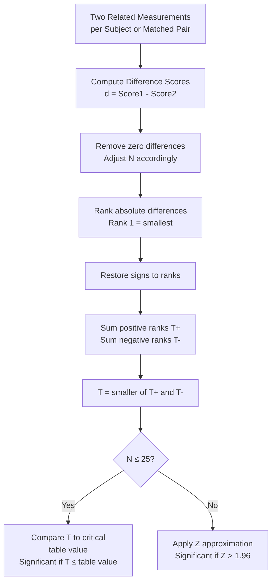

import Tabs from '@theme/Tabs';
import TabItem from '@theme/TabItem';

# Wilcoxon Matched-Pairs Signed-Ranks Test

## Overview

When comparing *related* measurements from the same participants — pre-test vs. post-test, two matched groups, or repeated measures — and the data violates the assumptions of the dependent-samples t-test, the **Wilcoxon Matched-Pairs Signed-Ranks (MPSR) test** is the appropriate non-parametric alternative. Developed by Wilcoxon (1945, 1949), this test takes into account *both the direction and magnitude* of differences between pairs, making it more powerful than the simpler Sign Test.

:::info This Unit Covers
1. Definition and logic of the Wilcoxon Matched-Pairs Signed-Ranks test
2. Assumptions and background
3. Step-by-step procedure for small samples (n ≤ 25)
4. Large-sample Z approximation
5. SPSS procedure
6. Comparison of Mann-Whitney U, Wilcoxon, and t-tests
:::

---

## 2.8 The Wilcoxon Matched-Pairs Signed-Ranks Test: Core Logic

The Wilcoxon MPSR test works on **difference scores** between matched pairs, then ranks those differences by absolute value. It examines whether the population of differences has a **median of zero**.

### Step-by-Step Logic

1. **Compute difference scores**: For each pair, $d_i = \text{Score}_{condition1} - \text{Score}_{condition2}$
2. **Rank differences by absolute value** (ignoring sign), giving rank 1 to the smallest absolute difference
3. **Restore signs**: Assign original + or − sign to each rank
4. **Sum positive ranks**: $T^+$
5. **Sum negative ranks**: $T^-$
6. **Test statistic T** = the *smaller* of $T^+$ and $T^-$
7. **Compare T** to critical value from table (significant if T ≤ table value)

:::note Why Differences of Zero Are Excluded
Pairs with zero difference (no change) cannot be ranked because they provide no directional information. These pairs are **excluded from analysis**, reducing the effective N.
:::

### What the Test Assesses

The null hypothesis:

> *H₀: In the underlying population, the median difference score equals zero.*

If H₀ is rejected, it indicates the two conditions likely represent populations with different median values — i.e., the intervention or condition had a real effect.



---

## 2.9 Assumptions and Background

The Wilcoxon MPSR test was developed as a more sensitive alternative to the Sign Test — unlike the Sign Test, it uses **the magnitude of differences, not just their direction**.

### Formal Assumptions

1. **Random sampling**: The n subjects are randomly selected from the population
2. **Interval/ratio data**: The original scores should be at interval or ratio level (the *differences* are then ranked)
3. **Symmetric difference distribution**: The distribution of difference scores in the population is *symmetric* about the median

:::caution Key Distinction from Mann-Whitney
The Mann-Whitney U test assumes **independence** between the two samples. The Wilcoxon MPSR test applies when samples are **dependent** (same subjects tested twice, or matched pairs). These tests are not interchangeable!
:::

### Categorisation Debate

Most sources categorise the Wilcoxon MPSR test as an **ordinal-level test** because it involves a ranking step. However, some sources consider it an **interval-level test** since it ranks *difference scores* (which carry magnitude information), not the original data directly.

### Design Contexts

The Wilcoxon MPSR test is applicable to:

| Design Type | Example |
|---|---|
| **Pre-test / Post-test (same subjects)** | Anxiety scores before and after CBT intervention |
| **Matched pairs (different subjects)** | Twins randomly assigned to different treatments |
| **Counterbalanced repeated measures** | Same participants completing two different tasks |

---

## 2.10 Step-by-Step: Wilcoxon Test for Small Samples (n ≤ 25)

**Use when**: n ≤ 25 pairs AND:
- Differences between conditions can only be ranked in size, OR
- Data is obviously non-normal, OR
- Obvious variance differences between conditions

### Procedure

**STEP 1**: Compute the difference between each pair: $d = \text{Score}_1 - \text{Score}_2$ (retain sign)

**STEP 2**: Rank the **absolute values** of differences from smallest to largest. If differences are tied, assign the mean of the tied ranks.

**STEP 3**: Calculate **T** = sum of ranks for differences with the *less frequent sign*

**STEP 4**: Look up T in **Table J**. Significant if **observed T ≤ table value**.

**STEP 5**: Interpret the result in terms of the research question.

### Worked Example: Reaction Time and Alcohol

Eight pairs of twins were tested on complex reaction time. One member of each pair drank 3 double whiskies; the other was sober.

| Pair | Sober | Whisky | Difference (Sober − Whisky) | Absolute Diff | Rank |
|---|---|---|---|---|---|
| 1 | 310 | 300 | −10 | 10 | 1 |
| 2 | 340 | 320 | −20 | 20 | 2 |
| 3 | 290 | 360 | +70 | 70 | 5 |
| 4 | 270 | 320 | +50 | 50 | 4 |
| 5 | 370 | 540 | +170 | 170 | 6 |
| 6 | 330 | 360 | +30 | 30 | 3 |
| 7 | 320 | 680 | +360 | 360 | 7 |
| 8 | 320 | 1120 | +800 | 800 | 8 |

**STEP 3**: Less frequent sign = negative (2 negative differences)

$$T = \text{Rank}_1 + \text{Rank}_2 = 1 + 2 = 3$$

**STEP 4**: From Table J, for N = 8: critical value = 4.

Since T = 3 ≤ 4 (table value), the result is **significant**.

**STEP 5**: Complex reaction time scores are significantly higher after consuming alcohol than when sober. The Wilcoxon MPSR test confirms the alcohol-induced impairment in reaction time.

:::tip Handling Ties in Ranks
When two or more differences have the same absolute value, assign each the *mean* of the ranks they would have occupied. For example, if two values would occupy ranks 3 and 4, each receives rank 3.5.
:::

---

## 2.11 Step-by-Step: Wilcoxon Test for Large Samples (n > 25)

For larger samples, T is approximately normally distributed:

$$Z = \frac{T - \frac{N(N+1)}{4}}{\sqrt{\frac{N(N+1)(2N+1)}{24}}}$$

### Significance Criteria

| Test Type | α = .05 threshold |
|---|---|
| Two-tailed | \|Z\| > 1.96 |
| One-tailed | \|Z\| > 1.64 |

As with Mann-Whitney, for large samples the Wilcoxon test is still valid but often unnecessary — large samples meet parametric assumptions well enough that the t-test is preferred for its greater power.

---

## 2.12 Computing Wilcoxon Signed-Ranks in SPSS

```
Analyse → Non-Parametric Tests → Legacy Dialogs → 2 Related Samples
```

### Detailed Steps

1. **Analyse** → **Non-Parametric Tests** → **2 Related Samples**
2. Click on both variables that form the pair → click the arrow to move them into *Test Pair(s) List*
3. Under **Test Type**, select **Wilcoxon**
4. For exact probabilities: click **Exact** → **Exact** → **Continue**
5. Click **OK**

### Interpreting SPSS Output

SPSS provides:
- **Negative Ranks**: n pairs where condition 1 < condition 2 (and their mean rank, sum of ranks)
- **Positive Ranks**: n pairs where condition 1 > condition 2 (and their mean rank, sum of ranks)
- **Ties**: n pairs with equal scores
- **Z statistic** and **Asymptotic Significance (2-tailed)** p-value

---

## Self-Assessment Questions

### Level 1 — Recall

1. What is the key difference between the Wilcoxon MPSR test and the Sign Test?

2. Why are pairs with a difference score of zero excluded from the Wilcoxon analysis?

3. In the Wilcoxon test, if you obtain T = 6 and the critical table value for N = 10 at α = .05 is 8, what is your conclusion?

### Level 2 — Application

4. A therapist measures depression scores (BDI) for 12 clients before and after a 10-week CBT programme. Scores are continuous but the distribution of *differences* is skewed. Which test is appropriate? Why not the paired t-test?

5. Compute the Wilcoxon T statistic for the following 5 pairs: differences = +4, −1, +7, +2, −3 (absolute values ranked: 1=1, 2=2, 3=3, 4=4, 5=7). Which sign is less frequent? What is T?

### Level 3 — Critical Thinking

6. A researcher has matched pairs (n = 15) and is debating between the Wilcoxon MPSR test and the dependent-samples t-test. The data are roughly normally distributed. Which would you recommend, and why? What is "lost" by choosing the non-parametric option?

7. The Wilcoxon MPSR test is sometimes described as an interval-level test rather than ordinal. Construct an argument for each position. Does this classification affect when you would use the test?

---

## 🧠 Memory Aid

**"DRIED Ranks"** — Wilcoxon MPSR procedure:

- **D**ifferences: compute $d = \text{Score}_1 - \text{Score}_2$
- **R**emove zeros (exclude ties from analysis)
- **I**gnore signs; rank absolute differences
- **E**ndorse signs back onto ranks
- **D**ecide: T = sum of less-frequent-sign ranks; compare to table

**Tip**: The **smaller** T is, the *more* significant the result. T approaching zero means one direction of difference is nearly absent — strong evidence of an effect.

---

## 📚 External Resources

### Foundational Reading
- 🌐 [Wikipedia: Wilcoxon signed-rank test](https://en.wikipedia.org/wiki/Wilcoxon_signed-rank_test) — Mathematical derivation, assumptions, and historical context
- 🌐 [Wikipedia: Sign test](https://en.wikipedia.org/wiki/Sign_test) — Simpler alternative for comparison

### Tutorials and Guides
- 📖 [Laerd Statistics: Wilcoxon Signed-Rank Test](https://statistics.laerd.com/statistical-guides/wilcoxon-signed-rank-test-statistical-guide.php) — Step-by-step guide with SPSS output
- 📖 [Statistics How To: Wilcoxon Signed-Rank Test](https://www.statisticshowto.com/wilcoxon-signed-rank-test/) — Accessible tutorial with examples
- 📖 [Real Statistics: Wilcoxon Signed Ranks Test](https://real-statistics.com/non-parametric-tests/wilcoxon-signed-ranks-test/) — Excel implementation included

### Video Resources
- 🎥 [Wilcoxon Signed Rank Test — YouTube (StatQuest)](https://www.youtube.com/watch?v=TqCg2tb4wJ0) — Conceptual walkthrough
- 🎥 [SPSS Wilcoxon Signed Rank Test Tutorial](https://www.youtube.com/watch?v=lMPEn-cAzsk) — Full SPSS output interpretation

### Research Articles
- 📄 Wilcoxon, F. (1945). Individual comparisons by ranking methods. *Biometrics Bulletin, 1*(6), 80–83. (Original paper)
- 📄 Conover, W. J., & Iman, R. L. (1981). Rank transformations as a bridge between parametric and nonparametric statistics. *The American Statistician, 35*(3), 124–129.
- 📄 Rosner, B., Glynn, R. J., & Lee, M. T. (2006). The Wilcoxon signed rank test for paired comparisons of clustered summary measures. *Biometrics, 62*(1), 185–192.

---

**Source PDFs**:
- 📄 [Block-4/Unit-2.pdf — Pages 28–33](/pdfs/MPC-006%20Statistics%20in%20Psychology/Block-4/Unit-2.pdf)
- 📚 MPC-006 Statistics in Psychology
