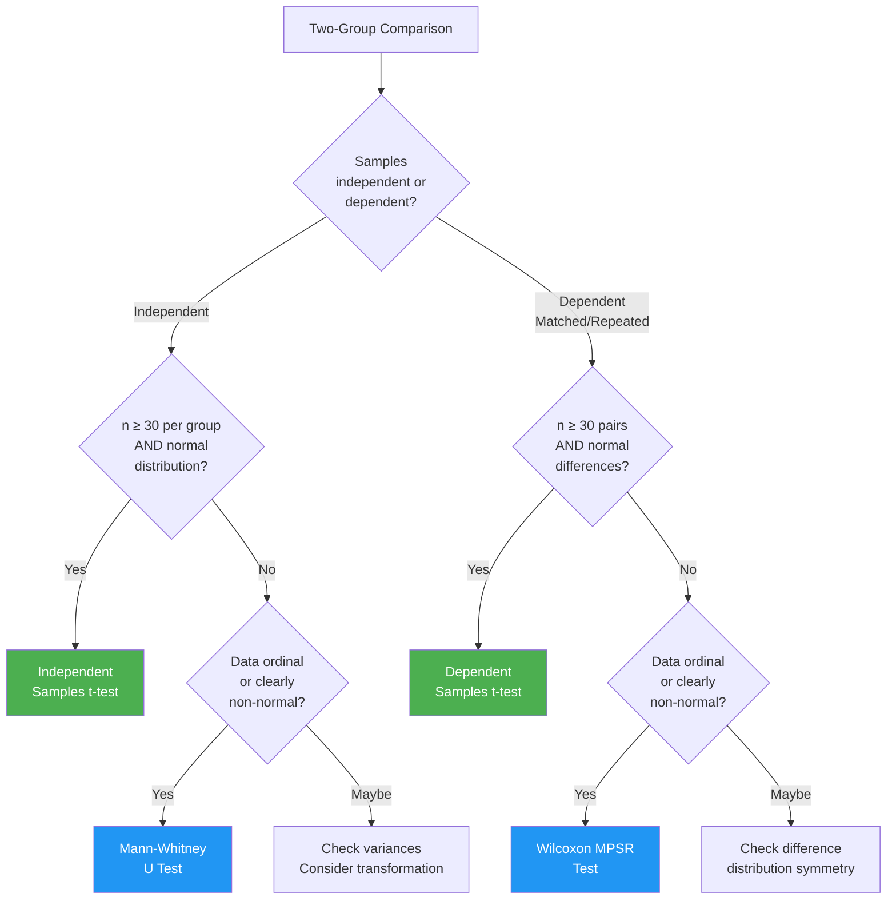

import Tabs from '@theme/Tabs';
import TabItem from '@theme/TabItem';

# Parametric vs. Non-Parametric Two-Sample Tests

## Overview

One of the most practical decisions in psychological research is: *should I use a parametric test (t-test) or a non-parametric test (Mann-Whitney U or Wilcoxon)?* This unit synthesises the comparison drawn in the IGNOU MPC-006 curriculum, situating it within the broader debate in statistical methodology.

---

## 2.13 Power Efficiency: The Central Trade-Off

The **power efficiency** of a non-parametric test is often defined relative to its parametric equivalent. For the Mann-Whitney U and Wilcoxon tests:

> When the assumptions of the t-test are *fully met*, the non-parametric tests require slightly larger sample sizes to achieve the same statistical power. However, when t-test assumptions are *violated*, non-parametric tests often outperform parametric alternatives.

### Asymptotic Relative Efficiency (ARE)

For normally distributed data, the Mann-Whitney U test has an **ARE of approximately 0.955** compared to the t-test — meaning it requires only about 5% more observations to achieve equivalent power. This is remarkably high for a "less powerful" test.

For data from non-normal distributions, the ARE can *exceed* 1.0 — meaning the non-parametric test is actually *more* powerful.

---

## Full Comparison Table

| Feature | Independent t-test | Mann-Whitney U | Dependent t-test | Wilcoxon MPSR |
|---|---|---|---|---|
| **Design** | Two independent groups | Two independent groups | Matched/repeated measures | Matched/repeated measures |
| **Data level** | Interval/ratio | Ordinal or above | Interval/ratio | Ordinal or above |
| **Normality required** | Yes | No | Yes | No (symmetric differences) |
| **Sample size** | Ideally ≥ 30/group | Any (table for ≤20, Z for >20) | Ideally ≥ 30 pairs | Any (table for ≤25, Z for >25) |
| **Sensitive to outliers** | Yes (highly) | No (ranks neutralise outliers) | Yes | Moderate |
| **What it tests** | Mean difference | Median / rank-sum difference | Mean difference (paired) | Median difference score |
| **Power efficiency** | 100% (baseline) | ~95.5% under normality | 100% (baseline) | ~95.5% under normality |
| **Computation** | Moderate | Moderate (laborious for large n) | Moderate | Moderate |
| **SPSS menu** | Analyze → Compare Means | Analyze → Non-Param → 2 Independent | Analyze → Compare Means | Analyze → Non-Param → 2 Related |

---

## The Two Camps of Statistical Opinion

### The Non-Parametric Camp

Proponents argue non-parametric tests:
- Are **simpler to compute** (especially with small samples)
- Have **fewer assumptions** (no normality, no homogeneity of variance)
- Can be **applied more widely** to ordinal, skewed, or small-sample data
- **Reduce outlier influence** via the ranking procedure
- Are **appropriate by default** for Likert-scale and clinical data common in psychology

### The Parametric Camp

Advocates counter that parametric tests:
- Are **robust to mild violations** of assumptions (especially with n > 30)
- Maintain **higher power efficiency** under ideal conditions
- Are directly interpretable in terms of **means** (a more intuitive parameter)
- Benefit from the **Central Limit Theorem** in large samples

---

## Decision Framework: When to Use Each Test

### Practical Rule (Siegel & Castellan Recommendation)

> **Use the t-test** unless:
> 1. Data is in rank-order format, OR
> 2. Sample is small AND distribution is clearly non-normal, OR
> 3. Sample is small AND variances are obviously unequal

When any of these conditions holds, switch to the appropriate non-parametric test.

### Additional Consideration: Pressed for Time

The IGNOU MPC-006 text notes: *"If you are particularly pressed for time or have a large number of analyses to do, there is particularly nothing inappropriate about using non-parametric statistics, even in cases where t-tests might have been used."*

This pragmatic stance reflects the reality that for most psychological data — ordinal scales, small clinical samples, convenience samples — non-parametric tests are often the safer choice by default.

---

## When Parametric Assumptions Fail in Psychology

Indian and international psychology research routinely encounters situations where non-parametric tests are mandatory:

| Situation | Why Non-Parametric? | Preferred Test |
|---|---|---|
| Comparing 12 patients before/after therapy | n < 25, distribution unknown | Wilcoxon MPSR |
| Assessing Likert-scale attitude differences between two cultural groups | Ordinal data, often skewed | Mann-Whitney U |
| Ranking job candidates assessed by two different panels | Data inherently ordinal (ranks) | Mann-Whitney U |
| Pilot study with n = 8 per group | Too small for CLT, normality unverifiable | Mann-Whitney U |
| Measuring recovery time in two surgical groups with outliers | Outliers distort t-test | Mann-Whitney U |

---

## Self-Assessment Questions

### Level 1 — Recall

1. What is the parametric equivalent of the Mann-Whitney U test? What is the parametric equivalent of the Wilcoxon MPSR test?

2. What is the approximate Asymptotic Relative Efficiency of the Mann-Whitney U test relative to the t-test for normally distributed data?

3. List three conditions under which the IGNOU text recommends choosing a non-parametric test over a t-test.

### Level 2 — Application

4. A researcher studying the effect of meditation on stress (n = 15 participants, pre–post design) finds that the difference scores are clearly skewed. Should they use: (a) Paired t-test, (b) Mann-Whitney U, or (c) Wilcoxon MPSR? Explain your choice.

5. Across five studies, all using the same two-group design with n = 25 per group, three studies report normal distributions and two report moderate skewness. Design a consistent analytical strategy that is valid across all five studies.

### Level 3 — Critical Thinking

6. A senior researcher insists: "With a sample of n = 50 per group, you can always use the t-test regardless of distribution shape." Is this correct? Under what conditions might it still be advisable to use the Mann-Whitney U test with large samples?

7. Compare the statement "non-parametric tests are assumption-free" with the actual assumption list for Mann-Whitney U and Wilcoxon MPSR. What is misleading about the common claim that these tests "require no assumptions"?

---

## 🧠 Memory Aid

**"MIND the Pair"**:

- **M**ann-Whitney → **M**ismatch (two independent groups with no pairing)
- **I**ndependent samples → t-test is the parametric twin
- **N**on-normal or small n → switch from t to Mann-Whitney
- **D**ependent/paired → Wilcoxon MPSR is the non-parametric choice
- **Pair**ed t-test → Wilcoxon is the "pair"-analogous non-parametric test

**Power shortcut**: Non-parametric ≈ t-test in power **unless distributions are perfectly normal** — and in psychology, they rarely are.

---

## 📚 External Resources

### Foundational Reading
- 🌐 [Wikipedia: Power (statistics)](https://en.wikipedia.org/wiki/Power_of_a_test) — Statistical power concepts including efficiency
- 🌐 [Wikipedia: Parametric statistics](https://en.wikipedia.org/wiki/Parametric_statistics) — Overview of the parametric/non-parametric distinction

### Tutorials and Guides
- 📖 [GraphPad: Parametric vs. Non-parametric Tests](https://www.graphpad.com/guides/prism/latest/statistics/stat_nonparam_intro.htm) — Practical decision guide
- 📖 [Statistics Solutions: Assumptions of Non-Parametric Tests](https://www.statisticssolutions.com/non-parametric-analysis-mann-whitney-u/) — Common misconceptions addressed
- 📖 [UCLA OARC: Non-Parametric Tests in SPSS](https://stats.oarc.ucla.edu/spss/whatstat/what-statistical-analysis-should-i-usestatistical-analyses-using-spss/) — Choosing the right test flowchart

### Video Resources
- 🎥 [When to Use Non-Parametric Tests? — YouTube](https://www.youtube.com/watch?v=biXY84hDX5M) — Decision-making tutorial
- 🎥 [Parametric vs. Non-Parametric — StatQuest](https://www.youtube.com/watch?v=biXY84hDX5M) — Conceptual comparison

### Research Articles
- 📄 Siegel, S., & Castellan, N. J. (1988). *Non-Parametric Statistics for the Behavioral Sciences* (2nd ed.). McGraw-Hill. (Core textbook referenced throughout IGNOU MPC-006)
- 📄 Zimmerman, D. W. (1998). Invalidation of parametric and nonparametric statistical tests by concurrent violation of two assumptions. *The Journal of Experimental Education, 67*(1), 55–68.
- 📄 de Winter, J. C., & Dodou, D. (2010). Five-point Likert items: t test versus Mann-Whitney-Wilcoxon. *Practical Assessment, Research & Evaluation, 15*(1), 11.

---

**Source PDFs**:
- 📄 [Block-4/Unit-2.pdf — Pages 31–33](/pdfs/MPC-006%20Statistics%20in%20Psychology/Block-4/Unit-2.pdf)
- 📚 MPC-006 Statistics in Psychology
