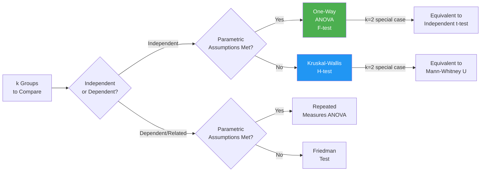

import Tabs from '@theme/Tabs';
import TabItem from '@theme/TabItem';

# Kruskal-Wallis ANOVA: Non-Parametric Analysis for Multiple Independent Groups

## Overview

When a researcher needs to compare **more than two independent groups** on some variable of interest, but the data violate the assumptions of one-way ANOVA (normality, homogeneity of variance), the **Kruskal-Wallis one-way analysis of variance by ranks** provides the non-parametric solution. Developed by Kruskal (1952) and Kruskal & Wallis (1952), it extends the Mann-Whitney U test to designs with $k > 2$ groups.

:::info Core Concept
The Kruskal-Wallis test is essentially **one-way ANOVA performed on ranked data**. Instead of comparing group means, it compares group **medians** by converting all scores to ranks and examining whether rank sums differ across groups more than expected by chance.
:::

---

## 3.2 Why Not Just Run Multiple t-Tests?

A common student impulse is to handle $k$ groups by running all pairwise comparisons. Consider the escalation problem:

| Number of Groups (k) | Pairwise Comparisons Needed |
|---|---|
| 2 | 1 |
| 3 | 3 |
| 4 | 6 |
| 5 | 10 |
| 6 | 15 |

With $k = 5$ groups, you'd need **10 separate t-tests**. This is problematic for two reasons:

1. **Computational burden**: Each test requires complete data processing
2. **Type I Error inflation**: With α = .05 per test, running 10 tests gives a family-wise error rate approaching $1 - (0.95)^{10} = 40\%$ — meaning there's a 40% chance of at least one false positive even if all null hypotheses are true

The **ANOVA family of tests** (both parametric and non-parametric) was developed precisely to address this problem — they compare all groups simultaneously in a single omnibus test while controlling the overall Type I error rate at the desired α level.

### Parametric ANOVA: A Brief Review

One-way (parametric) ANOVA, developed by Sir Ronald Fisher, examines variability in a response variable (Y) to determine whether it can be attributed to group membership (X). The logic:

$$H_0: \mu_1 = \mu_2 = \mu_3 = \mu_4 \quad (\text{all population means are equal})$$
$$H_1: \text{At least one population mean differs}$$

ANOVA requires:
1. **Random, independent sampling** from each of the $k$ populations
2. **Normal population distributions**
3. **Equal variances** across the $k$ populations (homogeneity of variance)

When assumptions 2 and 3 are violated with small samples, **Kruskal-Wallis ANOVA** is the appropriate substitute.

---

## 3.3 Introduction to the Kruskal-Wallis Test

The Kruskal-Wallis test operates with the following hypotheses:

$$H_0: \text{The population medians are equal} \quad (\theta_1 = \theta_2 = ... = \theta_k)$$
$$H_1: \text{At least two population medians differ}$$

### Relationship to Other Tests

:::note Key Relationship
When $k = 2$, the Kruskal-Wallis test yields results **identical** to the Mann-Whitney U test. The Kruskal-Wallis test is thus a direct extension of Mann-Whitney to the multi-group case.
:::

---

## 3.4 Assumptions of the Kruskal-Wallis Test

Sources including Conover (1980, 1999), Daniel (1990), and Siegel & Castellan (1988) specify these assumptions:

1. **Random sampling**: Each sample randomly selected from its population
2. **Independence**: The $k$ samples are independent of one another
3. **Continuous dependent variable**: The original variable (subsequently ranked) is ideally continuous. In practice, discrete variables are frequently used.
4. **Identical distribution shape**: Underlying populations have the same distributional shape (not necessarily normal)

:::caution Hidden Variance Assumption
Maxwell and Delaney (1990) note that assumption 4 (identical shapes) implies **homogeneity of variance** — the same implicit assumption noted for the Mann-Whitney U test. The Kruskal-Wallis test is less sensitive to variance heterogeneity than the F-test (Zimmerman & Zumbo, 1993), but this assumption is not entirely absent.
:::

### Why Rank Data? The Outlier Problem

In multi-group research, outliers can:
- Inflate variance within groups (creating apparent heterogeneity)
- Distort group means (making ANOVA F-test unreliable)
- Mask true group differences

By converting scores to ranks, the Kruskal-Wallis test **neutralises outlier influence** — a score of 500 in a dataset where typical values are 10–50 simply becomes the highest rank, without distorting computations.

---

## Self-Assessment Questions

### Level 1 — Recall

1. Why can running multiple pairwise t-tests be problematic when comparing more than two groups? Name both issues.

2. What are the four assumptions of the Kruskal-Wallis test? How do they compare to the assumptions of one-way ANOVA?

3. True or False: The Kruskal-Wallis test requires normally distributed data. Explain your answer.

### Level 2 — Application

4. A researcher has collected anxiety scores from five different therapy groups (n = 8 per group). Shapiro-Wilk tests reveal significant non-normality in two of the five groups. Should the researcher use one-way ANOVA or Kruskal-Wallis? Justify your choice.

5. With 6 groups, how many pairwise t-tests would be needed? What is the approximate family-wise Type I error rate if each test uses α = .05? Why is a single omnibus test preferable?

### Level 3 — Critical Thinking

6. A textbook states: "The Kruskal-Wallis test is assumption-free." Critically evaluate this claim with reference to the actual assumptions of the test.

7. If the Kruskal-Wallis test yields a significant result (H₀ rejected), what can the researcher conclude? What can they *not* conclude, and what additional analyses might be needed?

---

## 🧠 Memory Aid

**"KRUSKAL Ranks K groups"**

- **K**ruskal-Wallis = K groups (k > 2, hence "K" for "many")
- **R**anks all data together before computing H
- **U**ses medians, not means
- **S**ubstitutes for ANOVA when assumptions fail
- **K**ey statistic = H (compare to chi-square table for large samples, Table H for small)
- **A**nalogous to F-test in ANOVA
- **L**ogic: if groups differ, rank sums will be unequal

---

## 📚 External Resources

### Foundational Reading
- 🌐 [Wikipedia: Kruskal-Wallis test](https://en.wikipedia.org/wiki/Kruskal%E2%80%93Wallis_test) — Complete mathematical background, assumptions, and examples
- 🌐 [Wikipedia: One-way ANOVA](https://en.wikipedia.org/wiki/One-way_analysis_of_variance) — Parametric counterpart for comparison

### Tutorials
- 📖 [Laerd Statistics: Kruskal-Wallis Test](https://statistics.laerd.com/statistical-guides/kruskal-wallis-test-statistical-guide.php) — Comprehensive guide with SPSS screenshots
- 📖 [Statistics How To: Kruskal Wallis H Test](https://www.statisticshowto.com/kruskal-wallis/) — Clear examples and interpretation guidance
- 📖 [Real Statistics: Kruskal-Wallis Test](https://real-statistics.com/one-way-analysis-of-variance-anova/kruskal-wallis-test/) — Excel and manual calculation

### Videos
- 🎥 [Kruskal-Wallis Test Explained — YouTube](https://www.youtube.com/watch?v=q7Do2HxFmUg) — Conceptual overview
- 🎥 [SPSS Kruskal-Wallis Tutorial](https://www.youtube.com/watch?v=xOqTQWTdLOg) — Full SPSS walkthrough

### Research Articles
- 📄 Kruskal, W. H., & Wallis, W. A. (1952). Use of ranks in one-criterion variance analysis. *Journal of the American Statistical Association, 47*(260), 583–621. (Original paper)
- 📄 Iman, R. L., & Conover, W. J. (1981). Rank transformations as a bridge between parametric and nonparametric statistics. *The American Statistician, 35*(3), 124–129.
- 📄 Vargha, A., & Delaney, H. D. (1998). The Kruskal-Wallis test and stochastic homogeneity. *Journal of Educational and Behavioral Statistics, 23*(2), 170–192.

---

**Source PDFs**:
- 📄 [Block-4/Unit-3.pdf — Pages 34–38](/pdfs/MPC-006%20Statistics%20in%20Psychology/Block-4/Unit-3.pdf)
- 📚 MPC-006 Statistics in Psychology
