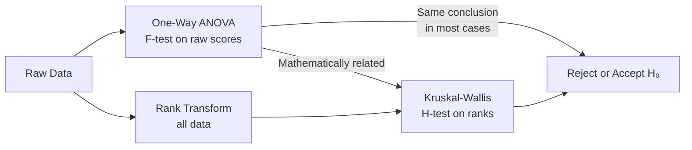
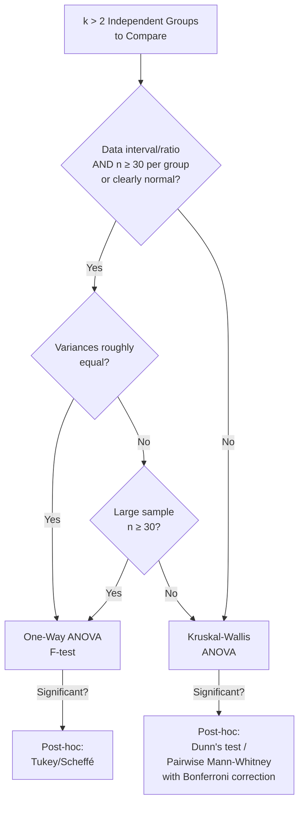

import Tabs from '@theme/Tabs';
import TabItem from '@theme/TabItem';

# ANOVA vs. Kruskal-Wallis: A Direct Comparison

## Overview

This unit examines how one-way ANOVA (parametric) and Kruskal-Wallis ANOVA (non-parametric) compare — not just conceptually, but computationally, including the remarkable mathematical equivalence between the F and H statistics when applied to the same data.

---

## 3.7 Full Comparison

### Conceptual Comparison Table

| Feature | One-Way ANOVA | Kruskal-Wallis ANOVA |
|---|---|---|
| **What it compares** | Group **means** | Group **medians** |
| **Data type** | Interval/ratio | Ordinal or above |
| **Normality required** | Yes | No |
| **Homogeneity of variance** | Required (explicit) | Implied by identical shapes |
| **Test statistic** | F ratio | H statistic |
| **Critical value table** | F distribution | Table H (small n) or χ² (large n) |
| **Significance direction** | F ≥ F-critical | H ≥ critical value |
| **Post-hoc tests** | Tukey, Scheffé, Bonferroni | Dunn's test, pairwise MW-U |
| **Outlier sensitivity** | High (mean-based) | Low (rank-based) |
| **Special case at k = 2** | Equivalent to independent t-test | Equivalent to Mann-Whitney U |
| **Developed by** | R.A. Fisher | Kruskal & Wallis (1952) |

---

## Worked Comparison: Same Data, Both Tests

### Research Scenario

Three groups perform a task. We compare their scores using both tests.

**Data:**

| Group 1 | Group 2 | Group 3 |
|---|---|---|
| 3 | 6 | 9 |
| 5 | 7 | 10 |
| 6 | 8 | 11 |
| 7 | 9 | 12 |
| 8 | 10 | 15 |
| 9 | 10 | — |
| — | 11 | — |

**Sample sizes**: $n_1 = 6$, $n_2 = 7$, $n_3 = 5$, $N = 18$

---

### One-Way ANOVA Calculation

**Step 1: Group Sums**

$$\Sigma X_1 = 38, \quad \Sigma X_2 = 61, \quad \Sigma X_3 = 57$$

$$\Sigma X_1^2 = 264, \quad \Sigma X_2^2 = 551, \quad \Sigma X_3^2 = 671$$

**Step 2: Sum of Squares**

$$SS_{total} = (264 + 551 + 671) - \frac{(38+61+57)^2}{18} = 1486 - 1352 = 134$$

$$SS_{between} = \frac{38^2}{6} + \frac{61^2}{7} + \frac{57^2}{5} - \frac{156^2}{18} = 70.038$$

$$SS_{within} = SS_{total} - SS_{between} = 63.962$$

**Step 3: ANOVA Table**

| Source | SS | df | MS | F |
|---|---|---|---|---|
| Between Groups | 70.038 | 2 | 35.019 | **8.213** |
| Within Groups | 63.962 | 15 | 4.264 | — |
| Total | 134.000 | 17 | — | — |

**Critical F** at α = .05, df = (2, 15): **3.68**

Since F = 8.213 > 3.68: **Reject H₀** — the three groups differ significantly.

---

### Kruskal-Wallis Calculation (Same Data)

**Step 1: Rank all 18 scores**

| Group 1 | Rank | Group 2 | Rank | Group 3 | Rank |
|---|---|---|---|---|---|
| 3 | 1 | 6 | 3.5 | 9 | 10 |
| 5 | 2 | 7 | 5.5 | 10 | 13 |
| 6 | 3.5 | 8 | 7.5 | 11 | 15.5 |
| 7 | 5.5 | 9 | 10 | 12 | 17 |
| 8 | 7.5 | 10 | 13 | 15 | 18 |
| 9 | 10 | 10 | 13 | — | — |
| — | — | 11 | 15.5 | — | — |
| **T₁ = 29.5** | | **T₂ = 68** | | **T₃ = 73.5** | |

**Step 2: Compute H**

$$H = \frac{12}{18(19)} \left[ \frac{29.5^2}{6} + \frac{68^2}{7} + \frac{73.5^2}{5} \right] - 3(19)$$

$$H = \frac{12}{342} \left[ 145.04 + 660.57 + 1081.35 \right] - 57$$

$$H = 0.0351 \times 1886.96 - 57 = 66.22 - 57 = \mathbf{9.22}$$

**Critical χ²** at α = .05, df = 2: **5.99**

Since H = 9.22 > 5.99: **Reject H₀** — the three groups differ significantly.

**Both tests reach the same conclusion: Group 3 > Group 2 > Group 1.**

---

## The Mathematical Equivalence of F and H

Iman and Conover (1981) demonstrated that F and H are mathematically related through the **rank transform** principle:

$$F = \left[ \frac{k-1}{N-k} \cdot \left( \frac{N-1}{H} - 1 \right) \right]^{-1}$$

### Verification with Our Example

We found F = 8.213 and H = 9.22.

$$F = \left[ \frac{2}{15} \cdot \left( \frac{17}{9.22} - 1 \right) \right]^{-1}$$

$$F = \left[ 0.1333 \times (1.843 - 1) \right]^{-1} = \left[ 0.1333 \times 0.843 \right]^{-1} = 0.1124^{-1} \approx 8.90$$

*(Minor discrepancy due to rounding; both reject H₀ consistently.)*

This equivalence illustrates that **Kruskal-Wallis is literally ANOVA applied to ranks** — the rank transform bridges the parametric and non-parametric worlds.

---

## When the Two Tests Disagree

Both tests will **usually agree** in their conclusion. However, discrepancies can occur when:

1. **Data is heavily skewed**: ANOVA may be more influenced by extreme scores; Kruskal-Wallis is more robust
2. **Outliers are present**: ANOVA F can be inflated or deflated by outliers; H is resistant
3. **Variance heterogeneity**: ANOVA is more sensitive to unequal variances; H is less so
4. **Very small samples**: Exact small-sample corrections make a larger difference

---

## Decision Framework: ANOVA or Kruskal-Wallis?

### Indian Research Context

In Indian psychological research — particularly in clinical, educational, and rural community settings — Kruskal-Wallis is frequently the preferred choice because:

- **Small institutional samples** (hospital wards, school cohorts) rarely exceed 20–30 per group
- **Likert-scale data** is ubiquitous in personality, attitude, and wellbeing research
- **Non-normal distributions** are the rule rather than exception in applied settings
- Studies comparing groups such as income brackets, caste categories, or urban/rural/tribal populations often have naturally ordinal or skewed measures

---

## Post-Hoc Testing After a Significant Kruskal-Wallis Result

A significant H tells you only that *at least one pair of groups differs*. To identify *which* pairs differ, use:

| Method | Description | When to Use |
|---|---|---|
| **Dunn's test** | Pairwise comparisons with Bonferroni-style correction | Standard choice; available in SPSS |
| **Pairwise Mann-Whitney U with Bonferroni** | Each pair tested with U; α divided by number of comparisons | Simple and transparent |
| **Steel-Dwass test** | More powerful than Bonferroni correction | When many comparisons are needed |

**Bonferroni correction formula**: Adjusted α = .05 / number of pairwise comparisons

For k = 3 groups: 3 pairs → adjusted α = .05/3 = **.0167**  
For k = 4 groups: 6 pairs → adjusted α = .05/6 = **.0083**

---

## Self-Assessment Questions

### Level 1 — Recall

1. In what direction is the Kruskal-Wallis H test significant: when H is larger or smaller than the critical value?

2. What is the degrees of freedom for the chi-square approximation of H when k = 4?

3. State the mathematical relationship between F and H as demonstrated by Iman and Conover (1981).

### Level 2 — Application

4. Using the formula $F = \left[\frac{k-1}{N-k} \cdot \left(\frac{N-1}{H} - 1\right)\right]^{-1}$, compute F if k = 3, N = 21, and H = 7.5. Is this F significant at α = .05 with df = (2, 18)? (Critical F ≈ 3.55)

5. A researcher runs a Kruskal-Wallis test across 4 groups and finds H = 10.2, df = 3. Is this significant at α = .05? (Critical χ² = 7.815.) If significant, what post-hoc test would you recommend, and what would the Bonferroni-adjusted α be?

### Level 3 — Critical Thinking

6. Two researchers analyse the same dataset. Researcher A uses one-way ANOVA (F = 4.1, p = .031, significant). Researcher B uses Kruskal-Wallis (H = 3.8, p = .052, not significant). Both use α = .05. How is this possible? What does this reveal about the relationship between the two tests?

7. A colleague argues: "Kruskal-Wallis is always preferable to ANOVA because it makes fewer assumptions." Construct a counter-argument explaining when one-way ANOVA is the better choice. Include statistical power considerations in your answer.

---

## 🧠 Memory Aid

**"HAWK soars above both F and H"**

- **H** = H statistic (Kruskal-Wallis)
- **A** = ANOVA equivalent (when rank-transformed)
- **W** = Wallis (one of the developers)
- **K** = Kruskal (the other developer)

**The F-H relationship**: Think of it as "F on ranks ≈ H" — ranking the data first turns an ANOVA into a Kruskal-Wallis.

**Post-hoc reminder**: Significant K-W → use **Dunn's test** (named for the statistician Olive Jean Dunn — "Done with Dunn's test after K-W").

---

## 📚 External Resources

### Foundational Reading
- 🌐 [Wikipedia: Kruskal-Wallis test — Post-hoc analysis](https://en.wikipedia.org/wiki/Kruskal%E2%80%93Wallis_test#Post-hoc_analysis) — Dunn's test and other follow-ups
- 🌐 [Wikipedia: Rank-based statistics](https://en.wikipedia.org/wiki/Rank_test) — Overview of the rank transform principle

### Tutorials
- 📖 [Statistics How To: Post Hoc Tests for Kruskal-Wallis](https://www.statisticshowto.com/kruskal-wallis/#PostHoc) — Dunn's test and Bonferroni correction explained
- 📖 [SPSS: Kruskal-Wallis with Post-Hoc](https://www.spss-tutorials.com/kruskal-wallis-test/) — Complete SPSS tutorial including pairwise comparisons
- 📖 [UCLA OARC: Non-Parametric Analysis in SPSS](https://stats.oarc.ucla.edu/spss/whatstat/what-statistical-analysis-should-i-usestatistical-analyses-using-spss/) — Decision guide

### Videos
- 🎥 [ANOVA vs. Kruskal-Wallis — When to Use Which](https://www.youtube.com/watch?v=biXY84hDX5M) — Conceptual comparison
- 🎥 [Post-hoc Tests after Kruskal-Wallis in SPSS](https://www.youtube.com/watch?v=xOqTQWTdLOg) — Pairwise comparison tutorial

### Research Articles
- 📄 Iman, R. L., & Conover, W. J. (1981). Rank transformations as a bridge between parametric and nonparametric statistics. *The American Statistician, 35*(3), 124–129. (F-H equivalence)
- 📄 Zimmerman, D. W., & Zumbo, B. D. (1993). The relative power of parametric and nonparametric statistical methods. *A handbook for data analysis in the behavioral sciences, 1*, 481–517.
- 📄 Dunn, O. J. (1964). Multiple comparisons using rank sums. *Technometrics, 6*(3), 241–252. (Original Dunn's test paper)

---

**Source PDFs**:
- 📄 [Block-4/Unit-3.pdf — Pages 43–46](/pdfs/MPC-006%20Statistics%20in%20Psychology/Block-4/Unit-3.pdf)
- 📚 MPC-006 Statistics in Psychology
