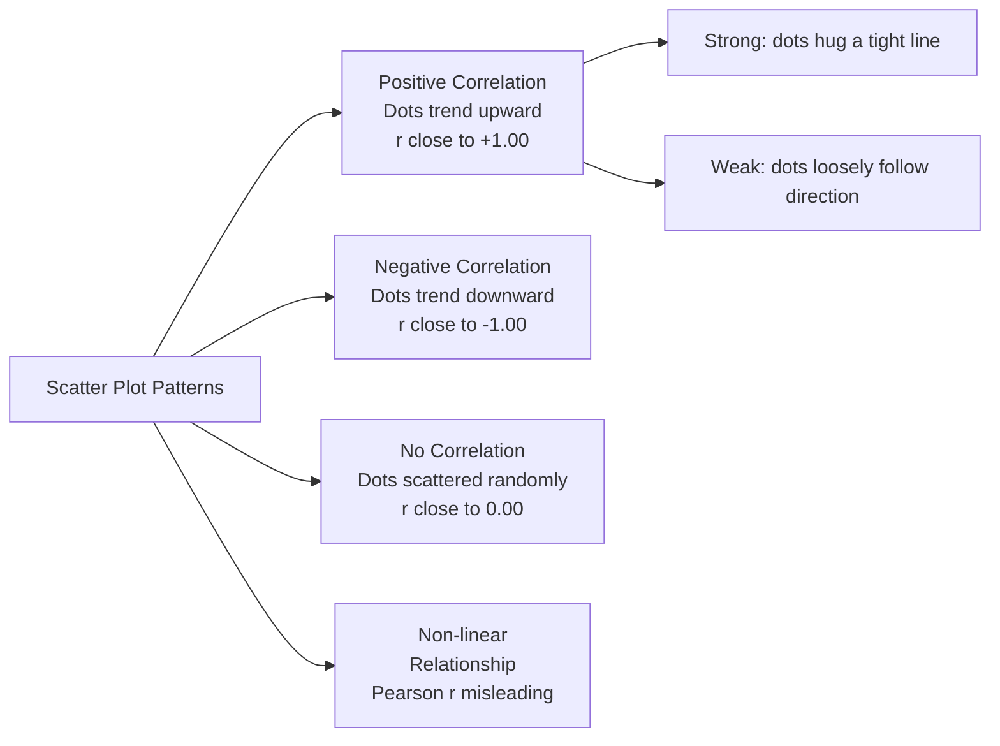
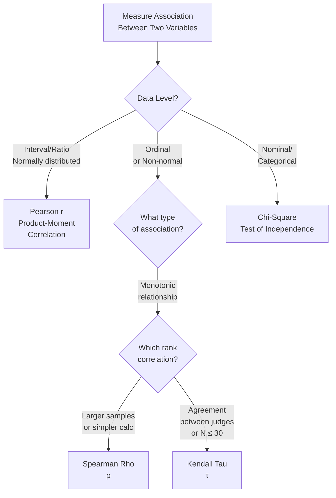

import Tabs from '@theme/Tabs';
import TabItem from '@theme/TabItem';

# Correlation: Concepts, Scatter Plots, and Measures of Association

## Overview

Correlation is one of the most fundamental concepts in psychological research — it quantifies the *degree and direction* of relationship between two variables. This unit establishes the conceptual foundations of correlation, explores scatter plots as a visual diagnostic tool, and maps the landscape of correlation measures from parametric (Pearson r) to non-parametric (Spearman Rho, Kendall Tau, Chi-Square). Knowing *which* correlation to use — and when — is as important as knowing how to calculate it.

---

## 4.2 The Concept of Correlation

Correlation answers a deceptively simple question: *Do these two variables move together?*

When high values of X are consistently associated with high values of Y → **positive correlation**
When high values of X are consistently associated with low values of Y → **negative correlation**
When changes in X tell us nothing about Y → **zero correlation**

### The Correlation Coefficient: Key Properties

A correlation coefficient (denoted **r** for Pearson, **ρ** for Spearman, **τ** for Kendall) is a *unit-free* summary statistic with three essential characteristics:

1. **Direction**: Positive (+) or negative (−) sign tells you the direction of the relationship
2. **Bounded range**: Always falls between −1.00 and +1.00 (inclusive); cannot exceed these limits
3. **Magnitude = Strength**: Closer to ±1.00 = stronger relationship; closer to 0.00 = weaker relationship

| Value | Interpretation |
|---|---|
| +1.00 | Perfect positive correlation — as X increases, Y increases perfectly predictably |
| +0.70 to +0.99 | Strong positive correlation |
| +0.40 to +0.69 | Moderate positive correlation |
| +0.10 to +0.39 | Weak positive correlation |
| 0.00 | No correlation — knowing X tells you nothing about Y |
| −0.10 to −0.39 | Weak negative correlation |
| −0.40 to −0.69 | Moderate negative correlation |
| −0.70 to −0.99 | Strong negative correlation |
| −1.00 | Perfect negative correlation |

:::warning Correlation ≠ Causation
A correlation between X and Y tells us only that they co-vary. It does not establish that X *causes* Y, Y *causes* X, or that both are driven by a third variable Z. This distinction is critical in psychological interpretation.
:::

---

## 4.2.1 Scatter Plots: Visualising Relationships

A **scatter plot** (or scattergram) displays each data point as a dot positioned by its X and Y coordinates. It is the essential first step before computing any correlation — as the IGNOU text aptly quotes: *"There is no excuse for failing to plot and look."*

### What Scatter Plots Reveal Beyond r

Scatter plots expose features that a single correlation coefficient can miss:
- **Non-linear relationships** (e.g., an inverted-U: performance peaks at moderate stress)
- **Outliers** that distort the correlation estimate
- **Subgroup patterns** (different clusters in the data)
- **Ceiling/floor effects** in measurement

:::note The Eye Can Deceive
Correlational *strength* cannot be reliably judged visually — axis scaling and aspect ratio manipulate how "tight" a cloud looks. Always compute r rather than relying on visual impression alone.
:::

---

## 4.3 The Taxonomy of Correlation Measures

Choosing the correct correlation measure depends on data level, sample size, and distributional assumptions.

### 4.3.1 Parametric: Pearson r

The **Pearson Product-Moment Correlation Coefficient** is the gold standard when:
- Both variables are at interval or ratio level
- Data are approximately normally distributed
- Sample size is reasonably large (n ≥ 30 recommended)

It measures the *linear* relationship between X and Y.

### 4.3.2 Non-Parametric Correlation Measures

| Measure | Symbol | Best For |
|---|---|---|
| **Spearman Rho** | ρ | Ordinal data; ranks; non-normal distributions; conceptually a Pearson r on ranks |
| **Kendall Tau** | τ | Agreement between judges; small samples (N ≤ 30); counts of concordant vs. discordant pairs |
| **Chi-Square** | χ² | Categorical (nominal) variables; goodness of fit; independence testing |

### Efficiency Comparison

When applied to data from a bivariate normal distribution where Pearson r is fully appropriate:
- **Spearman Rho**: ~91% efficiency relative to Pearson r (needs ~10% more cases to match r's power)
- **Kendall Tau**: ~91% efficiency — comparable to Spearman Rho
- Both non-parametric measures are remarkably efficient despite using less information

---

## 4.2.2 Characteristics of Correlation: A Summary

**Characteristic 1 — Direction**
The sign of the coefficient tells you whether the relationship is positive (variables move together) or negative (variables move oppositely). This is arguably the most important aspect for theoretical interpretation in psychology.

**Characteristic 2 — Range**
All correlation coefficients are bounded between −1.00 and +1.00. A value outside this range signals a calculation error. Note that this universal property holds regardless of whether you use Pearson r, Spearman ρ, or Kendall τ.

**Characteristic 3 — Magnitude = Relationship Strength**
The absolute value of r (ignoring sign) indicates strength. r = −0.85 indicates a *stronger* relationship than r = +0.45, even though the latter is positive. In psychological research, correlations above 0.50 are considered substantial; above 0.70 are considered strong.

---

## Real-World Applications in Indian Psychology Research

Correlation is used extensively in Indian psychological research:

| Research Domain | Variables Correlated | Typical Measure Used |
|---|---|---|
| Academic achievement | Study hours ↔ exam performance | Pearson r (large samples, interval data) |
| Personality assessment | Introversion rank ↔ social anxiety rank | Spearman Rho (ordinal scales) |
| Clinical agreement | Two clinicians' severity ratings | Kendall Tau (N ≤ 15, judge agreement) |
| Voting behaviour | Region (nominal) ↔ candidate preference | Chi-Square (categorical) |
| Stress-performance | Cortisol level ↔ test performance (inverted-U) | Scatter plot first; non-linear analysis |

---

## Self-Assessment Questions

### Level 1 — Recall

1. What three questions does a correlation coefficient answer?

2. A researcher obtains r = −0.78. What does the sign tell you? What does the magnitude tell you?

3. List the three main non-parametric measures of association covered in this unit and name one situation where each is most appropriate.

### Level 2 — Application

4. A psychologist plots stress scores (X) against performance scores (Y) and finds an inverted-U pattern (performance peaks at moderate stress, is lower at both extremes). If Pearson r is computed, it will be close to zero. Why is this misleading? What should the psychologist do instead?

5. A researcher has rankings from 8 participants on two variables (preferred therapy style and reported anxiety). Sample size is 8 and data is ordinal. Should they use Pearson r, Spearman Rho, or Kendall Tau? Justify your choice.

### Level 3 — Critical Thinking

6. "A correlation of r = 0.30 is weak and practically meaningless." Critically evaluate this claim. Under what circumstances might r = 0.30 be practically important?

7. Two studies measure the same construct. Study A uses Pearson r = 0.62. Study B uses Kendall τ = 0.48 on ordinal data. A student concludes: "Study A shows a stronger relationship." Is this comparison valid? Explain why or why not.

---

## 🧠 Memory Aid

**"Direction, Range, Strength" — the DRS Framework for Correlation**

- **D**irection: Sign (+ or −)
- **R**ange: Always −1.00 to +1.00
- **S**trength: Absolute value — closer to 1 = stronger

**Choosing your correlation measure — the "PaSKI" ladder**:
- **Pa**rametric, normal, interval → **Pearson r**
- **S**pearman → ordinal, non-normal, rank data
- **K**endall → judge agreement, small N, ties
- **I**ndependence of categories → Chi-Square

---

## 📚 External Resources

### Foundational Reading
- 🌐 [Wikipedia: Correlation and dependence](https://en.wikipedia.org/wiki/Correlation) — Comprehensive coverage including types of correlation and misinterpretations
- 🌐 [Wikipedia: Pearson correlation coefficient](https://en.wikipedia.org/wiki/Pearson_correlation_coefficient) — Mathematical derivation and assumptions

### Tutorials
- 📖 [Statistics How To: Correlation Coefficient](https://www.statisticshowto.com/probability-and-statistics/correlation-coefficient-formula/) — Clear conceptual guide
- 📖 [Laerd Statistics: Pearson r vs. Spearman rho](https://statistics.laerd.com/statistical-guides/pearson-correlation-coefficient-statistical-guide.php) — When to use which
- 📖 [Khan Academy: Correlation Basics](https://www.khanacademy.org/math/statistics-probability/describing-relationships-quantitative-data) — Free interactive lessons

### Videos
- 🎥 [StatQuest: Correlation Clearly Explained](https://www.youtube.com/watch?v=xZ_z8KWkhXE) — Intuitive video explanation
- 🎥 [Scatter Plots and Correlation — CrashCourse Statistics](https://www.youtube.com/watch?v=n1dpYjh5Hf0) — Conceptual overview

### Research Articles
- 📄 Cohen, J. (1988). *Statistical power analysis for the behavioral sciences* (2nd ed.). Lawrence Erlbaum. (Widely cited thresholds for r)
- 📄 Hauke, J., & Kossowski, T. (2011). Comparison of values of Pearson's and Spearman's correlation coefficients on the same sets of data. *Quaestiones Geographicae, 30*(2), 87–93.
- 📄 Schober, P., Boer, C., & Schwarte, L. A. (2018). Correlation coefficients: Appropriate use and interpretation. *Anesthesia & Analgesia, 126*(5), 1763–1768.

---

**Source PDFs**:
- 📄 [Block-4/Unit-4.pdf — Pages 47–52](/pdfs/MPC-006%20Statistics%20in%20Psychology/Block-4/Unit-4.pdf)
- 📚 MPC-006 Statistics in Psychology
