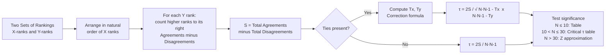

import Tabs from '@theme/Tabs';
import TabItem from '@theme/TabItem';

# Kendall's Tau (τ): Rank-Order Correlation

## Overview

**Kendall's tau (τ)**, developed by Maurice Kendall (1938), is a non-parametric bivariate correlation coefficient that measures the *degree of agreement* between two sets of rankings. Unlike Spearman's Rho — which is essentially Pearson r applied to ranks — Kendall's tau operates on a fundamentally different logic: it counts **concordant** and **discordant** pairs and computes the proportion of agreement net of disagreement.

Kendall's tau is the preferred choice when:
- Sample size is small (N ≤ 30)
- Data involves judge/rater agreement
- Ties are present in the rankings
- The probabilistic interpretation of agreement matters more than magnitude of rank differences

---

## 4.4 Core Logic: Concordant and Discordant Pairs

The engine of Kendall's tau is a count of **pairs of observations**:

- **Concordant pair**: For subjects $i$ and $j$, if the relative order on Variable X matches the relative order on Variable Y — i.e., $(R_{xi} - R_{xj})$ and $(R_{yi} - R_{yj})$ have the **same sign** → both agree on which subject ranks higher
- **Discordant pair**: If the relative order on X *disagrees* with the relative order on Y — the two signs are **opposite**
- **Tied pair**: When either difference equals zero — assigned a value of 0 in the S calculation

### The S Statistic

S represents the **net agreement** across all pairs:

$$S = \text{(number of concordant pairs)} - \text{(number of discordant pairs)}$$

- S = +N(N−1)/2 → all pairs concordant → τ = +1.00 (perfect positive agreement)
- S = −N(N−1)/2 → all pairs discordant → τ = −1.00 (perfect negative agreement)
- S = 0 → equal concordance and discordance → τ = 0 (no agreement)

---

## 4.4.1 Assumptions and Background

1. **Both variables are at ordinal (rank-order) level** — or have been converted to ranks
2. **N subjects/objects** each have two observations (one on X, one on Y)
3. Can be applied to **judge agreement** — e.g., two raters independently ranking N candidates
4. Appropriate for **N ≤ 30**; for larger samples, a Z approximation is used

### Null Hypothesis

$$H_0: \tau = 0 \quad \text{(no correlation between ranks of X and Y in the population)}$$

---

## 4.5 Step-by-Step Procedure: Kendall's Tau

**STEP 1**: Rank observations on Variable X from 1 to N; rank observations on Variable Y from 1 to N.

**STEP 2**: Rearrange subjects so that X ranks are in *natural order* (1, 2, 3, ... N).

**STEP 3**: Observe the Y ranks in the order they occur when X is sorted.

**STEP 4**: For each Y rank, count how many ranks to its *right* are **larger** (agreements) and subtract those that are **smaller** (disagreements). Sum all these values to get **S**.

**STEP 5**: If no ties → apply the simple formula. If ties → apply the correction formula.

**STEP 6**: Test significance using the appropriate table or Z approximation.

---

## Worked Example 1: Without Ties

### Setup

Four objects (A, B, C, D) are rated by two judges (X and Y) out of 10.

| Object | Judge X Score | Judge Y Score |
|---|---|---|
| A | 6 | 8 |
| B | 8 | 4 |
| C | 5 | 9 |
| D | 2 | 6 |

### Step 1: Convert to Ranks

| Object | X Rank | Y Rank |
|---|---|---|
| A | 3 | 3 |
| B | 4 | 1 |
| C | 2 | 4 |
| D | 1 | 2 |

### Step 2–3: Rearrange by X Rank and Extract Y Ranks

| X Rank | 1 (D) | 2 (C) | 3 (A) | 4 (B) |
|---|---|---|---|---|
| **Y Rank** | **2** | **4** | **3** | **1** |

### Step 4: Compute S

Working left to right through the Y ranks (2, 4, 3, 1):

| Y Rank | Agreements (larger to right) | Disagreements (smaller to right) | Net |
|---|---|---|---|
| **2** | 2 (ranks 4 and 3 are both > 2) | 1 (rank 1 < 2) | +1 |
| **4** | 0 (nothing > 4 to the right) | 2 (ranks 3 and 1 < 4) | −2 |
| **3** | 0 (nothing > 3 to the right) | 1 (rank 1 < 3) | −1 |
| **1** | — | — | 0 |
| **Total** | | | **S = −2** |

### Step 5: Calculate τ

$$\tau = \frac{2S}{N(N-1)} = \frac{2(-2)}{4(3)} = \frac{-4}{12} = -0.33$$

**Interpretation**: τ = −0.33 indicates a *weak negative* agreement — the two judges tend to rank objects in somewhat opposite orders, but the agreement is not strong.

---

## Worked Example 2: With Ties

When tied ranks occur in either X or Y, a correction factor is applied.

### The Tie Correction Formula

$$\tau = \frac{2S}{\sqrt{[N(N-1) - T_x][N(N-1) - T_y]}}$$

Where:
- $T_x = \sum t(t-1)$ for each group of tied X observations, $t$ = number tied
- $T_y = \sum t(t-1)$ for each group of tied Y observations

### Example with Social Status and Yielding Ranks (N = 12)

**Given**: S = 25 (computed by the concordant/discordant counting method)

**Tied ranks on Y**: Three pairs of tied ranks:
- Ranks 1.5 (2 subjects tied): $t = 2$, $t(t-1) = 2$
- Ranks 3.5 (2 subjects tied): $t = 2$, $t(t-1) = 2$
- Ranks 10.5 (2 subjects tied): $t = 2$, $t(t-1) = 2$

$$T_y = 2 + 2 + 2 = 6$$

No ties on X: $T_x = 0$

$$\tau = \frac{2 \times 25}{\sqrt{[12(11) - 0][12(11) - 6]}} = \frac{50}{\sqrt{132 \times 126}} = \frac{50}{\sqrt{16632}} = \frac{50}{128.97} \approx 0.39$$

Without tie correction: τ = 0.38. The correction makes a small but principled adjustment.

:::tip When is the Tie Correction Important?
The correction is small unless ties are numerous or involve large groups. Always apply it when ties exist — it's the principled approach and SPSS/R do it automatically.
:::

---

## 4.6 Significance Testing

| Sample Size | Method |
|---|---|
| N ≤ 10 | Upper-tail probability table for τ |
| 10 < N ≤ 30 | Critical value table for τ |
| N > 30 | Z approximation: $z = \frac{3\tau\sqrt{N(N-1)}}{\sqrt{2(2N+5)}}$ |

For the Z approximation, use two-tailed α = .05 → reject H₀ if |Z| > 1.96.

---

## 4.6.1 Comparison of Kendall's Tau and Spearman's Rho

| Feature | Spearman Rho (ρ) | Kendall Tau (τ) |
|---|---|---|
| **Logic** | Pearson r on ranks — uses rank differences | Counts concordant vs. discordant pairs |
| **Scale** | Same scale as Pearson r | Different scale — numerically smaller |
| **Comparability** | Comparable to Pearson r interpretation | Cannot be directly compared to ρ |
| **Computation** | Simpler | More tedious (pair counting) |
| **Ties** | Simple correction | Principled correction formula |
| **Best for** | General rank correlations; larger samples | Judge agreement; small N; probabilistic interpretation |
| **Efficiency vs. Pearson r** | ~91% | ~91% |
| **Large-sample behaviour** | Normal approximation | Normal approximation |

### The Mathematical Inequality

While τ and ρ cannot be directly compared, they are bounded by:

$$-1 \leq 3\tau - 2\rho \leq 1$$

This guarantees that very large discrepancies between τ and ρ on the same data are mathematically impossible — they measure related but distinct aspects of the same relationship.

---

## Self-Assessment Questions

### Level 1 — Recall

1. What is the difference between a concordant pair and a discordant pair in Kendall's tau?

2. What is the value of τ when all pairs are concordant? When all pairs are discordant?

3. Under what condition should the tie-correction formula be used instead of the simple tau formula?

### Level 2 — Application

4. Five candidates are ranked by two interviewers. Interviewer X ranks: 1, 2, 3, 4, 5. Interviewer Y ranks (after sorting by X): 2, 1, 4, 3, 5. Compute S (count concordant/discordant pairs) and then compute τ.

5. In the tie-correction example, if $T_y$ were 12 instead of 6, would τ increase or decrease? Compute the new τ (S = 25, N = 12, $T_x$ = 0, $T_y$ = 12) and explain the direction of change.

### Level 3 — Critical Thinking

6. A researcher computes Spearman ρ = 0.62 and Kendall τ = 0.41 on the same data. A colleague says: "The Spearman result shows stronger correlation." Evaluate this statement. Can the two values be compared directly?

7. Under what specific research scenario would you choose Kendall's tau over Spearman's Rho, even if both could technically be applied? What does Kendall's tau offer that Rho does not in terms of interpretation?

---

## 🧠 Memory Aid

**"CARD for Kendall's Tau"**:

- **C**oncordant pairs: same order on X and Y → contribute **+1**
- **A**rrange X ranks in natural order (1 to N) first
- **R**ight-side counting: for each Y rank, count larger values to the right (agreements) minus smaller (disagreements)
- **D**ivide 2S by the total possible pairs: $\tau = 2S / N(N-1)$

**Tie correction mnemonic**: "Tx and Ty shrink the denominator" — ties reduce the maximum possible S, so the formula adjusts by subtracting $T_x$ and $T_y$ from the denominator terms.

---

## 📚 External Resources

### Foundational Reading
- 🌐 [Wikipedia: Kendall rank correlation coefficient](https://en.wikipedia.org/wiki/Kendall_rank_correlation_coefficient) — Full derivation, properties, and comparison with Spearman
- 🌐 [Wikipedia: Spearman's rank correlation coefficient](https://en.wikipedia.org/wiki/Spearman%27s_rank_correlation_coefficient) — For comparison

### Tutorials
- 📖 [Statistics How To: Kendall's Tau](https://www.statisticshowto.com/kendalls-tau/) — Step-by-step guide with examples
- 📖 [Real Statistics: Kendall's Tau](https://real-statistics.com/non-parametric-tests/kendalls-tau/) — Excel implementation included
- 📖 [Laerd Statistics: Kendall's Tau-b](https://statistics.laerd.com/statistical-guides/kendalls-coefficient-of-concordance-statistical-guide.php) — SPSS guide

### Videos
- 🎥 [Kendall's Tau Explained — YouTube](https://www.youtube.com/watch?v=oXVxaSoY94k) — Concordant/discordant pair walkthrough
- 🎥 [Spearman vs. Kendall: Which to Use? — YouTube](https://www.youtube.com/watch?v=XV8NNDRiWFI) — Comparison tutorial

### Research Articles
- 📄 Kendall, M. G. (1938). A new measure of rank correlation. *Biometrika, 30*(1/2), 81–93. (Original paper)
- 📄 Gilpin, A. R. (1993). Table for conversion of Kendall's tau to Spearman's rho within the context of measures of magnitude of effect for meta-analysis. *Educational and Psychological Measurement, 53*(1), 87–92.
- 📄 Croux, C., & Dehon, C. (2010). Influence functions of the Spearman and Kendall correlation measures. *Statistical Methods & Applications, 19*(4), 497–515.

---

**Source PDFs**:
- 📄 [Block-4/Unit-4.pdf — Pages 52–58](/pdfs/MPC-006%20Statistics%20in%20Psychology/Block-4/Unit-4.pdf)
- 📚 MPC-006 Statistics in Psychology
