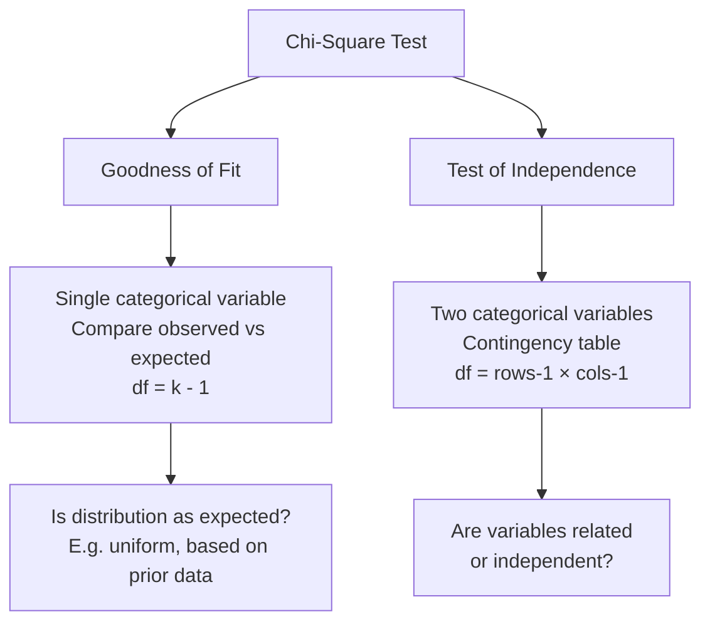

import Tabs from '@theme/Tabs';
import TabItem from '@theme/TabItem';

# Chi-Square Test: Goodness of Fit and Test of Independence

## Overview

The **Chi-Square (χ²) test** is the workhorse of categorical data analysis in psychology. Where correlation and t-tests operate on continuous variables, the chi-square test works with **frequencies in categories** — answering two related questions:

1. **Goodness of Fit**: Do observed category frequencies match theoretically expected frequencies?
2. **Test of Independence**: Are two categorical variables related to each other?

Unlike the other non-parametric tests in this block, chi-square does not involve ranking at all — it works directly with **counts** in cells of a frequency table.

$$\chi^2 = \sum \frac{(O - E)^2}{E}$$

Where $O$ = Observed frequency and $E$ = Expected frequency.

---

## 4.7 The Chi-Square Test: Two Functions

### Function 1: Goodness of Fit

Tests whether an *observed* distribution of frequencies across categories matches an *expected* distribution.

> **H₀**: The observed frequencies do not differ significantly from the expected frequencies.
> **H₁**: At least one observed frequency differs significantly from its expected value.

**When is it used?**
- Checking whether survey responses follow a predicted distribution
- Testing whether a die is fair (equal frequencies expected)
- Comparing this year's customer preferences to last year's

### Function 2: Test of Independence (Contingency Table Analysis)

Tests whether two categorical variables are *related* or *independent* of each other.

> **H₀**: The two variables are independent (no association).
> **H₁**: The two variables are associated (not independent).

**When is it used?**
- Testing whether gender is related to voting preference
- Examining whether caste category is associated with educational attainment
- Assessing whether treatment type is related to recovery outcome category



---

## 4.8 Assumptions and Background

The chi-square goodness-of-fit test rests on three assumptions (Siegel & Castellan, 1988):

1. **Categorical nominal data**: Test data must represent frequencies for $k$ mutually exclusive categories. Each observation belongs to one and only one cell.

2. **Independent random observations**: Each subject/observation appears in the data only *once*. Repeated-measures designs violate this assumption.

3. **Expected frequency ≥ 5 per cell**: The chi-square approximation becomes unreliable when expected frequencies are very small.

:::caution The Expected Frequency Rule
Following Cochran (1952/1954):
- **No expected cell frequency should be < 1**
- **No more than 20% of cells should have expected frequency < 5**

When this rule is violated: for 2×2 tables, use **Fisher's Exact Test**. For larger tables, consider collapsing categories. Note that different sources debate how strict this rule needs to be — it is somewhat conservative.
:::

### What Counts as Valid Cell Data

The chi-square formula requires **actual frequency counts** in cells:

| ✅ Valid | ❌ Invalid |
|---|---|
| Number of people choosing each colour | Percentages |
| Count of students in each grade category | Means of a scale |
| Frequency of each response category | Proportions |

One person, one cell — no double-counting.

---

## 4.9 Step-by-Step: Chi-Square Goodness of Fit

### The Six Steps

1. Record **Observed frequencies (O)** in each category
2. Determine **Expected frequencies (E)** — either from equal distribution assumption or from prior proportions
3. Compute $\chi^2 = \sum \frac{(O-E)^2}{E}$ across all categories
4. Calculate **degrees of freedom**: $df = k - 1$ (where $k$ = number of categories)
5. Look up critical $\chi^2$ in the chi-square table at chosen $\alpha$ and $df$
6. **Decision**: Reject H₀ if calculated $\chi^2 \geq$ critical $\chi^2$

---

## Worked Example 1: Car Colour Preferences (Goodness of Fit)

### Research Question

A car dealership manager surveyed 150 customers about colour preferences. Based on last year's sales, expected proportions were: Yellow 20%, Red 30%, Green 10%, Blue 10%, White 30%. Do this year's preferences significantly differ from last year?

### Data Table

| Colour | Observed (O) | Expected % | Expected (E) | O − E | (O−E)² | (O−E)²/E |
|---|---|---|---|---|---|---|
| Yellow | 35 | 20% | 30 | +5 | 25 | **0.83** |
| Red | 50 | 30% | 45 | +5 | 25 | **0.56** |
| Green | 30 | 10% | 15 | +15 | 225 | **15.00** |
| Blue | 10 | 10% | 15 | −5 | 25 | **1.67** |
| White | 25 | 30% | 45 | −20 | 400 | **8.89** |
| **Total** | **150** | | **150** | | | **χ² = 26.95** |

**Expected frequencies** are calculated as: $E = \text{proportion} \times N$
(e.g., Yellow: 0.20 × 150 = 30)

**df** = k − 1 = 5 − 1 = **4**

**Critical χ²** at α = .05, df = 4: **9.49**

Since 26.95 > 9.49 → **Reject H₀**

**Conclusion**: Customer colour preferences have changed significantly since last year. The largest discrepancies are in Green (observed twice as many as expected) and White (observed about half as many as expected). The manager should adjust inventory accordingly.

---

## Step-by-Step: Chi-Square Test of Independence

For the independence test, **expected frequencies** are calculated from the marginal totals:

$$E_{ij} = \frac{\text{Row}_i \text{ total} \times \text{Column}_j \text{ total}}{N}$$

**Degrees of freedom** = $(r - 1)(c - 1)$ where $r$ = rows, $c$ = columns

---

## Worked Example 2: Traffic Stop Behaviour by Gender

### Research Question

Does stopping behaviour at traffic signs differ between male and female drivers?

### Observed Frequencies

| | Male | Female | Row Total |
|---|---|---|---|
| Full Stop | 6 | 6 | **12** |
| Rolling Stop | 16 | 15 | **31** |
| No Stop | 4 | 3 | **7** |
| **Column Total** | **26** | **24** | **50** |

### Step 1–2: Compute Expected Frequencies

$$E = \frac{\text{Row Total} \times \text{Column Total}}{N}$$

| Cell | Calculation | Expected |
|---|---|---|
| Male / Full Stop | (12 × 26) / 50 | **6.24** |
| Female / Full Stop | (12 × 24) / 50 | **5.76** |
| Male / Rolling Stop | (31 × 26) / 50 | **16.12** |
| Female / Rolling Stop | (31 × 24) / 50 | **14.88** |
| Male / No Stop | (7 × 26) / 50 | **3.64** |
| Female / No Stop | (7 × 24) / 50 | **3.36** |

### Step 3: Compute χ²

| Cell | O | E | (O−E)² / E |
|---|---|---|---|
| Male/Full Stop | 6 | 6.24 | 0.009 |
| Female/Full Stop | 6 | 5.76 | 0.010 |
| Male/Rolling Stop | 16 | 16.12 | 0.001 |
| Female/Rolling Stop | 15 | 14.88 | 0.001 |
| Male/No Stop | 4 | 3.64 | 0.036 |
| Female/No Stop | 3 | 3.36 | 0.039 |
| **χ²** | | | **≈ 0.095** |

**df** = (3 − 1)(2 − 1) = **2**

**Critical χ²** at α = .05, df = 2: **5.99**

Since 0.095 < 5.99 → **Fail to reject H₀**

**Conclusion**: Stopping behaviour does not differ significantly between male and female drivers.

---

## 4.10 Further Considerations

### Low Expected Frequencies

When any expected cell frequency falls below 5, the chi-square approximation becomes unreliable:

| Situation | Recommended Solution |
|---|---|
| 2×2 table with any E < 5 | Use **Fisher's Exact Test** |
| Larger table with some E < 5 | **Collapse adjacent categories** to raise expected frequencies |
| Very small total N (< 20) | Reconsider design; increase sample size |

### Mutual Exclusivity Requirement

Each observation **must appear in one and only one cell**. If a person could belong to multiple categories simultaneously (e.g., a swimmer who is also a hurdler), chi-square is invalid. This is a design issue, not a calculation fix.

### Goodness of Fit vs. Independence: Reading the Table

| Function | Critical Region |
|---|---|
| **Goodness of Fit** | Right tail: reject if χ² ≥ χ²-crit (standard α = .05) |
| **Independence** | Right tail: reject if χ² ≥ χ²-crit (same logic) |

Both use the *right* tail — a large χ² in either direction means observed and expected frequencies diverge substantially.

---

## Chi-Square in SPSS

### Goodness of Fit
```
Analyse → Non-Parametric Tests → Legacy Dialogs → Chi-Square
```
1. Move test variable to **Test Variable List**
2. Under **Expected Values**: choose "All categories equal" OR enter custom expected proportions under "Values"
3. Click **OK**

### Test of Independence (Crosstabs)
```
Analyse → Descriptive Statistics → Crosstabs
```
1. Place one variable in **Rows**, the other in **Columns**
2. Click **Statistics** → check **Chi-Square** → **Continue**
3. Click **Cells** → check **Expected** (to display expected frequencies) → **Continue**
4. Click **OK**

### Reading SPSS Output

- **Chi-Square Tests table**: Look for "Pearson Chi-Square" row — read the χ² value, df, and Asymptotic Significance (p-value)
- **Cells with expected frequency < 5**: SPSS will flag how many cells violate this assumption
- **Fisher's Exact Test**: Automatically provided for 2×2 tables

---

## Self-Assessment Questions

### Level 1 — Recall

1. Write the chi-square formula and label each component.

2. What are the two functions of the chi-square test? Give one research example for each.

3. How is the expected frequency calculated in (a) the goodness of fit test when equal distribution is assumed, and (b) the test of independence?

### Level 2 — Application

4. A researcher surveys 200 students about their preferred study method: 80 prefer visual, 60 prefer auditory, and 60 prefer kinaesthetic. If the null hypothesis states equal preference across the three modes, what are the expected frequencies? Compute χ² and determine significance at α = .05 with df = 2 (critical χ² = 5.99).

5. In a 2×3 contingency table (2 genders × 3 therapy preferences), what are the degrees of freedom? If one cell has an expected frequency of 3.2, does this violate the Cochran rule? What would you do?

### Level 3 — Critical Thinking

6. A student computes χ² = 4.0 for a 2×2 table with very small cell counts (total N = 16, two cells have expected frequencies of 4). The calculated value exceeds the critical value of 3.84. Should the student reject H₀? Explain the risks and appropriate alternative procedure.

7. A researcher asks: "Can I use chi-square to test whether average therapy satisfaction scores differ between two groups?" What is wrong with this proposal? What test would be appropriate, and why?

---

## 🧠 Memory Aid

**"Chi-square = ODES"** (for the calculation workflow):

- **O**bserved frequencies — record what you actually measured
- **D**etermine expected frequencies — equal distribution or from prior data
- **E**valuate: compute $(O - E)^2 / E$ for each cell and sum
- **S**ignificance: compare to critical χ² at df = k−1 (goodness of fit) or (r−1)(c−1) (independence)

**Three "C" assumptions of Chi-Square**:
- **C**ategorical data (frequencies, not means or percentages)
- **C**ells are mutually exclusive (one person, one cell)
- **C**ell expected frequencies ≥ 5 (Cochran's rule)

---

## Real-World Indian Applications

Chi-square is among the most widely used tests in Indian social science research:

| Research Context | Variables | Chi-Square Type |
|---|---|---|
| NFHS health surveys | Region × Vaccination status | Test of Independence |
| Educational research | School type (govt/private) × Pass/fail rate | Test of Independence |
| Consumer psychology | Age category × Brand preference | Test of Independence |
| Clinical trials | Treatment group × Recovery category | Test of Independence |
| Behavioural studies | Predicted behaviour distribution vs. observed | Goodness of Fit |

---

## 📚 External Resources

### Foundational Reading
- 🌐 [Wikipedia: Chi-squared test](https://en.wikipedia.org/wiki/Chi-squared_test) — Full mathematical background, history, and variants
- 🌐 [Wikipedia: Fisher's exact test](https://en.wikipedia.org/wiki/Fisher%27s_exact_test) — Small sample alternative to chi-square

### Tutorials
- 📖 [Laerd Statistics: Chi-Square Goodness of Fit](https://statistics.laerd.com/statistical-guides/chi-square-goodness-of-fit-test-statistical-guide.php) — SPSS guide with assumptions check
- 📖 [Statistics How To: Chi-Square Test](https://www.statisticshowto.com/probability-and-statistics/chi-square/) — Multiple worked examples
- 📖 [Real Statistics: Chi-Square Tests in Excel](https://real-statistics.com/chi-square-and-f-distributions/chi-square-test-independence/) — Excel implementation

### Videos
- 🎥 [Chi-Square Test — CrashCourse Statistics](https://www.youtube.com/watch?v=7_cs1YlZoug) — Accessible conceptual overview
- 🎥 [SPSS Chi-Square Test Tutorial](https://www.youtube.com/watch?v=LE3AIyY_cn8) — Full SPSS walkthrough

### Research Articles
- 📄 Cochran, W. G. (1952). The chi-square test of goodness of fit. *Annals of Mathematical Statistics, 23*(3), 315–345. (Source of the "expected frequency ≥ 5" rule)
- 📄 Franke, T. M., Ho, T., & Christie, C. A. (2012). The chi-square test: Often used and more often misinterpreted. *American Journal of Evaluation, 33*(3), 448–458.
- 📄 McHugh, M. L. (2013). The chi-square test of independence. *Biochemia Medica, 23*(2), 143–149.

---

**Source PDFs**:
- 📄 [Block-4/Unit-4.pdf — Pages 58–66](/pdfs/MPC-006%20Statistics%20in%20Psychology/Block-4/Unit-4.pdf)
- 📚 MPC-006 Statistics in Psychology
