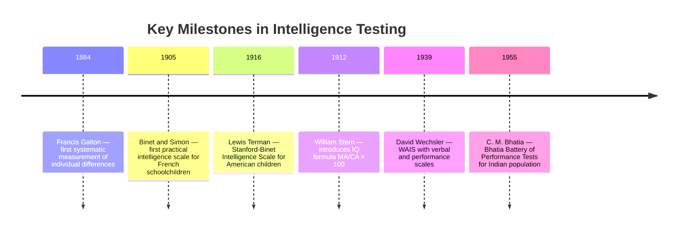

import Tabs from '@theme/Tabs';
import TabItem from '@theme/TabItem';

# MPCL-007 Practicals: Intelligence Testing, Personality Assessment, and Social Scales

## Overview

This file covers four of the eight mandatory MPCL-007 practicals focused on standardised psychological tests: Bhatia's Battery of Performance Test of Intelligence, the Sixteen Personality Factor Questionnaire (16 PF), the Vineland Social Maturity Scale, and the Family Pathology Scale. For each, the focus is on theoretical background, standardised administration procedure, scoring, interpretation, and the key concepts needed for viva voce examination.

---

## Practical 1: Bhatia's Battery of Performance Test of Intelligence

### Background: What Is Intelligence?

Intelligence has been defined in multiple ways, reflecting the difficulty of measuring an invisible construct:

- **Wechsler (1944)**: "The aggregate or global capacity of the individual to act purposefully, to think rationally and to deal effectively with his environment"
- **Binet**: Manifested in reasoning, imagination, insight, judgement, and adaptability
- **Pragmatic definition**: "Intelligence is what intelligence tests measure" (Reber & Reber, 2001)

### Historical Development of Intelligence Testing

**IQ Formula (classical)**:

$$IQ = \frac{MA}{CA} \times 100$$

Where MA = Mental Age, CA = Chronological Age. Modern tests use deviation IQ (standard scores) rather than this ratio.

### Bhatia's Battery: Designed for India

Constructed by **C. M. Bhatia (1955)** specifically for the Indian population, particularly children and less educated or illiterate individuals. It is a **non-verbal performance test** — avoiding the linguistic bias of tests like Stanford-Binet.

The battery consists of **five sub-tests** with a maximum total score of **95 marks**:

| Sub-test | Max Marks | Time Limits | Description |
|---|---|---|---|
| **1. Koh's Block Design** | 25 | 2 min (first 5), 3 min (last 5) | Reproduce coloured card designs using coloured blocks |
| **2. Alexander Pass-Along** | 20 | 2 min (first 4), 3 min (last 4) | Slide pieces to match target pattern |
| **3. Pattern Drawing** | 20 | 2 min (first 4), 3 min (last 4) | Draw patterns without lifting pencil |
| **4. Immediate Memory** | 15 | Untimed | Digit span forward and backward |
| **5. Picture Construction** | 15 | 2 min (first 2), 3 min (last 3) | Arrange picture parts into a meaningful whole |

**Target population**: Boys aged 11–16 (norms available); norms for girls obtained subsequently.

### Administration Procedure

1. **Preparation**: Arrange all materials — block set, pass-along pieces, pattern cards, answer sheets, stopwatch
2. **Rapport**: Greet the subject warmly; explain the session informally; address concerns
3. **Informed consent**: Explain confidentiality; obtain consent; ask permission to record if applicable
4. **Instructions**: Read standardised instructions from the manual for each sub-test
5. **Conduct**: Administer each sub-test in sequence; enforce time limits strictly
6. **Scoring**: Score each sub-test using the manual's criteria (accuracy + behavioural observation)
7. **Total**: Sum scores across all five sub-tests

### IQ Classification (Terman's Stanford-Binet Framework, SD = 16)

| IQ Range | Classification |
|---|---|
| 164 and above | Genius or near genius |
| 148–164 | Very superior |
| 132–148 | Superior |
| 113–132 | Above average |
| 84–113 | Normal/average |
| 68–84 | Dullness |
| 52–68 | Borderline deficiency |
| Below 52 | Definite feeble-mindedness |

### Practicum Report: Key Sections

**Introduction**: Define intelligence (Wechsler's definition), outline the history from Galton to Bhatia, explain why a non-verbal Indian test was necessary.

**Discussion**: Interpret the subject's scores against norms. Relate performance on each sub-test to cognitive domains (spatial reasoning, working memory, visual-motor coordination). Include introspective report observations about attention, effort, and approach strategy.

---

## Practical 2: 16 PF (Sixteen Personality Factor Questionnaire)

### Background: Trait Approaches to Personality

Personality theories range from ancient typologies (Hippocrates' four humors; Ayurvedic tridosh and trigunas) to modern factor-analytic models. **Raymond B. Cattell** used factor analysis to identify **16 fundamental source traits** — stable, underlying "building blocks" of personality.

:::info Indian Cultural Context
Indian personality typologies predate Western science:
- **Tridosh** (Vata, Pitta, Kapha) from Ayurveda
- **Trigunas** (Sattva, Rajas, Tamas) — proportions of these three gunas shape personality type
The 16 PF offers a scientifically standardised assessment while practitioners should remain aware of culturally embedded personality frameworks
:::

### The 16 Personality Factors

Cattell described each factor as a bipolar dimension:

| Factor | High Score | Low Score |
|---|---|---|
| **A** | Outgoing, warm | Reserved, detached |
| **B** | High intelligence | Low intelligence |
| **C** | Emotionally stable | Emotionally unstable |
| **E** | Dominant | Submissive |
| **F** | Happy-go-lucky, enthusiastic | Sober, serious |
| **G** | Conscientious, persistent | Expedient, lax |
| **H** | Venturesome, socially bold | Shy, timid |
| **I** | Tender-minded, sensitive | Tough-minded, realistic |
| **L** | Suspicious, jealous | Trusting, accepting |
| **M** | Imaginative, absorbed | Practical, conventional |
| **N** | Shrewd, calculating | Forthright, straightforward |
| **O** | Apprehensive, self-blaming | Confident, placid |
| **Q1** | Radical, experimenting | Conservative, traditional |
| **Q2** | Self-sufficient | Group-dependent |
| **Q3** | Controlled, compulsive | Undisciplined, lax |
| **Q4** | Tense, frustrated | Relaxed, composed |

### Test Details

- **Author**: Raymond B. Cattell; first published 1949; fifth edition 1993
- **Items**: 187 multiple-choice items
- **Format**: Three options per item (no right or wrong answers)
- **Time**: Approximately 45–60 minutes
- **Administration**: Individual or group (paper-pencil)

### Administration Procedure

1. Prepare test booklet, answer sheet, scoring key
2. Establish rapport; reassure subject there are no right/wrong answers
3. Read standardised instructions from the manual; clarify doubts
4. Time the session (no strict limit, but monitor for fatigue)
5. Collect answer sheet; score with appropriate stencil key for each factor
6. Convert raw scores to sten scores using normative tables
7. Plot the personality profile on the provided 16 PF profile sheet

### Scoring and Interpretation

Raw scores on each factor are converted to **sten scores** (standard ten; mean = 5.5, SD = 2). The profile plots the 16 sten scores, revealing the subject's personality structure. Sten scores of 1–3 indicate the low pole; 7–10 indicate the high pole; 4–6 are average.

### Report: Discussion Points

- Describe the overall personality profile pattern
- Identify particularly extreme factors (sten ≤ 3 or ≥ 7)
- Relate findings to the subject's stated life context (work, relationships, wellbeing)
- Cross-reference with introspective report — does the subject recognise the profile?

---

## Practical 3: Vineland Social Maturity Scale

### Background: Social Maturity and Adaptive Behaviour

Social maturity is the development of life skills enabling effective functioning in society. The **WHO defines life skills** as "abilities for adaptive and positive behaviour that enable individuals to deal effectively with the demands and challenges of everyday life."

The **Vineland Social Maturity Scale (VSMS)** was developed by **Edgar Arnold Doll** (American psychologist) to measure adaptive behaviour from infancy through adulthood. In India, it was adapted by **Dr. A. J. Malin** during his work at the Nagpur Guidance and Counselling Centre.

### What VSMS Measures

The scale assesses eight domains:

| Domain | Examples |
|---|---|
| Communication skills | Speaking, writing, following instructions |
| General self-help | Dressing, personal hygiene |
| Locomotion | Walking, navigating environment |
| Occupation skills | Task completion, vocational skills |
| Self-direction | Making choices, managing time |
| Self-help eating | Using utensils, independent eating |
| Self-help dressing | Putting on/removing clothes |
| Socialisation | Making friends, cooperative play |

### Key Details

- **Age range**: Birth to 15 years
- **Items**: 89 items
- **Administration**: Interview with parent or primary caregiver (not the child directly)
- **Time**: 20–30 minutes
- **Scoring**: Raw score → Social Age (SA) equivalent → Social Quotient (SQ)

$$SQ = \frac{SA}{CA} \times 100$$

Where SA = Social Age, CA = Chronological Age

### Clinical Applications

The VSMS is widely used in India for:
- Diagnosing intellectual disability and developmental delays
- Planning therapeutic interventions and special education programmes
- Monitoring progress in rehabilitation settings
- Screening in community mental health programmes

### Report: Interpretation Guide

A SQ of 100 indicates social maturity equivalent to chronological age. SQ > 100 = advanced social development; SQ < 100 = delayed social development. Discuss which specific domains show relative strengths and weaknesses.

---

## Practical 4: Family Pathology Scale

### Background: Family as a Psychological Unit

In India, the family — not the individual — has traditionally been considered the primary social unit. Pathological family dynamics can underlie a wide range of individual psychological difficulties. The **Family Pathology Scale** measures maladaptive behaviour patterns in spousal interactions and parent-child relationships.

### Development

Developed by Indian researchers through a rigorous process:
- 100 items drafted covering spousal and parent-child interactions
- 50 experts (25 clinical psychologists + 25 psychiatrists) rated item indicators on a 3-point scale
- Only items with 100% expert consensus retained
- Final scale: **42 items**
- Validated on 300 normal couples (N = 600) and 100 pathological couples (N = 200)

### Scoring

Each item is rated on a 3-point scale:
- **1** = Never (low/no pathology)
- **2** = Occasionally (average pathology)
- **3** = Most Often (high pathology)

Higher total scores indicate greater family pathology.

### Viva Voce Tips

- Be able to distinguish between *spousal pathology* (between partners) and *parent-child pathology*
- Know the validation methodology — expert consensus and normative group comparisons
- Discuss how family pathology relates to individual psychopathology (e.g., depression, anxiety, conduct disorders in children)

---

## Self-Assessment Questions

### Level 1 — Recall

1. Name the five sub-tests of Bhatia's Battery and state the maximum marks for each.

2. What does "sten score" mean in the context of 16 PF interpretation? What sten range is considered average?

3. What is the formula for Social Quotient (SQ) in the Vineland Social Maturity Scale? What does SQ = 85 indicate?

### Level 2 — Application

4. A child of chronological age 8 years scores at the social age level of 6 years on the VSMS. Compute SQ. What would you recommend in the practicum report's Discussion section?

5. A subject's 16 PF profile shows extreme scores (sten ≥ 7) on factors C (Emotional Stability), L (Suspiciousness), and Q4 (Tension). What personality picture does this paint? What areas would you explore in the Discussion?

### Level 3 — Critical Thinking

6. Bhatia's Battery is described as "culture-fair" for Indian populations. Evaluate this claim. What cultural factors does it address compared to Stanford-Binet? What potential biases might still remain?

7. The Family Pathology Scale uses a 3-point Likert response format. What are the psychometric advantages and limitations of such a coarse scale compared to a 5 or 7-point scale?

---

## 🧠 Memory Aid

**"BBVF" — The Four Tests in Order**:
- **B**hatia Battery → **B**rains (intelligence)
- **B**ig Sixteen → **B**ehaviour patterns (personality: 16 PF)
- **V**ineland → **V**erbal/social skills (adaptive behaviour)
- **F**amily Scale → **F**amily functioning (pathology)

**SQ and IQ formulas are parallel**:
- $IQ = \frac{MA}{CA} \times 100$ ←→ $SQ = \frac{SA}{CA} \times 100$
- Both compare achieved age-equivalent to chronological age

---

## 📚 External Resources

### Foundational Reading
- 🌐 [Wikipedia: Bhatia Battery of Performance Tests](https://en.wikipedia.org/wiki/Bhatia_Battery_of_Performance_Test_of_Intelligence) — Indian intelligence testing history
- 🌐 [Wikipedia: Sixteen Personality Factor Questionnaire](https://en.wikipedia.org/wiki/16PF_Questionnaire) — Full description of Cattell's model and factors
- 🌐 [Wikipedia: Vineland Adaptive Behavior Scales](https://en.wikipedia.org/wiki/Vineland_Adaptive_Behavior_Scales) — Modern successor to the original Vineland scale

### Tutorials and Guides
- 📖 [APA Dictionary of Psychology: Adaptive Behavior](https://dictionary.apa.org/adaptive-behavior) — Conceptual context for Vineland
- 📖 [Pearson: 16PF Overview](https://www.pearsonassessments.com/store/usassessments/en/Store/Professional-Assessments/Personality-%26-Biopsychosocial/16PF-Sixth-Edition/p/100000425.html) — Fifth and sixth edition details
- 📖 [APA PsycTests: Family Pathology Scale](https://psycnet.apa.org) — Research usage of family assessment instruments

### Videos
- 🎥 [Intelligence Testing Overview — YouTube](https://www.youtube.com/watch?v=9Oc1jSgBs3U) — History of intelligence measurement
- 🎥 [16 PF Personality Assessment Introduction](https://www.youtube.com/watch?v=NjqBFHPz7FU) — Factor structure explained

### Research Articles
- 📄 Cattell, R. B. (1943). The description of personality: Basic traits resolved into clusters. *Journal of Abnormal and Social Psychology, 38*(4), 476–506. (Foundation of 16 PF)
- 📄 Sparrow, S. S., Cicchetti, D. V., & Balla, D. A. (2005). *Vineland Adaptive Behavior Scales* (2nd ed.). AGS Publishing. (Modern Vineland)
- 📄 Doll, E. A. (1953). *Measurement of social competence: A manual for the Vineland Social Maturity Scale*. Educational Test Bureau. (Original Vineland)

---

**Source PDFs**:
- 📄 [Project.pdf — Pages 5–16](/pdfs/MPCL-007%20Practicals%20Experimental%20Psychology%20and%20Psychological%20Testing/Project.pdf)
- 📚 MPCL-007 Practicum: Experimental Psychology and Psychological Testing
