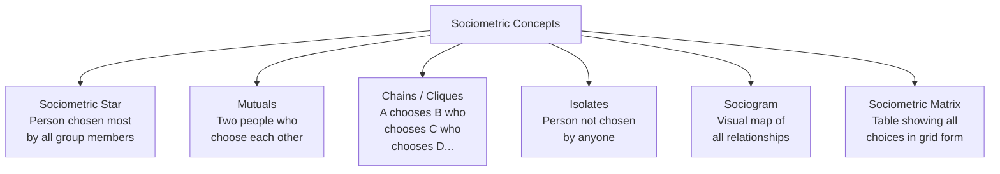
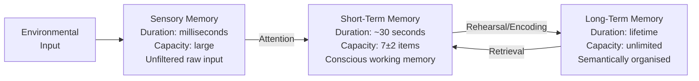

import Tabs from '@theme/Tabs';
import TabItem from '@theme/TabItem';

# MPCL-007 Practicals: Sociometry, Experiments & Report Format

## Overview

This file covers the remaining four MPCL-007 practicals — Sociometry, Problem Behaviour Checklist, Span of Attention Experiment, and Memory Experiment — together with comprehensive guidance on the standardised practicum report format, the evaluation structure, and preparation strategies for the term-end practical examination and viva voce.

---

## Practical 5: Sociometry

### Background: Measuring Human Relationships

**Sociometry** (from Latin *socius* = social + *metrum* = measure) was coined by **Jacob Levy Moreno (1953)** as a methodology for measuring the degree of relatedness and affiliation among people in a group. It maps the invisible architecture of interpersonal preference, trust, and conflict within a group.

Moreno defined sociometry as *"the mathematical study of psychological properties of populations, the experimental technique of, and the results obtained by application of quantitative methods."*

### Key Concepts

### Administration Procedure

**Minimum group size**: 5–6 members

**Step 1 — Select a criterion**: Pose a specific question the group will answer, e.g.:
- "Whom would you trust most in this group?"
- "Who would you choose to work with?"
- "Who would you go to for advice on serious matters?"

**Step 2 — Collect choices**: Each member nominates one person per criterion. Record all responses.

**Step 3 — Build the Sociometric Matrix**:

| | A | B | C | D | E | F |
|---|---|---|---|---|---|---|
| **A** | — | + | − | M | M | + |
| **B** | + | — | + | + | + | + |
| **C** | − | M | — | − | − | − |
| **D** | M | M | + | — | M | + |
| **E** | M | M | + | + | — | + |
| **F** | + | + | M | + | M | — |

Legend: + = High trust, M = Moderate trust, − = Distrust/conflict

**Reading the matrix**:
- **High + column total** → Sociometric star (most chosen, informal leader)
- **High − row total** → Potential isolate or rejected member
- **Mutual +** → Strong bonding pair
- **Mutual −** → Conflict pair (intervention priority)
- **All M column** → Member possibly guarding responses (fear of disclosure)

**Step 4 — Build the Sociogram**: Represent each person as a circle; draw arrows to indicate choices. Place the sociometric star at the centre.

**Step 5 — Identify**:
- ⭐ **Stars**: Circle with most inward arrows
- 🔗 **Mutuals**: Bidirectional arrows
- 📎 **Chains/Cliques**: Sequential arrow chains
- 🏝️ **Isolates**: Circles with no inward arrows

### Practicum Report: What to Discuss

The Discussion should:
- Identify the sociometric star and explain what this reveals about group dynamics
- Name any isolates and discuss the implications (need for intervention?)
- Highlight mutual pairs — positive ones indicate cohesion; negative ones indicate conflict zones
- Reflect on the reliability of self-report data in sociometric methods

### Applications

Sociometry is used in:
- **Classroom management**: Identifying socially isolated children for targeted support
- **Organisational psychology**: Team formation based on mutual preference
- **Group therapy**: Understanding relational dynamics before intervention
- **Indian community psychology**: Mapping caste or gender-based isolation in educational settings

---

## Practical 6: Problem Behaviour Checklist

### Background

The Problem Behaviour Checklist was developed to identify **emotional and conduct problems in children**, aligned with ICD-10 diagnostic criteria. It distinguishes three categories: emotional disorders, conduct disorders, and mixed conduct-emotional disorders.

### Development and Standardisation

- Initial pool: 100 items in symptom format
- Expert validation: 25 psychologists + 25 psychiatrists rated each item
- Method: Internal consistency — only items with 100% consensus selected
- Final scale: **58 items** (from original 100)
- Validation sample: 300 normal couples (N = 600) + 100 psychiatric couples (N = 200)

### Scoring

Each item rated by parents:
- **1** = Never (no problem behaviour)
- **2** = Occasionally (average)
- **3** = Most Often (high problem behaviour)

Higher scores → greater emotional/conduct problems.

### Interpretation

Score profiles can be examined for subscale patterns (emotional vs. conduct vs. mixed). Clinicians use this data to plan intervention strategies and referral decisions.

---

## Practical 7: Span of Attention Experiment

### Background: Attention in Experimental Psychology

**Attention** is the cognitive process of selectively concentrating on one aspect of the environment while ignoring others. It is also described as the allocation of processing resources. **Span of attention** is the maximum number of items that can be grasped in a single brief presentation when items are of the same type.

### Historical Development

- **Wilhelm Wundt**: First systematic study of attention in psychology; held attention was an inner activity regulating consciousness
- **Hermann von Helmholtz (1821–1894)**: Demonstrated attentional focus can be directed in advance of stimulus presentation, independent of eye fixation
- **William James (1890)**: Defined attention as "taking possession by the mind, in clear and vivid form, of one of what seem several simultaneously possible objects"

### The Gestalt Principle and Proofreader's Illusion

Gestalt psychologists showed that the mind tends to apprehend stimuli as wholes. A striking demonstration: when reading a familiar word like PSYCHOLOGY, we often perceive the complete word even if a middle letter is missing. This **proofreader's illusion** illustrates that attention operates on configured wholes rather than individual elements.

### Experimental Design

Any experiment measuring span of attention using a **tachistoscope** (an instrument for brief, precisely timed visual presentations) qualifies for this practical:

| Design Element | Description |
|---|---|
| **Independent Variable** | Number of items presented / presentation time |
| **Dependent Variable** | Number of items correctly reported |
| **Hypothesis** | Subjects can accurately report approximately 7 ± 2 items in a single brief presentation (Miller's Law) |
| **Apparatus** | Tachistoscope or equivalent brief-exposure device |
| **Stimuli** | Dots, letters, digits, or objects of the same type |
| **Procedure** | Present stimuli for a fixed brief duration (e.g., 50ms); subject reports what was seen |

### Key Concepts for Discussion

- **Span of attention** vs. **span of apprehension** vs. **working memory capacity**
- Miller's "magical number 7 ± 2" and its relevance to attentional capacity
- Factors affecting span: familiarity, grouping, stimulus complexity
- Gestalt principles of perceptual organisation and their role in attention

### Report: Hypothesis and Results

State a directional hypothesis (e.g., "The span of attention will be approximately 7 ± 2 items"). Graph the results (number correct as a function of items presented). Discuss individual differences and compare with Helmholtz's and James's accounts.

---

## Practical 8: Memory Experiment

### Background: Memory in Experimental Psychology

Memory is the ability to **encode, store, and retrieve** information and experiences. Ebbinghaus (1885) made the first systematic experimental study of memory using nonsense syllables — minimising the role of meaning and prior knowledge to isolate pure memory processes.

### Three-Stage Model of Memory

**Sensory memory**: Briefly holds raw sensory input (~0.5–2 seconds); most information decays unless attended to.

**Short-term memory (STM)**: Limited capacity (~7 ± 2 items); duration ~30 seconds without rehearsal. Demonstrates:
- **Primacy effect**: Items at the beginning of a list are remembered well (transferred to LTM through rehearsal)
- **Recency effect**: Items at the end are remembered well (still in STM)

**Long-term memory (LTM)**: Potentially unlimited capacity and duration; semantically and associatively organised.

### Ebbinghaus and Bartlett: A Contrast

| Aspect | Ebbinghaus (1885) | Bartlett (1932) |
|---|---|---|
| **Method** | Nonsense syllables (ZUG, DAX) | Meaningful stories and images |
| **Focus** | Eliminating meaning to isolate memory trace | Social, cultural, and cognitive influences on memory |
| **Key Finding** | Forgetting curve — rapid initial forgetting, then slower | Memory is reconstructive, not reproductive |
| **Legacy** | Experimental rigour in memory research | Schema theory and ecological validity |

### Memory Drum Experiments

The **memory drum** is a cylindrical mechanical device that presents words or syllables at regulated intervals, enabling precise control over learning pace and serial order effects. Classical memory drum experiments examine:

- **Serial learning**: Learning a list in a fixed order
- **Paired-associate learning**: Learning pairs of stimuli (stimulus → response)
- **Serial position effects**: Primacy and recency patterns

### Experimental Design

| Design Element | Description |
|---|---|
| **Independent Variable** | Type of material (meaningful vs. nonsense), serial position, number of trials |
| **Dependent Variable** | Number of items recalled correctly; trials to criterion |
| **Hypothesis** | Meaningful words will be recalled better than nonsense syllables (opposing Ebbinghaus); serial position effects will be demonstrated |
| **Apparatus** | Memory drum or equivalent word presentation device |
| **Procedure** | Present list at controlled pace; test immediate recall; analyse serial position curve |

### Discussion Points

- Compare the subject's serial position curve to theoretical expectations (primacy + recency peaks, asymptotic middle)
- Discuss whether results support Ebbinghaus (rote memory) or Bartlett (meaningful reconstruction) perspective
- Relate findings to three-stage memory model (sensory → STM → LTM)
- Introspective report: What strategies did the subject use? (rehearsal, chunking, visual imagery?)

---

## Standardised Practicum Report Format: Complete Guide

### The 12 Sections — Expanded

**1. Title**
Clear, descriptive name: e.g., *"Assessment of Personality Using 16 PF Questionnaire"* or *"Span of Attention Experiment Using Tachistoscope"*

**2. Aims/Objectives**
One or two sentences: *"To assess the personality traits of the subject using Cattell's 16 PF Questionnaire and interpret the findings against standardised norms."*

**3. Hypothesis** *(Experiments only)*
State the expected relationship: *"It is hypothesised that subjects will be able to accurately report 7 ± 2 items in a single brief tachistoscopic presentation."*

**4. Introduction**
- Historical background of the test/experiment
- Key theoretical concepts (define and discuss)
- Relevant research findings
- Rationale for choosing this test/experiment

**5. Description of the Test/Experiment**
- Author and year of development
- Number of items/trials
- Dimensions/factors/variables
- Reliability and validity data (from manual)
- Standardisation sample (who the norms are based on)

**6. Materials Required**
Exhaustive list: *Test booklet, answer sheet, scoring key, stopwatch, pencils, eraser*

**7. Subject's Profile**
Name (optional), age, gender, educational qualification, occupation, any relevant history

**8. Procedure and Administration**

> **Preparation**: *All materials were assembled prior to the session. The room was quiet and well-lit. The test booklet, answer sheet, and scoring key were arranged on the desk.*
>
> **Rapport**: *The subject was welcomed, seated comfortably, and general conversation established to reduce anxiety. The nature and purpose of the practical were explained in simple terms.*
>
> **Instructions**: *(Reproduce standardised instructions from the manual verbatim or paraphrased)*
>
> **Precautions**: *The subject was told not to leave any item unanswered. The examiner monitored pacing and noted any signs of fatigue or distress.*

**9. Introspective Report** *(written in first person by the subject)*
*"I found the first few blocks easy but by the fifth design I started feeling confused about colour placement..."*

**10. Scoring and Interpretation**
- Present raw scores per sub-test/factor
- Convert to derived scores (sten scores, SA, SQ, IQ) using tables
- Interpret against normative data
- Include the numerical findings in a table

**11. Discussion**
- Interpret the scores in the context of the subject's profile
- Relate to theory
- Incorporate introspective report insights
- Acknowledge limitations (single assessment, test anxiety, cultural fit)

**12. References**
APA format: *Cattell, R. B., Eber, H. W., & Tatsuoka, M. M. (1970). Handbook for the Sixteen Personality Factor Questionnaire (16 PF). Institute for Personality and Ability Testing.*

---

## Term-End Examination and Viva Voce Preparation

### Examination Format

- **Duration**: 3 hours
- **Method**: Each learner draws a chit to determine which practical they will conduct
- **Process**: Collect materials → conduct practical on a subject brought by the learner → write report on answer sheet → submit to internal examiner → viva voce with internal and external examiner

### Viva Voce: Common Questions

| Question | Key Answer Elements |
|---|---|
| "What is the reliability of the 16 PF?" | Split-half and test-retest reliability; ranges across factors; 5th edition has improved reliabilities |
| "Why did Bhatia develop a non-verbal battery?" | To avoid linguistic bias; suitable for illiterate/less educated Indian subjects |
| "What is the difference between social age and mental age?" | SA = level of social competence; MA = level of cognitive functioning; both compared to chronological age |
| "What is a sociometric star?" | Person most frequently chosen by group members on a specific criterion |
| "Why are nonsense syllables used in memory experiments?" | To eliminate the confound of prior knowledge and semantic meaning on memory |
| "What is the proofreader's illusion?" | Perceiving a complete word even with a missing letter — demonstrates whole-perception over part analysis |

---

## Self-Assessment Questions

### Level 1 — Recall

1. Define the terms: sociometric star, mutual, isolate, and clique. Give one example of each from the sample sociometric data in this unit.

2. What are the three types of memory in the Atkinson-Shiffrin model? State the approximate duration and capacity of each.

3. What two types of functions does sociometry serve in psychological practice?

### Level 2 — Application

4. You are conducting a sociometric study in a class of 20 students using the criterion "Who would you most like to work with on a project?" Student X receives 14 nominations, Student Y receives 0. What are X and Y each called in sociometric terminology? What practical steps might a counsellor take based on this data?

5. A subject in the memory experiment recalls items 1, 2, 3 (from beginning) and items 13, 14, 15 (from end) of a 15-item list but forgets most items in the middle. What effect does this demonstrate? Explain the mechanism using the three-stage memory model.

### Level 3 — Critical Thinking

6. Bartlett (1932) argued that Ebbinghaus's use of nonsense syllables makes memory research ecologically invalid. Evaluate this argument. Is ecological validity always necessary, or does reductionist experimental control also have value?

7. A student conducting a sociometric study finds that the most academically talented student in the class is also an isolate (receives zero nominations). What psychological and social factors might explain this pattern? How would you handle this finding ethically in a practicum report?

---

## 🧠 Memory Aid

**"SPAME" — the five MPCL-007 experiments and applied tools**:
- **S**ociometry → Social mapping (Moreno)
- **P**roblem Behaviour Checklist → Paediatric conduct/emotional problems
- **A**ttention Experiment → Apprehension span (tachistoscope)
- **M**emory Experiment → Memory drum (Ebbinghaus)
- **E**valuation → 50% internal + 50% external = 100 marks

**Practicum Report 12 sections — "TAHDM SPISS DC R"**:
Title → Aims → Hypothesis → Description → Materials → Subject Profile → Introspective Report (Procedure + Scoring) → Score Interpretation → Discussion → Conclusion → References

---

## 📚 External Resources

### Foundational Reading
- 🌐 [Wikipedia: Sociometry](https://en.wikipedia.org/wiki/Sociometry) — History, methods, and applications
- 🌐 [Wikipedia: Memory](https://en.wikipedia.org/wiki/Memory) — Multi-store model, Ebbinghaus, Bartlett
- 🌐 [Wikipedia: Attention](https://en.wikipedia.org/wiki/Attention) — History from Wundt through cognitive psychology

### Tutorials and Guides
- 📖 [Simply Psychology: Memory Models](https://www.simplypsychology.org/memory.html) — Multi-store and working memory models
- 📖 [Simply Psychology: Span of Attention](https://www.simplypsychology.org/attention.html) — Selective and focused attention
- 📖 [APA: Sociometric Methods](https://www.apa.org/research/tools/sociometric) — Application in research

### Videos
- 🎥 [Memory: Crash Course Psychology #13](https://www.youtube.com/watch?v=bSycdIx-C48) — Accessible overview of memory stages
- 🎥 [Attention in Psychology — Khan Academy](https://www.youtube.com/watch?v=E-UHNM0HTNE) — Attentional processes explained

### Research Articles
- 📄 Moreno, J. L. (1953). *Who shall survive? Foundations of sociometry, group psychotherapy and sociodrama* (2nd ed.). Beacon House.
- 📄 Ebbinghaus, H. (1885/1913). *Memory: A contribution to experimental psychology* (H. A. Ruger & C. E. Bussenius, Trans.). Teachers College, Columbia University.
- 📄 Bartlett, F. C. (1932). *Remembering: A study in experimental and social psychology*. Cambridge University Press.

---

**Source PDFs**:
- 📄 [Project.pdf — Pages 5–23](/pdfs/MPCL-007%20Practicals%20Experimental%20Psychology%20and%20Psychological%20Testing/Project.pdf)
- 📚 MPCL-007 Practicum: Experimental Psychology and Psychological Testing
